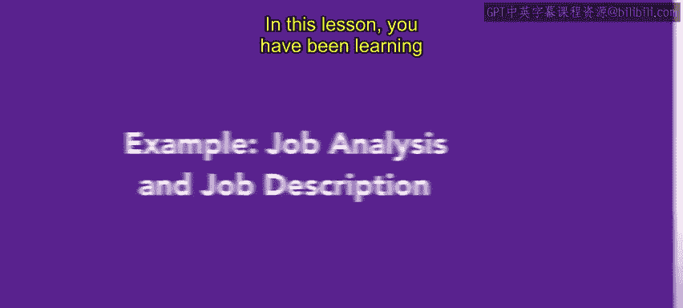
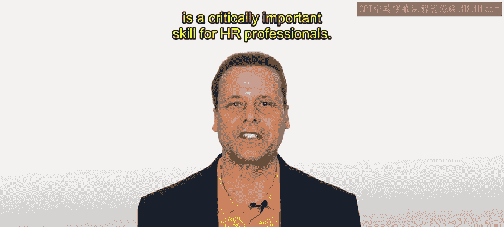
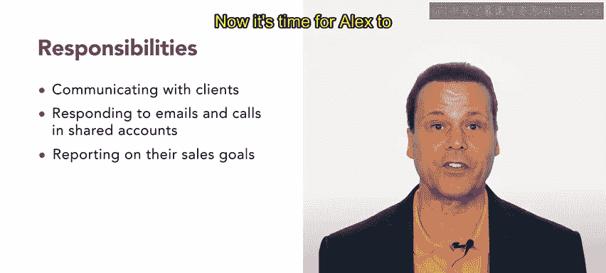
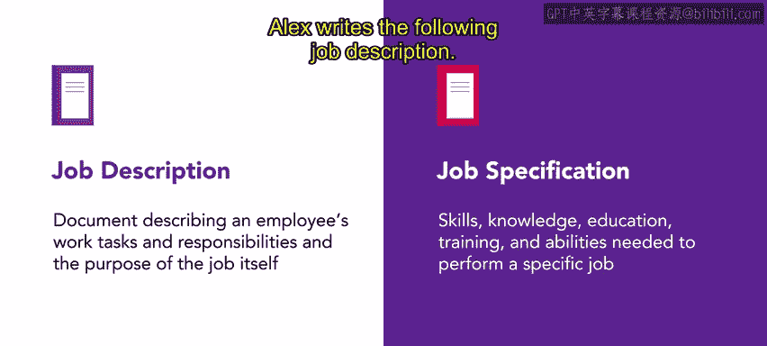

# HRCI《人力资源助理（招聘、学习发展、薪酬福利，1-3课／共5课）》：P23：示例：工作分析与工作描述

在本节课中，我们将学习工作分析与工作描述，这是招聘流程的第一步。分析与定义你要招聘的职位，是人力资源专业人员的一项关键技能。我们将通过一个真实世界的例子，来探讨工作分析与描述流程在组织中是如何运作的。

## 背景介绍：Connective公司

让我们继续以Connective公司的Alex为例。作为回顾，Connective是一家现代通信公司，帮助企业保持互联。他们专注于通过一套软件工具（如视频会议和基于云的电话系统）帮助分布式团队协作。

Alex来自人力资源部门，正在努力填补一个销售职位。在几次大型且成功的营销活动之后，销售团队一直难以跟上需求。Alex知道销售团队需要帮助，因此是时候为该职位完成工作分析了。

## 进行工作分析

工作分析将产出两份文件：**工作描述**和**工作规范**。这两份文件都将用于寻找合适的职位候选人。

Alex与销售团队合作，研究初级销售代表职位的任务和职责。Alex还花时间了解该职位如何与团队内及组织内的其他职位相关联。

为了完成这项工作，Alex对初级销售代表职位的员工以及团队领导进行了一系列访谈。为了确保Alex有充分的理解，他们还观察了部分工作角色，以准确衡量员工在该职位上的实际工作内容。

通过分析，Alex了解到该角色的任务包括：
*   联系对产品表示兴趣的客户。
*   向潜在客户进行陌生电话拜访。
*   进行销售演示。
*   协助高级销售代表完成销售。

初级销售代表将负责：
*   及时与所有分配的客户沟通。
*   回复共享销售邮箱账户和语音信箱中的电子邮件和电话。
*   每周结束时汇报销售目标。

这些是Alex通过工作分析确定的主要任务和职责。现在，是时候让Alex来编制工作描述和规范了。

## 编制工作描述与规范

请记住，**工作描述**是一份描述员工工作任务、职责以及工作本身目的的文件。

**工作规范**则描述了执行特定工作所需的技能、知识、教育、培训和能力。了解工作规范很重要，一份工作描述通常包含职位名称和汇报关系等重要信息。

Alex编写了以下工作描述：

**职位名称：初级销售代表**
**职位概述：** 全职销售代表，负责与感兴趣的客户和潜在客户沟通，并协助高级销售人员。
**汇报对象：** 直接向销售经理汇报。
**任职要求：** 必须具备以往的销售经验、成功的动力，并且善于与客户交谈。

Alex还包含了以下任务列表：
**初级销售代表任务：**
*   联系感兴趣的客户。
*   向潜在客户进行陌生电话拜访。
*   进行销售演示。
*   协助高级销售代表完成销售。
*   回复共享销售邮箱账户和语音信箱中的电子邮件和电话。
*   每周结束时汇报其销售目标。

该职位除了以往的销售经验外，不需要特定的教育或培训背景，因此Alex确保将这一点包含在工作描述中。

## 总结与应用

这份工作描述让潜在候选人基本了解了该职位涉及的内容以及他们需要做什么来完成工作。我们稍后会再次查看Alex和Connective公司的情况。

在人力资源工作中，你招聘的任何和每一个职位都需要工作描述。学习和定义职位是你未来人力资源职业生涯中的一项重要技能。

接下来，你将学习招聘流程的开始阶段。

