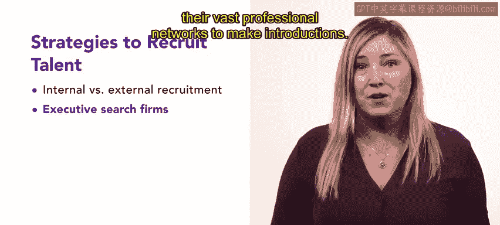

# HRCI人力资源助理课程：第23课：招聘与申请者追踪

## 概述

在本节课中，我们将要学习招聘与选拔流程中的关键环节：如何招募并追踪合格的职位候选人。我们将探讨不同的招聘策略、实用的追踪工具，以及确保招聘过程公平、透明的最佳实践。

---

## 招聘流程回顾与启动

上一节我们介绍了工作分析。现在，你已经完成了工作分析并制定了职位描述，接下来需要专注于为职位招募和追踪潜在候选人。

所有招聘活动，包括征集申请者、追踪申请者以及确保公平透明的实践，都属于这个漏斗阶段。

以下是招聘流程的快速回顾：
*   当管理者确定需要填补一个职位时，他们会向人力资源部门提交正式请求。
*   作为回应，人力资源部门会生成一份**员工需求表**。这是一个在公司希望雇佣新员工填补职位时使用的程序。

在创建职位描述后，该描述会向具备职位所需技能和要求的潜在申请者公布。组织随后可以选择多种策略来招募人才。

---

## 招聘策略：内部与外部

首先，组织可以通过内部或外部渠道来填补职位。

如果现有员工具备填补该职位的技能，这些信息可以被收集并存储在**技能清单**中，以备将来使用。

根据组织的具体情况，外部招聘可能是更好的策略。它涉及通过各种平台（如招聘网站、招聘会、社交媒体和社区网站）向组织外部的人员分享职位描述。

---

## 招聘策略：高管猎头公司

下一个策略是使用高管猎头公司，通常被称为“猎头”。

高管猎头公司充当高技能专业人士与潜在雇主之间的中介。

由于竞争对手经常雇佣这些专业人士，猎头可以利用其庞大的专业人脉网络进行引荐，帮助公司避免因直接接触人才而引发的指控。

然而，猎头服务的成本很高，费用通常为所招聘高管或专业人士职位薪水的30%到40%。因此，组织在选择招聘策略时必须考虑这一点。

---

## 申请者追踪工具

一旦组织开始招募申请者，就需要一种方式来追踪他们。各种规模的组织都使用**申请者追踪系统**等工具，在整个招聘和选拔过程中追踪职位申请者。

小型组织可能只需要一个简单的文件归档系统来追踪和管理申请者，但大型组织可能需要一个更先进的系统。ATS帮助在整个招聘过程中组织并维护申请者记录。

将ATS与**人力资源信息系统**集成，可以实现从候选人到员工的平稳过渡，允许组织独立或结合使用它们。

ATS通常允许组织执行以下操作：
*   发布职位空缺。
*   收集、标准化、分析和比较申请者信息。
*   存储数据。
*   使用背景调查服务提供商。
*   与组织的HRIS整合。
*   为审查和政府报告创建报告。

既然我们已经讨论了招聘策略和追踪工具，接下来让我们探讨一些最佳实践，以确保流程保持公平和透明。

---

## 公平透明的招聘实践

在招聘过程中，公平对待所有申请者并避免可能对特定候选人产生偏袒或歧视的做法至关重要。

**裙带关系**就是这样一种偏见。它发生在有影响力的人任命其亲属或朋友担任企业职位时，即使他们可能比其他候选人资格更差。

受平等就业机会法规约束的雇主，如果选择性雇佣他们认识的人，而不是考虑所有潜在候选人并确保招聘过程透明，就可能面临法律问题。

当职位要求具备专业知识、技能和能力时，对合适候选人的竞争就会加剧。

相反，高失业率会使招聘变得更容易管理，因为会有许多合格的候选人申请。然而，这也意味着选择最合适的候选人变得更具挑战性。

---

## 雇主品牌建设

对于一个组织来说，要吸引合格的候选人，它必须被视为一个优秀的工作场所。

组织可以通过有效的**雇主品牌建设**来实现这一点。这能创造一个连贯且得到良好推广的形象，突出公司的优势，并将其与竞争对手区分开来。

这些优势通常包括公司的薪酬、福利、工作文化、工作职责、培训和发展机会。

---

## 总结

本节课中，我们一起学习了招聘与申请者追踪的核心内容。你了解了**员工需求表**、内部与外部招聘、用于招募和追踪申请者的工具，以及公平招聘的最佳实践等重要主题。接下来，你将进一步探索人才获取流程中的后续步骤。