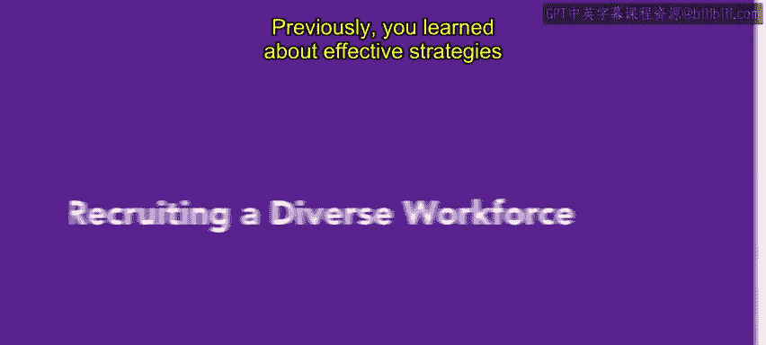
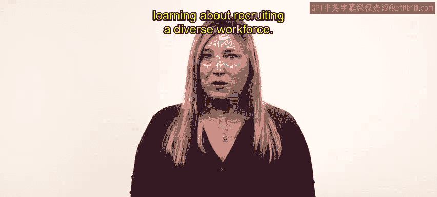

# HRCI《人力资源助理（招聘、学习发展、薪酬福利，1-3课／共5课）｜HRCI Human Resource Associate》 - P25：24_招聘多元化员工.zh_en - GPT中英字幕课程资源 - BV1qi421r7ba

Previously， you learned about effective strategies and tools for finding and recruiting candidates。

 we also explored best practices for promoting inclusivity throughout the recruitment process In this video。

 we will explore inclusivity further by discussing the benefits of building a diverse workforce and practical recruitment strategies for reaching an organization's diversity objectives。

😊，By the end of this video， you will have a better understanding of how to attract and retain skilled individuals from a variety of backgrounds through a fair and unbiased hiring process for your organization to achieve its diversity objectives。

 it is necessary to align your recruitment strategies with diversity and inclusion principles。😊。

Inclusive job descriptions are an essential component。

 but specific strategies can also reduce bias in recruitment In this lesson。

 we'll review three inclusive recruitment strategies。 pre employment assessments。

 blind resumes and employee resource groups。 The first strategy is pre employment assessments。

 hiring teams commonly use these assessments to discover if a candidate's character traits align with the specific role。

😊，Preemploment assessments can also reveal whether a candidate is likely to succeed if they join your organization。

 Preemploment assessments measure different attributes and qualities that are important in a specific role through specially designed tests。

 they often evaluate job knowledge， integrity， cognitive ability， personality。

 emotional intelligence and physical ability to administer these tests the uniform guidelines on employee selection procedures or UGP requires that any test given to a job applicant should be reliable and valid。

😊，Later in this course， we'll discuss how to ensure the validity and reliability of these tests For now。

 it's important to note that pre employment assessments may need to be adjusted to accommodate specific individual needs。

A well designed pre employment assessment can streamline the hiring process。

 These assessments can highlight gaps in experience。

 Disc overrepresent proficiencies and identify candidates with diverse cognitive abilities。

 This knowledge about a candidate can foster better collaboration among teams。😊。

The next recruitment strategy is blind resumes。Blind resumes hide personal information and characteristics that are unrelated to the qualifications and experience needed in the role。

This information can include a candidate's name， age， gender， ability， ethnicity， level of education。

 and educational institution。For example， your company may hire candidates ethnicity or educational institutions to eliminate bias in the hiring process and more fairly assess candidates。

Blind resumes focus attention on an applicant's qualifications and skills。

 regardless of their demographic background。It's important to note that blind resumes do not guarantee diversity and inclusion。

 Your organizations should develop a clear plan for blind resumes。

 What information should be hidden and why。Automated HR software applications such as applicant tracking systems offer a convenient solution for removing demographic information from an application。

Alternatively， you can manually cover personal information on printed resumes or use spreadsheet applications。

 The third strategy is employee resource groups。 Also known as affinity groups。

 These voluntary employee led groups bring together employees with similar backgrounds or demographics such as gender or ethnicity。

 They promote diversity and inclusion through talent acquisition。

 employee engagement and professional networking。😊，Employee resource groups can take various forms。

 Some groups may emphasize volunteerism or support for a particular cause。

 Others may offer professional development and provide employees with opportunities to share knowledge。

 These groups have well defined purposes， activities。

 budgets and roles in supporting your organization Employ resource groups play a vital role in promoting and maintaining inclusive recruitment processes。

 They should be constructed with your organization's diversity recruitment strategy in mind and be recognized for their contributions。

😊。

These recruitment strategies will help you build a more diverse and inclusive workplace you can use them to create opportunities for underrepresented groups。

 accommodate flexibility and accessibility in the workplace and strive toward an equitable allocation of skills and roles Com up we will continue learning about recruiting a diverse workforce。

😊。

