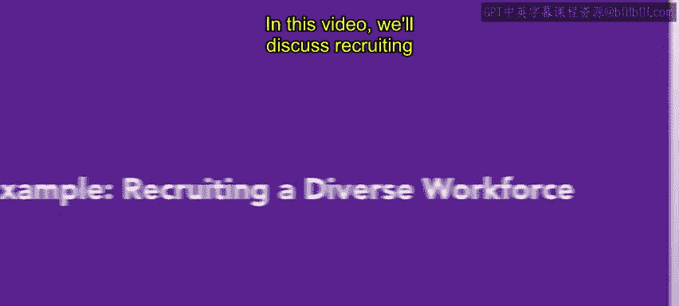
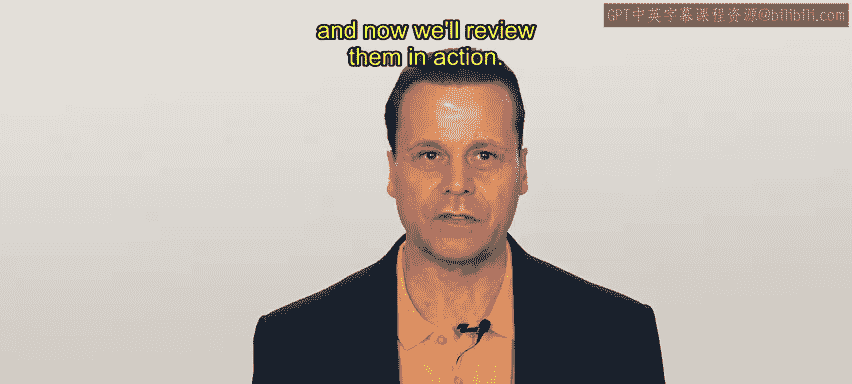
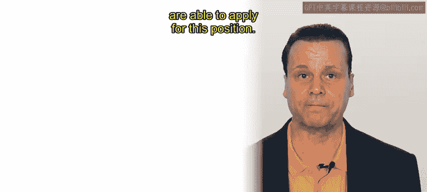
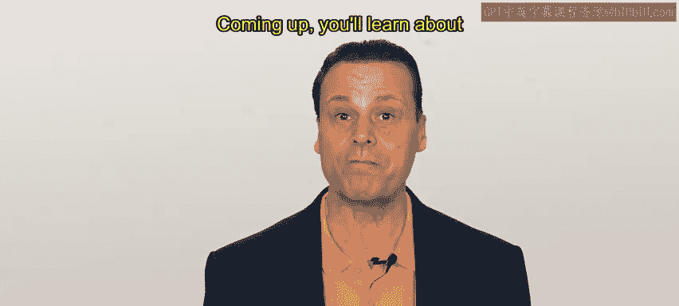

# HRCI《人力资源助理（招聘、学习发展、薪酬福利，1-3课／共5课）｜HRCI Human Resource Associate》 - P26：25_示例：招聘多元化员工.zh_en - GPT中英字幕课程资源 - BV1qi421r7ba

In this video， we'll discuss recruiting a diverse workforce in a real world scenario。

 As you are aware， a diverse workforce is beneficial and healthy for an organization。

 You've learned about a few of the tools an HR team can use in the recruitment process。

 and now we'll review them in action。 Let's continue with Alex from Connective。

As a refresher， Connective is a modern communication company that helps businesses stay connected。

 They specialize in helping distributed workforces collaborate with a suite of software tools such as video conferencing and cloud based phone systems。

Alex from HR is working to fill a sales position。 the sales team has been struggling to keep up with demand after a big and successful marketing campaign。

Last time， Alex completed a job analysis and then wrote up the job description and specifications。

As Alex begins the next round of recruitment， they know it's important to build a talented and diverse workforce。

Alex has received a formal request from the sales team and produced an official employee requisition。

 Alex and the sales team leaders have determined that an external candidate is probably going to be the best option for this role。

With the job description complete， Alex shares the job description with people outside of the organization through job boards。

 social media and community sites。There aren't any applicable industry job fairs coming up soon。

 but Alex reached out to several colleagues to see if they have job fairs in the near future。

 because the position is fully remote。 Alex reaches out to members of the HR and sales team to see if anyone is interested in attending and representing connective。

Alex prepares a set of spreadsheets and shared files for the applicant tracking at Connective。

 there is a strict procedure regarding nepotism。 That is to treat all applicants fairly。

 No relatives of connect employees are able to apply for this position。

As a new initiative at Connective， Alex and the HR team are going to use blind resumes for this position。

 removinging personal information and demographic information from the resume will allow everyone reviewing the background to focus on the skills。

 experience and qualifications of the applicant。Though this isn't the guarantee to introduce diversity。

 it is one of the many strategies that can help。Alex has also let the company's employee resource groups know that this position is hiring。

 and some members have mentioned that they will share the job listing。Alex。

 make sure to thank everyone participating for their time。

Alex has made sure to take some steps towards a fair and equitable recruitment process。

 There are more steps to take in the talent acquisition process。

 but this is where we'll leave Alex for now。Recruitment and specifically recruiting a diverse workforce are two important aspects of building an organization。

Coming up， you'll learn about the next stages of the talental acquisition lifecycle。

