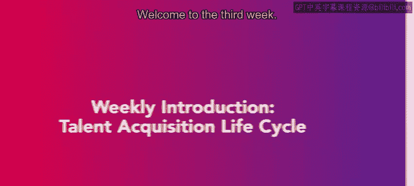
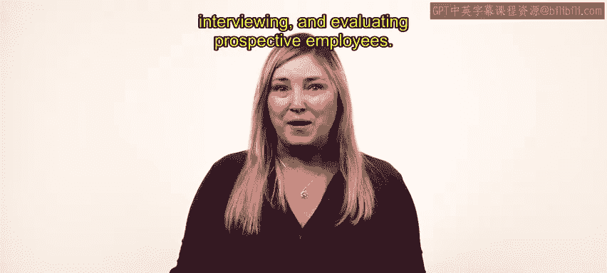
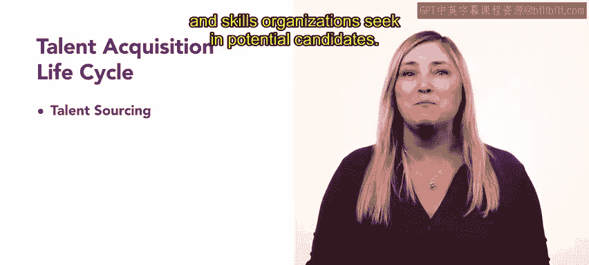
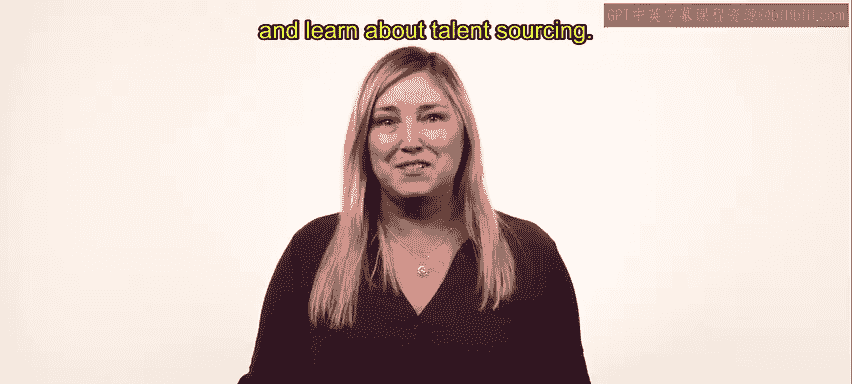

# HRCI《人力资源助理（招聘、学习发展、薪酬福利，1-3课／共5课）｜HRCI Human Resource Associate》 - P28：27_每周介绍：人才获取生命周期.zh_en - GPT中英字幕课程资源 - BV1qi421r7ba

Welcome to the third week。 You are making good progress on your journey to becoming an HR professional。

 Let's get started。 We will begin this week by introducing the talent acquisition lifecycle。

 which includes sourcing， screening， interviewing and evaluating prospective employees We will introduce talent sourcing strategies that HR professionals use to find suitable candidates。

 This will give you a better understanding of the qualities and skills organizations seek and potential candidates。

😊。

After learning how to gather a pool of candidates， we will explore the candidate screening process。

 Then we will discuss best practices for interviewing candidates。

 avoiding bias in the process and successful interview techniques。 Finally。

 we will explore various tests to evaluate prospective employees。

 We will reflect on bias and how to ensure a fair hiring process。

 Let's begin the first lesson and learn about talent forcing。😊。

