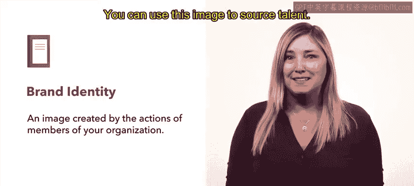
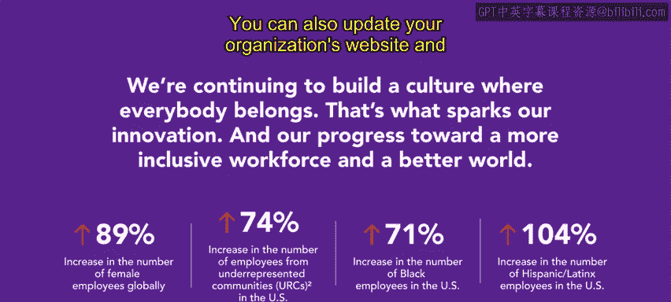

# HRCI人力资源助理课程：P30：29_雇主品牌

## 概述
在本节课中，我们将要学习**雇主品牌**的概念、重要性以及如何构建一个能有效吸引人才的雇主品牌。我们将探讨品牌身份如何影响招聘，并学习如何确保品牌形象与组织文化和价值观保持一致。

---

上一节我们介绍了几种人才寻源策略。本节中，我们来看看**雇主品牌**。

雇主品牌是潜在候选人在决定是否加入你的公司时，首先会考虑的因素之一。雇主品牌是一个管理和影响组织在员工、求职者及关键利益相关者中声誉的过程。

---

每个组织都有一个影响其寻源和招聘能力的**品牌身份**。品牌身份始于组织品牌本身，这包括其名称、标志、网站、建筑、员工、文化、口号，通常还包括其产品。

当你想到苹果这个品牌时，脑海中会浮现什么？可能是其可识别的标志、标志性建筑、员工福利与薪酬、广告或创新产品。这些元素中的每一项都为苹果品牌做出了贡献。

雇主品牌或品牌身份是由组织成员的行为所创造的形象。你可以利用这个形象来寻源人才。

---

为了创建一个有助于寻源候选人的身份，你的组织必须首先将其使命宣言和价值观与多元化及包容性目标对齐。

以下是具体步骤：
1.  **利用组织的印刷和数字材料**，开发一个能吸引多元化候选人群体的品牌身份。这些材料应反映一个多元化和包容性的组织。
2.  **如果组织当前状态缺乏多样性**，内容应表达其对包容性和多样性努力的承诺。这些材料可以包括劳动力人口统计数据以及关于多样性倡议（如员工资源小组）的信息。
3.  **更新组织的网站和营销页面**，添加反映你多元化与包容性承诺的内容。

---

如果组织的文化和目标与其品牌身份不符，雇主品牌将无助于候选人寻源。

为了确定员工对组织的认知是否准确反映了品牌身份，你可以考虑进行**员工调查**。

如果调查显示存在差异，组织的领导层可以进行运营调整来解决这些问题，或者调整品牌身份以匹配员工的认知。

如果执行得当，雇主品牌可以成为为组织吸引优秀人才的有力工具。

---

## 总结
本节课中我们一起学习了雇主品牌的核心概念。我们了解到，雇主品牌是组织声誉的管理过程，它始于由名称、标志、文化等构成的品牌身份。要有效利用雇主品牌吸引人才，关键在于确保品牌身份真实反映组织的使命、价值观以及对多元化和包容性的承诺，并且与员工的实际感知保持一致。

---

接下来，我们将学习其他寻源策略，例如员工推荐。