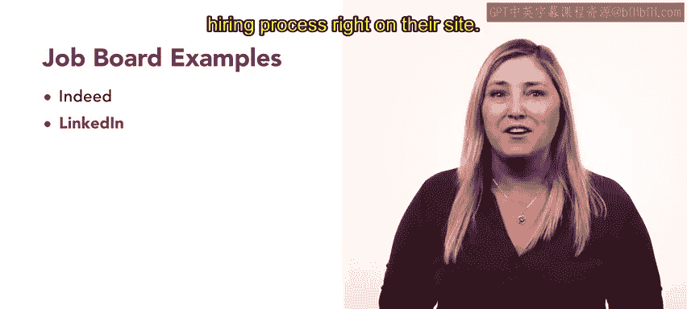

# HRCI《人力资源助理（招聘、学习发展、薪酬福利，1-3课／共5课）｜HRCI Human Resource Associate》 - P32：31_招聘网站.zh_en - GPT中英字幕课程资源 - BV1qi421r7ba

So far， you've learned multiple ways organizations can improve talent sourcing internally through employer branding and employee referrals now we'll explore external methods of looking for talent like job boards。

😊。

A job board is a website where organizations can post listings for job openings and where job seekers can search for openings。

 these websites allow employers to list information about open positions such as the job title。

 job description and job specification。Employers can also list requirements and preferences for the type of candidate they're seeking。

😊，Job boards can provide employers and candidates with tools and support for networking opportunities sourcing teams can use job boards that advertise in specific industries or seniority levels to search for strong candidates let's review a few tips to make researching and posting on job boards as effective as possible。

😊，Consider which industries might fit your open positions Some job boards target certain industries such as the science。

 technology and medical fields， for example， if you need to fill an opening for a nurse or other role in the medical field。

 you might search career vitalitals。com selecting niche job boards with a targeted audience can advertise to candidates with the specialized skills your organization needs。

Job descriptions should also be clear and concise， an effective job description should consist of inclusive language and set clear expectations。

 requirements and other relevant details for the position。

 This helps candidates get to know your organization and also attracts those who have the skills and experience you need Videos。

 infographics and pictures can help an organization stand out Visuals can be especially useful if your organization is easily recognizable by its brand identity。

😊。

Job seekers often stroll through many listings on a job board。

 so it's helpful to make your organization's post unique。

 Some job boards maintain candidates profiles， even for candidates who are no longer searching for a job。

 These recruitment databases are a useful tool for sourcing teams。

 You can build a network of candidates using searches based on industry。

 experience and education level， which can help your future talent searches。😊。

Although there are dozens of job boards to choose from。

 there are well respected sites that are a great place to start。

Indeed supports your entire hiring process according to their site， you can find great people。

 get quality applicants， connect with your top picks and make offers with confidence。

LinkedIn boasts that a hire is made every 10 seconds on their site Part job board。

 part professional social networking site， LinkedIn is a great tool for not only active job searches。

 but for maintaining connections for future search needs like indeed。

 LinkedIn allows you to move through the entire hiring process right on their site。😊。

Job boards are a great resource for talent acquisition teams to conduct their search。

 reach out to candidates and even send job offers with many customizable features。

 job boards are an excellent tool to search for talent Coming up you'll explore even more talent acquisition strategies。

😊。

