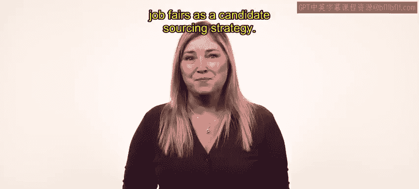
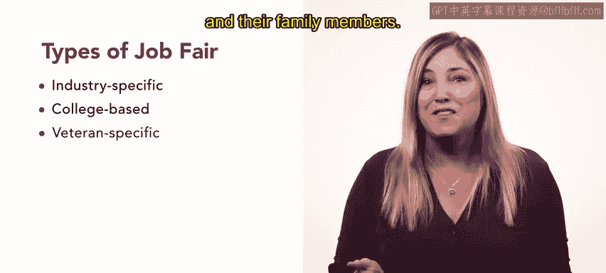

# HRCI《人力资源助理（招聘、学习发展、薪酬福利，1-3课／共5课）｜HRCI Human Resource Associate》 - P35：34_招聘会.zh_en - GPT中英字幕课程资源 - BV1qi421r7ba

Job fairs can be a great source of qualified candidates for both large and small organizations。

 These events provide recruiters the opportunity to identify individuals who are educated and trained in a variety of fields。

 Let's discuss how your organization can use job fairs as a candidate sourcing strategy。😊。

Job fairs are networking events for job seekers and employers participants can ask questions of each other and share information at a job fair。

 your organization can raise awareness of its employer brand and get job seekers excited about your employment opportunities。

😊，It's helpful to send hiring managers or current team members to a job fair so potential candidates can get authentic accounts of the organization's climate and culture Let's review the benefits of job fairs as a tool for candidate sourcing First job fairs provide recruiters the opportunity to meet potential candidates face to face these initial meetings allow the job seeker and employer to explore if the company might be a good fit earlyy conversations can save time in the hiring process for both sides。

 Second， although many job fairs are held in person。

 some transition to hybrid or fully virtual in response to the CoVId-19 pandemic both video conferencing and in-per interactions at job fairs can help you avoid scheduling interviews for unqualified candidates。

😊，Finally， jobb fairs allow recruiters to conduct dozens of informal interviews in a few hours and give extra attention to qualified candidates。

 fairs are also a great opportunity for candidates to explore different fields。

 companies or roles job fairs are versatile。 They can be open to many different opportunities or they can be specific to particular industries or demographics As a recruiter。

 you should attend job fairs that align with your organization's goals。

 Let's review common types of job fairs Indusspec job fairs are focused on a particular field These job fairs can boost your organization's employer brand among candidates who are interested in a certain field。

😊，College job fairs or career days can be ideal for identifying candidates for entry level roles and internships College job fairs give you access to students who are studying a specific field。

😊，Veterans job fairs present great opportunities to connect with military candidates and their family members。

Job fairs are a great tool for talentsurcing and acquisition in any setting or format your organization's presence at a job fair will likely expand your team's network of potential candidates and might even allow you to fill rules quickly。

😊，Coming up， you'll learn about e recruitment and e selection tools。 Keep up the great work。😊。

