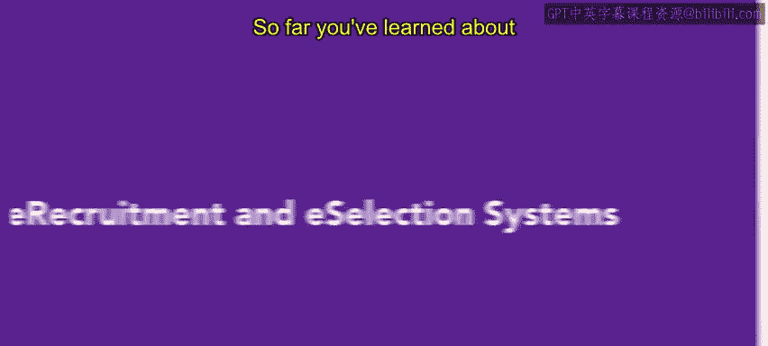

# HRCI人力资源助理课程：第3课：电子招聘与电子选拔系统 📧

在本节课中，我们将学习两种现代人才获取策略：电子招聘与电子选拔系统。我们将了解它们如何运作、各自的优势以及需要注意的潜在缺点。

## 概述

上一节我们介绍了招聘会、员工推荐等传统人才获取策略。本节中，我们来看看两种近年来日益流行的新策略：**电子招聘**与**电子选拔**。人力资源专业人员利用这些自动化系统来招募、筛选和选拔求职者。

## 什么是电子招聘？ 🌐

电子招聘，也称为远程招聘或在线招聘，指的是利用技术和互联网来开展招聘流程。

以下是电子招聘的主要方法：
*   **招聘软件**：用于管理整个招聘流程的专用系统。
*   **在线职业页面**：在公司官网上发布的职位信息与申请入口。
*   **数字化人才获取**：通过多种数字渠道吸引和寻找候选人。

通过电子招聘，你可以将职位空缺发布在第三方招聘网站、社交媒体以及公司网页上。职位列表不受本地、州或国家等地域渠道的限制，广泛的申请人可以即时上传申请。

## 什么是电子选拔？ ⚙️

电子选拔是利用技术来评估候选人的知识、技能和能力与职位要求的匹配程度。

电子选拔加快了选拔过程。软件程序会筛选数字化的申请材料，识别出符合期望标准的申请人。电子选拔还允许你进行在线评估，以检测申请人的能力和人格特质。许多平台还提供在线面试功能。

**公式/代码示例**：一个简单的筛选逻辑可能类似于 `if (applicant.skills.includes(“JavaScript”) && applicant.experienceYears >= 3) { proceedToNextRound(); }`。

## 优势与效率 🚀

电子招聘和电子选拔与传统招聘和选拔方法相比，能够更快地开发和处理更大规模的申请人池。这使得人才寻源团队能够绕过传统方法。许多人力资源部门采用电子选拔和电子招聘，主要是因为它们的成本效益。如果使用得当，它们可以成为为空缺职位寻找合适候选人的高效方式。

## 潜在缺点与注意事项 ⚠️

然而，这些方法也存在缺点，尤其是在被单独使用时。

以下是过度依赖电子招聘与选拔可能带来的问题：
*   **缺乏面对面交流**：过度依赖电子招聘会移除流程中的面对面环节。在许多情况下，亲自会面或面试是评估申请人能力和成熟度的更准确方式。
*   **纸面与实际表现的差异**：许多在书面材料上不突出的申请人可能非常适合该职位，反之亦然。
*   **文化匹配度难以评估**：缺乏个人面试或会面，使得申请人和组织都更难判断彼此是否适合工作场所的文化。

## 总结

本节课我们一起学习了电子招聘与电子选拔系统。我们了解了电子招聘是通过网络平台发布职位、电子选拔是利用技术筛选和评估候选人。这两种方法能高效处理大量申请且成本效益高，但需注意它们可能缺乏面对面交流，影响对候选人全面能力和文化匹配度的判断。在接下来的课程中，你将学习如何面试和筛选候选人。