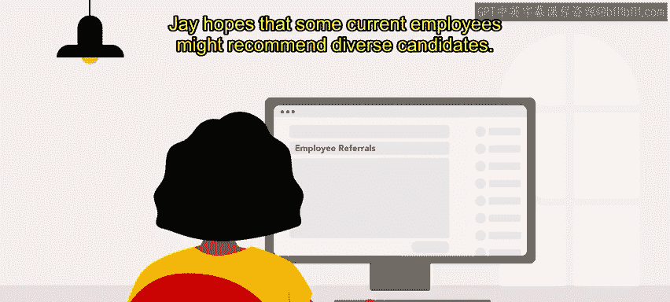
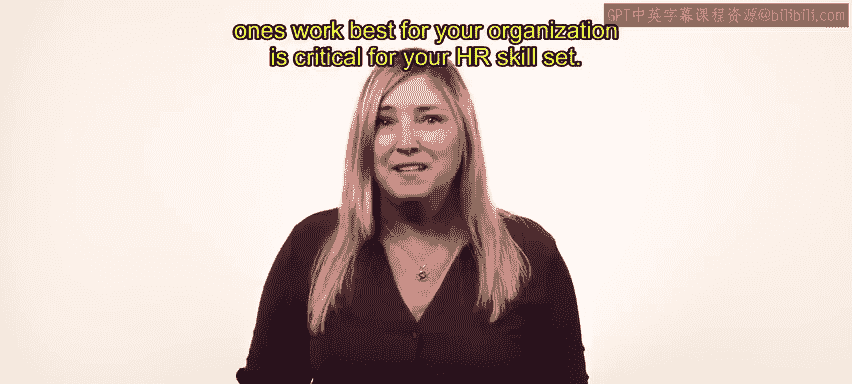

# HRCI人力资源助理课程：第3课：人才寻源实战示例 🍕

在本节课中，我们将通过一个现实世界的场景，来回顾和了解人才寻源的具体应用。我们将跟随一位人力资源专员，看看他如何为一家披萨连锁店寻找潜在候选人。

上一节我们介绍了多种人才寻源策略，本节中我们来看看这些策略如何在一个具体的组织中被组合运用。

---

让我们以“SliceU”披萨连锁店的J专员为例。SliceU是一家专注于大学客群的披萨连锁餐厅，以美味且价格合理的披萨闻名，其目标是尽可能地在大学附近开设新店。

J是SliceU总部的人力资源专员，负责协助全国各门店的招聘工作。根据招聘的职位（无论是总部还是门店岗位），J有多种寻源策略可供选择。目前，他正在为未来几个月即将开业的新餐厅寻源候选人。

即使潜在候选人并未在主动寻找工作，J也需要尽早地发现、评估并联系他们。SliceU是一个成长中的品牌，在大学校园附近有较高的知名度。J已与总部多个团队会面，商讨雇主品牌建设事宜，以确保求职者能准确了解在SliceU工作的体验。SliceU以其有趣、轻松的氛围和美味的产品而闻名。

J确信公司的品牌形象与其文化相匹配：这是一个有趣且友好的工作场所，但他们对披萨的制作非常认真。

---

## 实施多元寻源策略

SliceU的现有员工最了解公司文化以及谁可能适合空缺职位。因此，J首先启动了内部推荐计划。

以下是J采取的具体行动列表：
*   **全员沟通**：J向全体员工发送邮件，并利用公司聊天工具分享需要填补的职位空缺。
*   **利用员工资源组**：J也联系了公司的员工资源组，确保他们知悉招聘信息，以期现有员工能推荐多元化的候选人。

J知道，**员工推荐能节省时间和金钱，并能提供更高质量的候选人**。

同时，J也将职位发布在几个招聘网站上。为了在众多招聘信息中脱颖而出，J与设计团队合作，制作了一个他们披萨Logo跳舞的趣味动画。这既有趣，又符合公司文化，有望让潜在候选人会心一笑。

最后，J还研究了可能与所需职位相关的招聘会。这些非正式活动是J及其团队成员提升品牌知名度、面对面接触潜在候选人的绝佳方式。在接下来的几个月里，J计划参加三场招聘会，并订购了有趣的SliceU品牌宣传品用于现场发放。

---

## 策略总结与展望

这些寻源策略将帮助J识别范围广泛的候选人，包括那些对为SliceU工作有主动兴趣和被动兴趣的人。

所有候选人都是通过某种方式寻源获得的。了解寻源候选人的多种途径，以及哪些途径最适合你的组织，是人力资源技能组合中的关键部分。

本节课中，我们一起学习了如何将雇主品牌建设、内部推荐、在线招聘和线下招聘会等多种寻源策略，综合应用于一个具体的招聘场景中。

在接下来的课程中，你将学习如何筛选和面试候选人。

