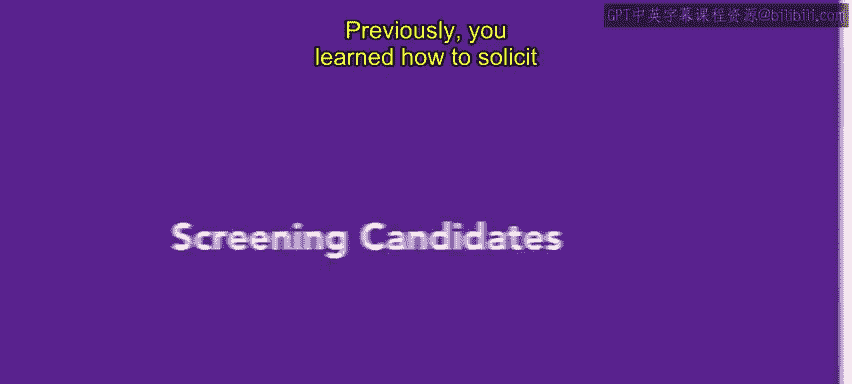
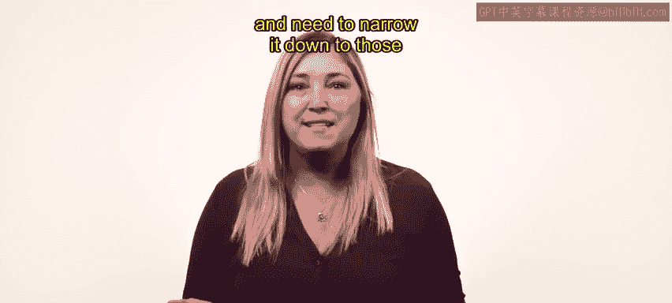
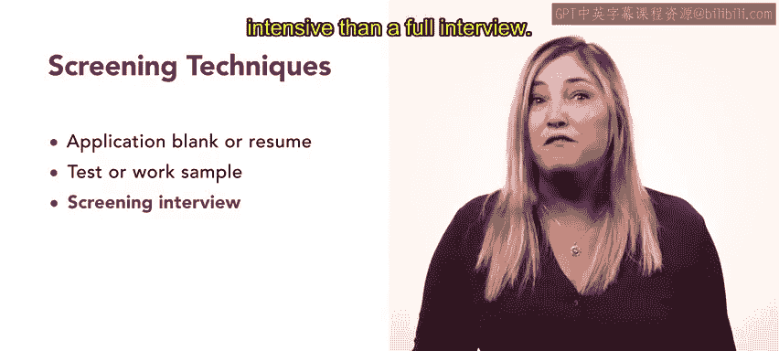
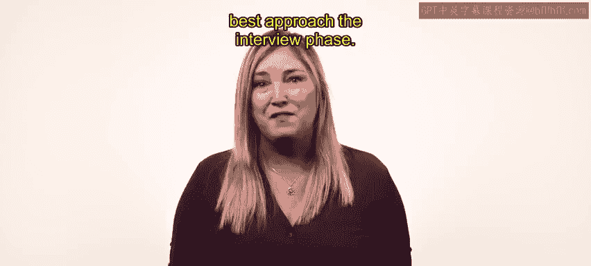

# HRCI人力资源助理课程：第3课：筛选候选人 👥

在本节课中，我们将学习如何从众多求职者中筛选出最符合职位要求的候选人。筛选是一个关键步骤，它帮助我们将候选人范围缩小，以便进行更深入的面试和评估。

上一节我们学习了如何为特定职位征集潜在候选人。现在，你已经拥有了一批求职者，需要从中筛选出最符合职位描述的人选。这个过程被称为“筛选”。

## 什么是筛选？🔍

**筛选**是一个识别最适合某职位候选人的过程。其核心方法是**将候选人的背景与职位所需能力进行比对**。

筛选可以包含多种技术，包括简历与工作样本审查、电话面试，以及测试或与工作相关的任务。

## 筛选技术详解

以下是筛选过程中常用的一些技术。我们将逐一进行探讨。

### 申请表与简历审查

我们首先从申请表或简历开始。**申请表**是你创建的、用于以结构化格式收集特定且一致信息的表格。对于初级职位，申请表非常有效，因为它能确保你从每位申请者那里获得相同的信息。

而**简历**则允许申请者展示其个人资质或成就。在这两种情况下，你都需要审查申请表或简历，以淘汰那些不符合职位基本要求的候选人。

### 测试与工作样本

对于某些职位，你可能要求申请者完成一项测试或提交工作样本。当你想验证申请者是否具备工作所需的技能时，可以使用这些技术。

例如，如果员工需要负责转录对话，你可能需要知道申请者是否能达到一定的打字速度。在多语言环境中，你可能需要确认申请者是否具备足够的语言技能。

**关键原则**：你应始终确保所提供的测试与申请者将要从事的工作类型之间存在相关性。

### 面试

面试是一种常见的筛选工具，因为它能让你评估申请者的动机或人际交往能力。同时，面试也为申请者提供了一个机会，来判断这份工作是否适合自己。

筛选面试通常由人力资源团队成员或招聘人员通过电话进行。它们比完整的面试更简略，强度也更低。

### 背景调查与推荐信核查

你通常在测试和面试完成后进行推荐信和背景调查。

在**推荐信核查**过程中，你可能会审查推荐信，或面试那些与候选人有专业往来的人士。

**背景调查**则会核实候选人是否有犯罪记录，并确认任何个人记录的有效性。

### 公文筐测试与心理测评

**公文筐测试**衡量的是对日常任务进行优先级排序和响应的能力。这类测试可用于那些可能已是你组织内部一员的管理岗位候选人。

**心理测评**则用于发现候选人是否能应对职位固有的情绪或行为压力。

## 总结与展望

本节课中，我们一起学习了筛选候选人的多种技术，包括简历审查、技能测试、面试、背景调查以及专项测评等。这些只是众多筛选技术中的一部分。随着你获得更多经验，你将能够判断在何种情况下使用何种技术。

接下来，我们将讨论如何最好地进行面试阶段。