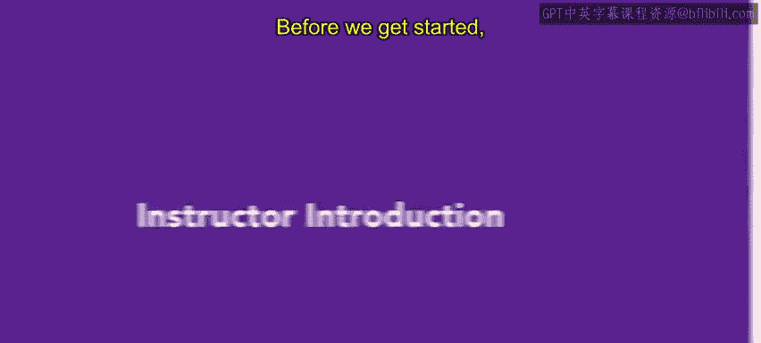

# HRCI人力资源助理课程：P3：讲师介绍

在本节课中，我们将了解本课程的讲师背景，这有助于你理解课程内容所基于的实践经验。

## 讲师背景与经验

在开始正式课程之前，我们先来认识一下今天的讲师。我是米歇尔·阿瓦拉多。

我的整个职业生涯都专注于人力资源领域。我的起点是在应用材料公司担任人力资源通才。在那家大型公司近三年的工作经历，让我对公司内部不同的人力资源角色有了相当深入的了解。

## 从通才到管理者

上一节我们了解了讲师的起点，本节中我们来看看她职业道路的发展。我将从应用材料公司积累的经验带到了TVo公司，并担任人力资源经理。最初，我是那里唯一的人力资源负责人。我的职责涵盖了人力资源的各个方面，包括**薪酬**、**福利**、**招聘**和**入职**。在这个角色中，我学到了人力资源实践中许多具体的操作细节。

在TVo公司的17年间，我担任过多个专注于人力资源不同领域的职位，并见证了公司和人力资源团队的成长。在TVo的最后五年，我担任人力资源副总裁，负责整个人力资源职能。

## 咨询与领导角色

从专精管理角色出发，讲师进一步拓宽了她的视野。之后，我转向为高科技公司提供咨询服务。这段经历让我真正有机会了解不同的企业以及人力资源在不同公司是如何运作的。我从事咨询工作两年。

此后，我在两家公司——Halio和Uster——担任人力资源负责人。在我所担任的每一个人力资源职位中，我都负责或接触过人才招聘流程的某个环节。

## 课程价值

基于以上丰富的实践经验，本课程将为你打下坚实的人力资源基础，供你进一步构建专业知识。

本节课中，我们一起学习了讲师米歇尔·阿瓦拉多女士在人力资源领域从通才、经理、副总裁到咨询顾问和部门负责人的完整职业路径。她的多元经验确保了本课程内容兼具广度与深度，紧密联系实际工作场景。