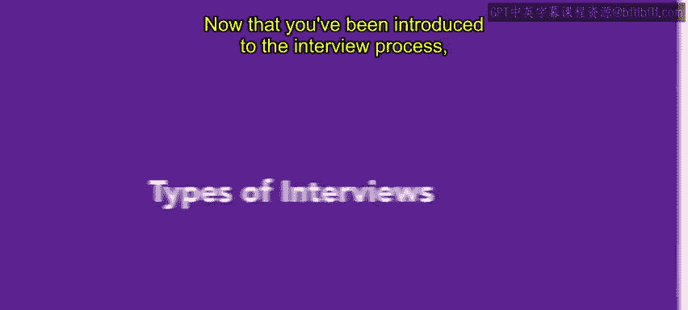
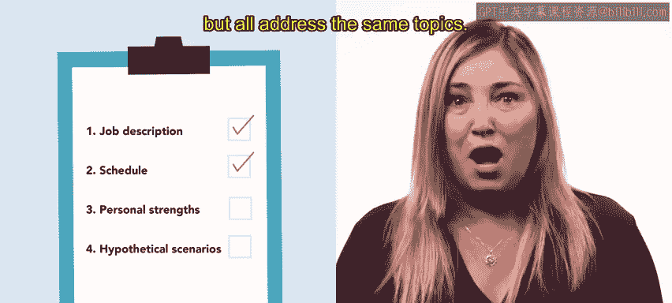
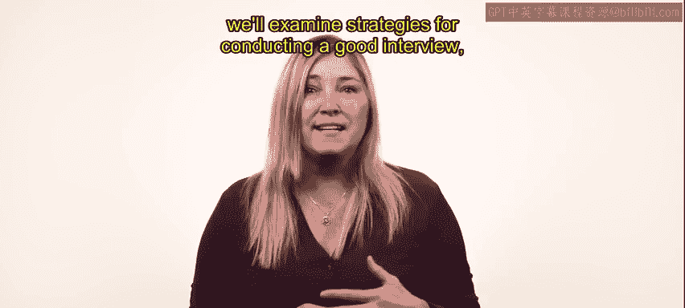

# HRCI人力资源助理课程：第3课：面试类型 🎯

在本节课中，我们将学习几种不同的面试类型。了解每种类型的优势，有助于你根据招聘目标选择最有效的方式。

上一节我们介绍了面试流程，本节中我们来看看几种具体的面试类型。

## 集体面试 👥

集体面试是指同时面试多位候选人。这种类型有助于直接比较候选人对同一问题的回答。同时，它允许你观察候选人之间的互动方式，从而洞察他们与他人协作的能力。

## 小组或委员会面试 👨‍👩‍👧‍👦

在小组面试中，多位面试官同时参与。所有小组成员都可能提问，或者由一位主要面试官负责大部分提问，其他成员则进行观察。

## 行为面试 📝

有时你需要了解候选人对特定情境的反应，行为面试在此情况下很有帮助。在行为面试中，候选人被要求解释他们过去如何应对问题或事件。其假设是，过去的行为可以预测员工未来在类似情况下的反应。面试中关注的问题和事件应与职位具体且重要的方面相关。

## 假设性/情境面试 🤔

行为面试关注员工过去的行为，而假设性面试则询问候选人未来将如何应对想象中的情境。这也被称为情境面试。

## 模式化面试 📋

模式化面试按主题进行。候选人可能被问到不同的问题，但所有问题都围绕相同的主题展开。

以上我们介绍了几种常见的面试类型，接下来还有几种类型需要了解。

## 指令性/结构化面试 🧱

指令性面试较为刻板。面试官会向候选人提出一套预先设定好的问题。这也被称为结构化面试。

## 非指令性面试 🗣️

非指令性面试比指令性面试更不正式。作为面试官，你会提出宽泛的开放式问题。开放式问题允许候选人引导对话。这种面试可以深入了解候选人的性格和个性，但由于每次对话可能涉及不同的问题和话题，因此难以一致地评估候选人。

## 半结构化面试 ⚖️

半结构化面试在指令性和非指令性方法之间取得了平衡。你提前准备一些关键问题，但也可以根据候选人的回答自由提出后续问题或探讨不同议题。

## 压力面试 😰

最后是压力面试，它将候选人置于焦虑和紧张的情境中，以观察他们的反应。当你评估的候选人将在工作中经常遇到压力情境时，这种面试最为有用。

你的组织需求和试图填补的职位角色需要不同的方法来获取正确的信息。现在你已经对不同类型的面试及其如何用于为组织寻找最佳候选人有了很好的了解。在本课后面的部分，我们将探讨进行良好面试的策略以及需要避免的事项。

**本节课总结**：我们一起学习了多种面试类型，包括集体面试、小组面试、行为面试、假设性面试、模式化面试、指令性面试、非指令性面试、半结构化面试和压力面试。每种类型都有其适用场景和优势，理解它们有助于你根据具体的招聘目标和职位要求，选择并组合最有效的面试方法。