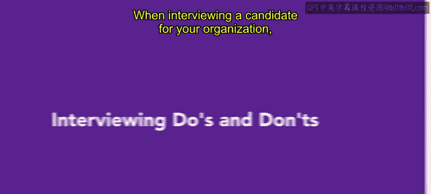
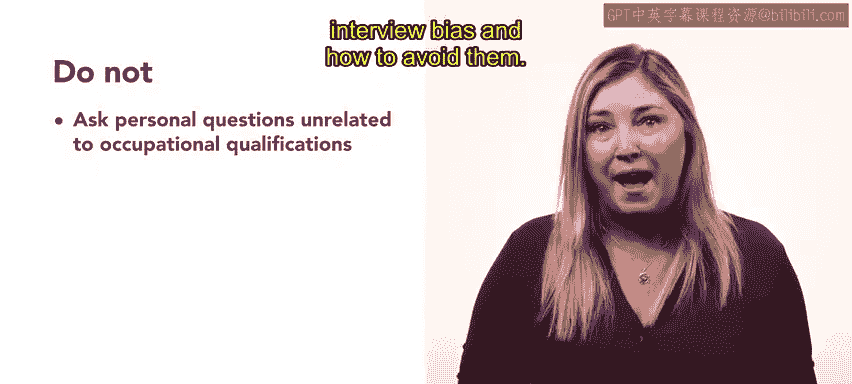
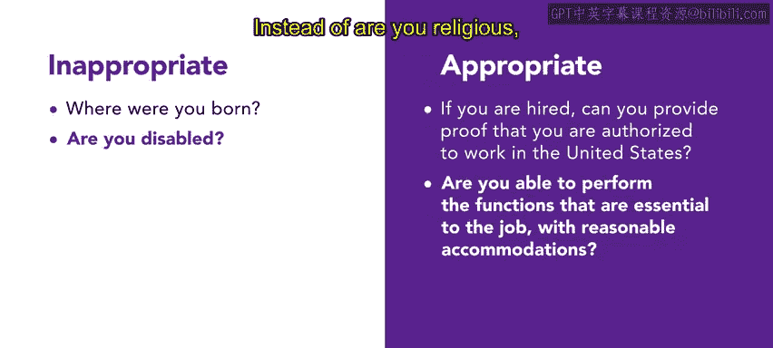
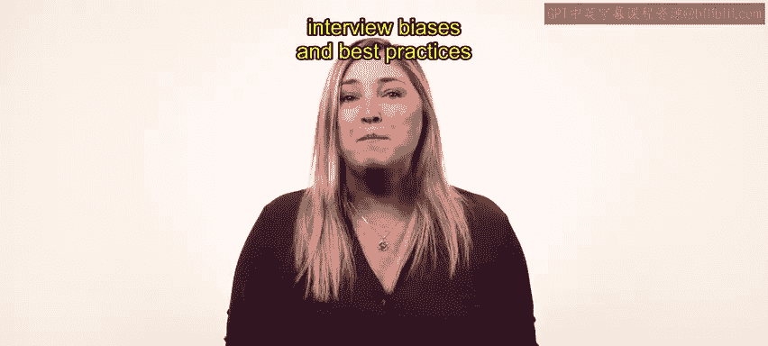

# HRCI《人力资源助理（招聘、学习发展、薪酬福利，1-3课／共5课）》：P41：面试的注意事项

## 概述
在本节课中，我们将学习如何有效地进行面试，确保问题既能帮助甄选最合适的候选人，又能避免法律风险。我们将重点探讨面试中应该做什么和不应该做什么。

## 面试中的“应该做” ✅
上一节我们介绍了课程概述，本节中我们来看看面试中应该遵循的原则。核心目标是确保所有问题都与职位相关，并能公平地比较候选人。

以下是面试中应该做的两件事：

1.  **只问与职位相关的问题**：所有问题都应围绕该职位所需的**任务或技能**。例如，如果招聘社交媒体营销人员，可以问：“你最喜欢的社交媒体平台是什么？为什么？”但这个问题不适合数据分析师的面试。
2.  **向所有候选人提问相同或主题一致的问题**：这有助于**比较候选人的回答**，确保评估标准一致。

## 面试中的“不要做” ❌
了解了应该遵循的原则后，我们来看看面试中需要避免的陷阱。关键在于避免提出与工作能力无关或可能引发偏见的问题。

以下是面试中不应该做的两件事：

1.  **避免询问个人性质或与工作资格无关的问题**：例如，不应询问候选人的出生地。这类问题无助于评估工作表现，还可能引入无意识的偏见。
2.  **绝对避免询问受法律保护的类别信息**：这包括种族、宗教、年龄、婚姻状况等。这些个人属性与工作能力无关，且受法律保护。询问此类问题不仅是非法的，还可能在选拔过程中导致歧视。

## 不恰当与恰当问题的对比 🔄
为了更清晰地理解，我们通过一个对比来区分不恰当与恰当的面试问题。

以下是一些问题重构的例子：

*   **不恰当**：“你出生在哪里？”
    **恰当**：“如果被录用，你能提供在美国合法工作的证明吗？”（此问题与工作资格相关）
*   **不恰当**：“你有残疾吗？”
    **恰当**：“在提供合理便利的情况下，你能否履行该职位的基本职能？”（此问题关注工作能力）
*   **不恰当**：“你有宗教信仰吗？如果有，你愿意在周日工作吗？”
    **恰当**：“这份工作需要员工在周末工作。你能做到吗？”（此问题聚焦于工作安排本身）

这些重构后的问题都与工作职能直接相关，既不会引入偏见，也遵守了反歧视法律。

## 总结
本节课中我们一起学习了面试的核心注意事项。让我们回顾一下要点：**保持面试问题与工作相关**；**向所有候选人提问相同的问题**；**不要询问关于受保护类别的个人问题**。牢记这些简单的技巧，将帮助你确定最佳候选人并确保合法合规。

在后续课程中，你将了解面试偏见的类型，以及如何组建多元化的面试小组的最佳实践。