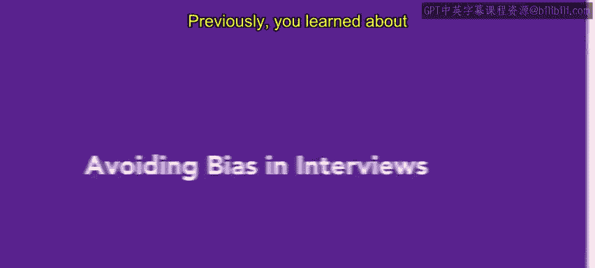
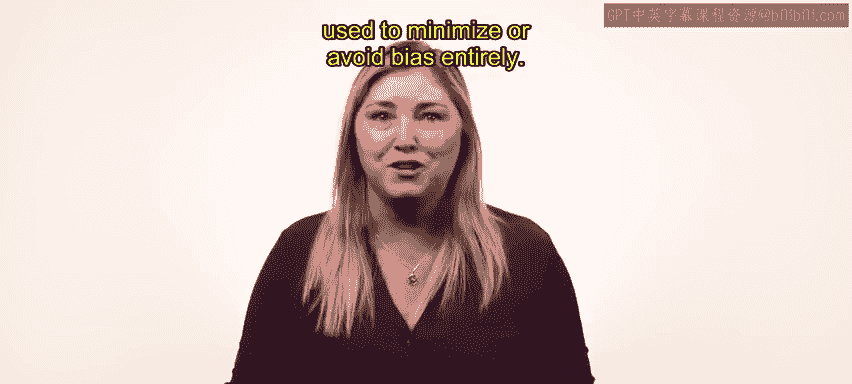
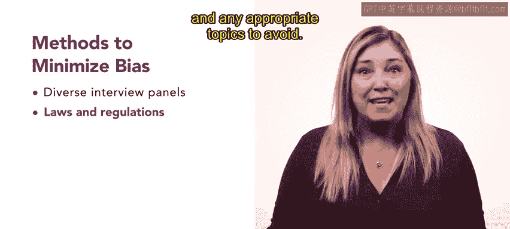
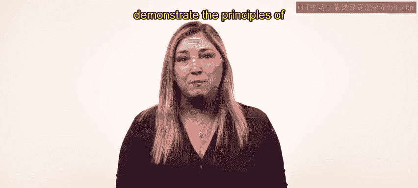

# HRCI人力资源助理课程：第3课：避免面试偏见

在本节课中，我们将学习如何在招聘面试中识别并最小化偏见，以确保选拔过程的公平与客观。我们将探讨组建多元化面试小组、进行无意识偏见培训以及建立标准化选拔流程等具体方法。

## 概述面试偏见

上一节我们介绍了面试中可能出现的各种偏见类型。本节中，我们来看看如何通过具体措施来避免或减少这些偏见。

面试过程中的参与者容易做出判断错误，表现出内群体偏爱或受到无意识偏见的影响。现在，我们讨论几种可以最小化或完全避免偏见的方法。

## 组建多元化面试小组

以下是组建有效面试小组的关键步骤。

*   **确保小组多样性**：组建一个多元化的面试小组至关重要。这体现了组织在员工入职之初就对多元化和包容性的承诺。多元化小组有助于评估和欣赏每位候选人为组织带来的能力和多样性。
*   **明确法律与要求**：必须让面试小组成员了解相关的州和联邦非歧视与平等就业机会法律。所有成员都应知晓受保护的类别或其他影响面试问题及应避免话题的法规。同时，应明确多元化面试小组的具体要求，例如规定小组至少包含两名来自代表性不足群体的成员。
*   **赋能与目标一致**：在面试开始前，应告知小组成员组织的政策、目标，以及他们的决策如何助力实现多元化目标。有效的成员必须认同组织的多元化和包容性目标。参与者需清楚他们的意见将如何被考量与重视。

## 实施无意识偏见培训

如果无法实现小组多样性，成员则必须接受培训以识别可能影响决策过程的因素。每个面试小组都应具备多样性或接受过避免无意识偏见的培训。

参与者应从专家或顾问那里接受无意识偏见培训。这种培训可以最小化内部偏见对候选人选拔过程的影响。

一次成功的无意识偏见培训应提供可应用的案例。员工们可以讨论与面试或招聘决策相关的假设场景。

## 建立标准化选拔流程

最后，建立候选人选拔流程至关重要。必须制定一个经过公平性审查的书面流程。

该流程应包含选拔后审查。审查应检视是否某些背景或经验相似的候选人比其他人在面试过程中走得更远。

*   **明确职位能力**：该职位的胜任能力应易于识别和明确定义。
*   **使用统一问题**：应向每位候选人提出相同的问题（无论是开放式还是基于场景的），并且问题始终与职位要求相关。
*   **纳入DEI问题**：在面试中至少包含一个关于多元化、公平与包容的问题，可以向候选人表明组织认真对待其多元化和包容性努力。

## 总结与预告

本节课中，我们一起学习了如何通过组建多元化面试小组、进行无意识偏见培训以及建立标准化流程来有效避免面试偏见。建立一套通过结构和教育来解决这些问题的系统，有助于为组织产生最佳结果。

接下来，你将通过一个面试示例，来演示截至目前所学的面试原则。