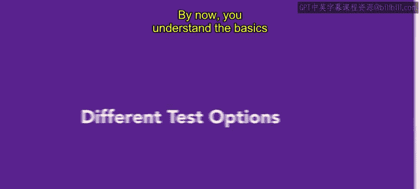
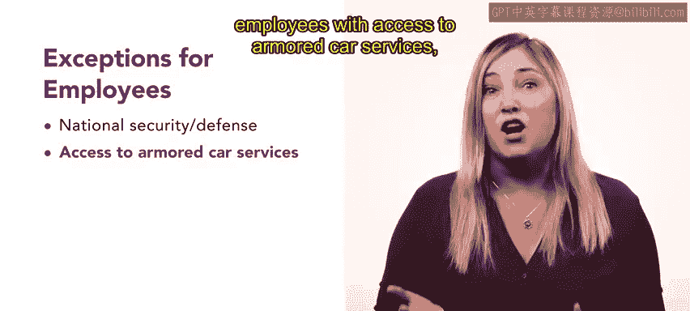

# HRCI《人力资源助理（招聘、学习发展、薪酬福利，1-3课／共5课）｜HRCI Human Resource Associate》 - P47：46_不同的测试选项.zh_en - GPT中英字幕课程资源 - BV1qi421r7ba

By now， you understand the basics of evaluating prospective employees。In this video。

 we will explore this concept further and learn about different types of pre employmentment tests organizations use to evaluate potential employees。

 including paper pencil， medical， hands on and polygraph tests。

Let's begin by discussing the types of tests that fall into each category and what employers should consider when administering them。

Paper pencil tests are written preempment tests。 However， many are now computerized。

 These commonly test employees for factors like general aptitude or intelligence， integrity。

 personality type， language fluency and knowledge specific to a role， Remember。

 all tests must be relevant to the job。 but employers should consider the test validity， too。

 For example， can a very bright applicant figure out what the employer is looking for and respond what the answers that reflect that。

😊，During the hiring process， employers might require applicants to undergo specific medical tests to ensure they are physically capable of performing the job duties medical tests can include a physical examination or drug testing。

 However， employers must be cautious not to use physical examinations to screen out applicants with disabilities unfairly  employers might also use handson test to assess an applicant's ability to perform a role These can include skills tests such as typing。

 drafting a letter and operating machinery。😊，If operating a vehicle is required for the job。

 a driving test might also be administered。In basket exercises are also common。

 this is where applicants are asked to sort memos and other documents to determine which items require priority。

😊，Another option is a try out or trial period where an applicant is paid to perform the job for a set time to see whether they would be a good fit on a permanent basis。

A short term consulting arrangement might also be used to evaluate whether an applicant fits the role and meets the performance requirements。

😊，Work sample reviews are common for creative rules such as writing or graphic design。

 These evaluations can be conducted at an assessment center to best measure a job candidate's ability to fulfill different job requirements。

 The assessment center might use a combination of interviews in basket tests。

 role playing exercises and group discussions to evaluate candidates。😊，Due to their high cost。

 assessment centers are most often used by state and local governments and large corporations and not as much by smaller organizations。

Lastly， we had polygraph tests。Although the Employee Polygraph Act of 1988 restricts employers from using polygraph tests on employees。

 there are some exceptions， national security or defense employees。

 employees with access to armored car services and employees working with pharmaceutical products might be required to take a polygraph test。

Additionally， prospective employees might be required to take a polygraph test if they are investigated for a financial loss or damage to a previous company。

Understanding these pre employment assessment methods allows hiring teams to decide which evaluation methods are relevant for specific positions。

Next， you will explore additional methods for evaluating potential employees。

