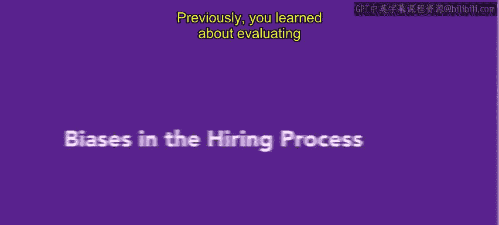
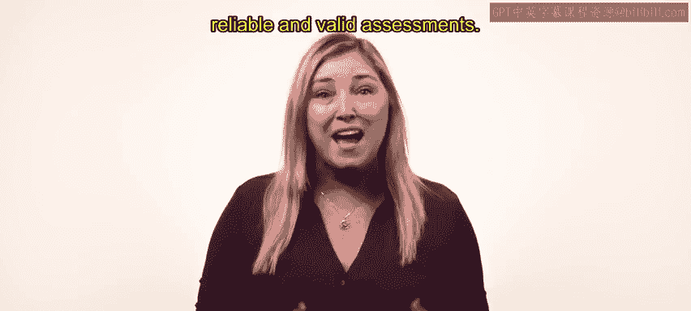
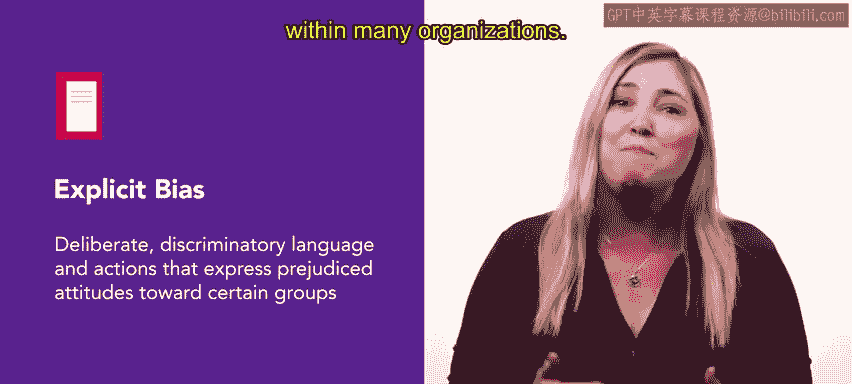
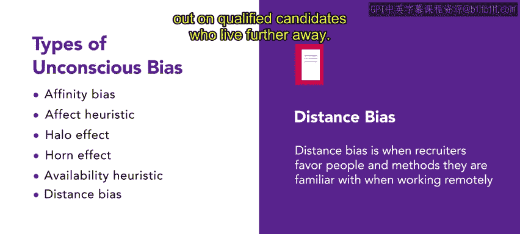
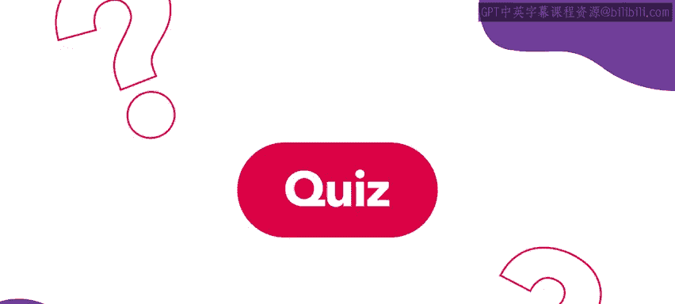
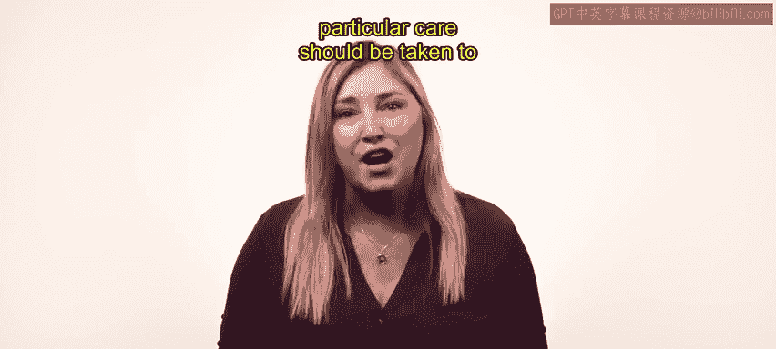

# HRCI《人力资源助理（招聘、学习发展、薪酬福利，1-3课／共5课）｜HRCI Human Resource Associate》 - P49：48_招聘过程中的偏见.zh_en - GPT中英字幕课程资源 - BV1qi421r7ba

Previously， you learned about evaluating prospective employees with reliable and valid assessments In this video。

 we will discuss different biases that can enter the hiring process。

 as you get closer to the end of the selection process， it's necessary to consider the role。

 bias plays in the hiring process during the interview and selection stages。

 before we dive into how to address biases。 Let's define and understand the two types of biases that exist。

 explicit and unconscious biases。 explicit bias refers to deliberate。

 discriminatory language and actions that express prejudice attitudes towards certain groups。

 Although explicit stereotypes are less common and illegal under civil rights legislation and equal employment opportunity Commission regulations。

 biases persist in individual and systemic behaviors。😊。

Within many organizations。The upside is that organizations can develop policies and procedures to address explicitly discriminatory language and actions。

 unconsciouscons bias， on the other hand， refers to the stereotypes people unconsciously form about specific groups based on past experiences and social conditioning。

 These biases are often challenging to identify and are used by the brain for quick and automatic decisions that might not involve conscious reflection。

😊，Now， let's explore some of the most common types of unconscious bias found in recruitment and hiring。

 Remember， these biases happen automatically and are often outside our awareness。

 The first unconscious bias is affinity bias。 also known as similarity bias。

 which is the tendency to show favoritism and build rapport with people who share similar physical attributes。

 beliefs， experiences or backgrounds。😊，An example of this is when a hiring manager favors a candidate who is raised in a similar household。

 believing that the candidate will be a good fit for the organization。 Next is effect heuristic。

 which is a bias where an individual makes decisions based mainly or entirely on their emotions。😊。

In a positive scenario， for example， a candidate can mention they like a certain sports team。

 if the interviewer also supports the same team， they are likely to develop a positive bias towards the candidate and be less critical of them or favor them during the interview process。

😊，A negative scenario， however， might happen if a candidate has the same last name as someone the interviewer dislikes。

 which puts them in a negative emotional state。 As a result。

 the interviewer becomes critical during the interview and focuses on the candidate's flaws and risks。

😊，Another common bias is the halo effect。 This occurs when an individual lets their overall impression influence their opinions。

 emotions and behavior towards a person。 For example。

 an employer might have a favorable view of candidates who show up early for an interview and might decide to hire them without thoroughly assessing whether they are qualified or a good fit for the job。

😊，The H effect， also known as the H's bias， refers to the tendency to form an unfavorable opinion based on a single negative trait。

 which might only be deemed negative due to past experiences。 For example。

 an interviewer might notice a tattoo under a candidate's shirt similar to a previous employee who performed unsatisfactorily。

As a result， the interviewer immediately develops a negative impression of the candidate。

 even though the tattoo is irrelevant to their qualifications or job performance。

 you might notice some similarities between the horn effect and effect heuristic。 Remember。

 the horn effect focuses on a single negative trait。

 whereas effect heuristic relies on emotions to make decisions。😊，Now， on to availability heuristic。

 also known as the availability bias， when making decisions。

 individuals might believe that vivid or memorable events they remember immediately are more representative than they actually are。

😊，For example， a hiring manager might choose a candidate based on their attire。

 despite the candidate having similar qualifications as another candidate。

 because the memory of the first candidate's untidy attire is more vivid and memorable。Lastly。

 we have distance bias。 Dis bias is when recruiters favor people and methods they are familiar with when working remotely。

 This happens because building trust and having face to face interactions can be hard when working from a distance。

 So recruiters might rely more on people and things they already know to reduce the challenges of remote work。

😊，For example， a recruiter conducting virtual interviews or remote onboarding might prefer candidates who live close to the organization because they are familiar with the local talent pool and have established relationships。

 However， this can cause them to miss out on qualified candidates who live further away。😊。

You've just learned about several unconscious biases that can influence HR and selection processes。

 These biases can lead to poor learning decisions and might exclude qualified candidates。

 and because unconscious bias is often more difficult to identify and address。

 particular care should be taken to reduce its impact on the selection process。😊。

Coming up， you'll explore these biases with an example。

