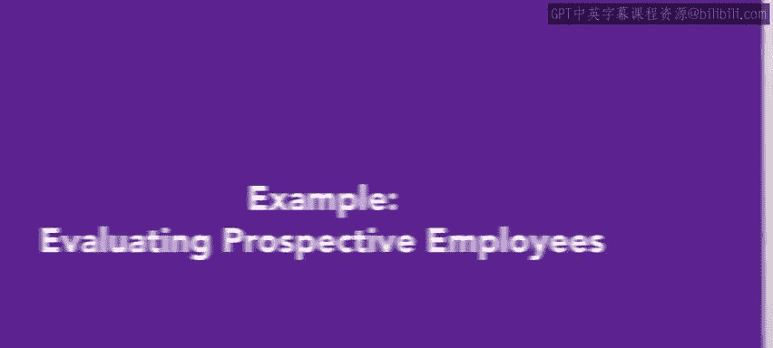
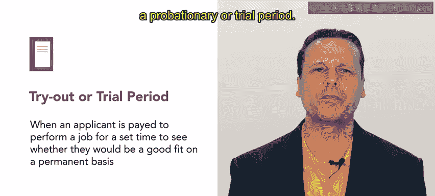

# HRCI《人力资源助理（招聘、学习发展、薪酬福利，1-3课／共5课）》：P50：示例：评估潜在员工

## 📋 课程概述
在本节课中，我们将通过一个真实世界的场景，学习如何在面试过程中或面试结束后评估潜在员工。我们将了解人力资源经理如何评估候选人的能力，以及组织可以运行的各种审查和测试类型。

---

## 🏢 场景介绍：Connective 通信公司
上一节我们介绍了面试流程，本节中我们来看看在面试之后，如何对候选人进行评估和审查。

Connective 是一家现代化的通信公司，其业务是帮助企业保持联系。该公司专注于帮助分布式团队通过一套软件工具（如视频会议和基于云的电话系统）进行协作。

人力资源部的 Alex 正在努力填补一个销售职位。在一次成功的大型营销活动之后，销售团队一直难以满足激增的需求。

---

## 👤 候选人背景：Mika
我们之前已经认识了正在应聘初级销售代表职位的 Mika。面试过程进展顺利。现在，Alex 将开始进行背景审查。

以下是 Alex 为评估 Mika 所采取的步骤：

1.  **背景审查与搜索**
    背景审查和搜索是相当标准的流程，Connective 公司对每一位潜在候选人都会进行。Alex 在进行任何搜索时都会非常谨慎，并会审查当地的法律法规。例如，Mika 居住在加利福尼亚州，因此 Alex 只有在职位适用的情况下才能进行信用检查。由于初级销售职位不涉及财务托管责任，所以 Alex 没有进行信用检查。

2.  **获取候选人许可**
    Alex 征求了 Mika 的同意以进行审查和搜索，并发送了需要 Mika 填写和签署的请求表格。根据《公平信用报告法》和公平就业机会委员会的规定，在获取这些报告之前，必须征得申请人的许可。

3.  **审查结果**
    背景审查结果清晰，没有 Alex 或 Connective 需要担心的未决问题。

---

## 📊 心理测评测试
除了背景审查，Connective 公司还喜欢进行心理测评测试。这种测试不会直接改变对新员工的任何安排，但其目的是帮助人力资源部门和管理者更好地了解并与新团队成员沟通。

销售团队负责人对 Mika 很感兴趣，但对其有限的销售经验有些担忧。因此，销售团队负责人和 Alex 询问 Mika 是否愿意接受一个试用期或考察期。

Mika 同意了这项测试。计划是让 Mika 进行为期三个月的试用，在此期间向团队学习。

---

## ✅ 试用期与最终决定
如果试用期一切顺利，Mika 将继续作为公司的全职员工。目前，我们就将 Alex 和 Mika 的故事讲到这里。

不同的组织对候选人的评估需求各不相同。Connective 公司运行的是相当标准的审查和测试。同时，Connective 的人力资源团队也坚持对申请同一职位的所有人进行相同的测试，以确保没有任何测试或审查被不当执行。

---

## 🎯 本节总结
在本节课中，我们一起学习了如何通过审查和测试来评估潜在员工。我们了解到：

*   背景审查是标准流程，但必须遵守法律法规并获取候选人许可。
*   心理测评等测试有助于团队更好地整合新成员。
*   试用期是评估候选人实际工作能力的有效方式。
*   评估流程应保持**简单、可重复且公平**（`simple, repeatable, and fair`），对同一职位的所有申请人一视同仁。

测试和审查是评估候选人的一种简单且可重复的方法。在你未来的人力资源工作中，很可能需要进行许多候选人评估。在接下来的课程中，你将学习关于谈判和入职的最后一周内容。