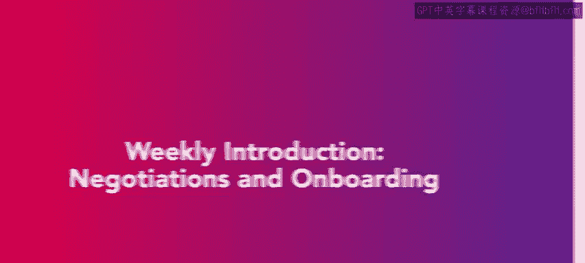
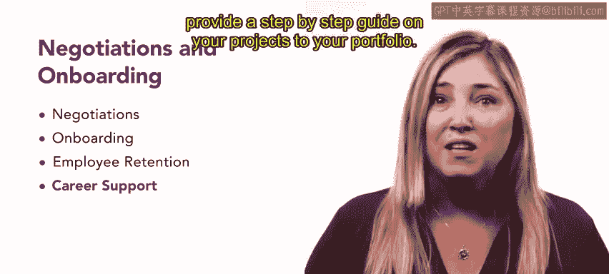

# HRCI《人力资源助理（招聘、学习发展、薪酬福利，1-3课／共5课）》：P52：51_每周介绍：谈判和入职 🎯

欢迎来到本课程的最终周。在完成第三周的学习后，你应该对人才获取的众多组成部分有了全面的理解。在本节课中，我们将要学习谈判与入职流程、员工保留策略，以及如何有效地在作品集中展示你的项目。

## 谈判流程详解 💼

上一节我们介绍了课程概述，本节中我们来看看谈判流程。我们将从讨论谈判过程开始。

我们将重点介绍完整的薪酬方案及其包含的条款。我们会区分雇佣合同与录用通知书。我们将探讨常见的合同条款，并使用我们的虚构公司来模拟现实世界的谈判场景。

## 入职流程定义与实践 📝

在了解了谈判之后，本节我们将探讨入职流程。我们将首先定义入职并介绍其方法，同时提供一个入职流程的示例，例如员工在第一周可能需要处理的任务。

我们还将涵盖员工入职的最佳实践，包括员工手册的核心组成部分。我们将学习每个元素、它们之间的区别，以及为何它们对成功的入职至关重要。

此外，我们将定义包容性入职，解释其重要性，并介绍包容性入职计划的关键要素。

## 员工保留策略与成本分析 🔄

掌握了入职流程，接下来我们探索员工保留。我们将探讨有助于在组织内保留人才的各类活动和策略。

我们也会讨论招聘和培训的成本，并解释为何保留员工至关重要。

## 项目展示与职业发展支持 🚀

最后，为了结束本课程，我们将提供关于如何在作品集中有效展示项目的信息和技巧。我们将讨论你可用的职业支持资源，并提供一份将项目添加到作品集的逐步指南，包括一份LinkedIn操作说明。

到本课结束时，你将更好地理解如何向潜在雇主展示你的工作并推动职业发展。

让我们从第一课开始，学习关于谈判的知识。

本节课中我们一起学习了谈判与入职的核心流程、员工保留的重要性及其策略，以及如何包装和展示个人项目以促进职业发展。这些知识将帮助你更专业地处理人力资源中的关键环节。