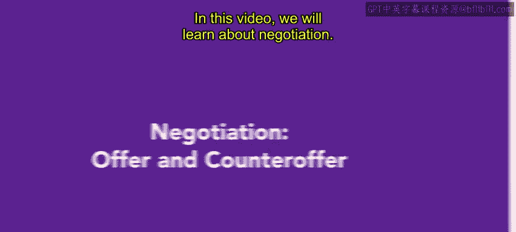
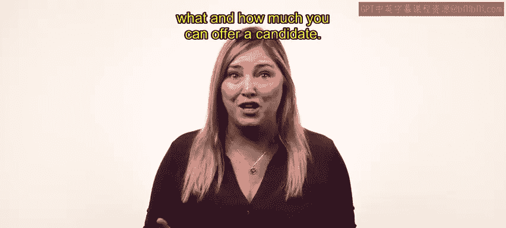
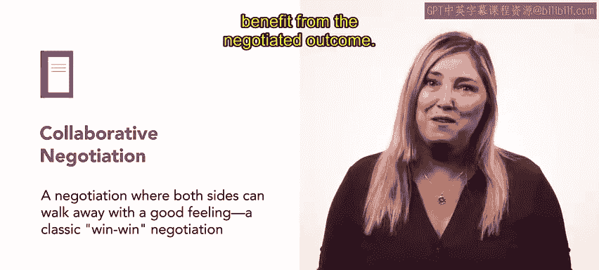
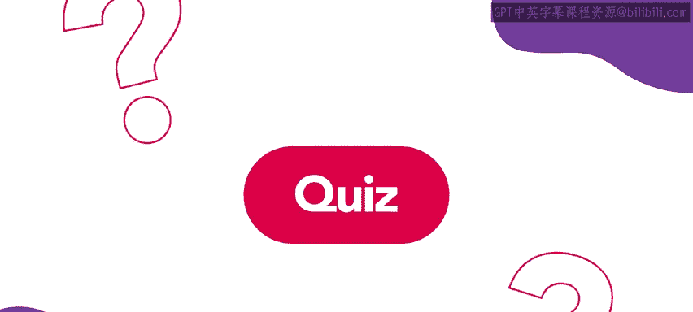
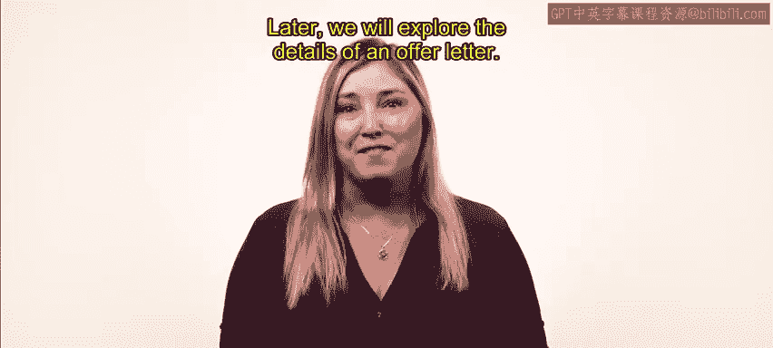

# HRCI《人力资源助理（招聘、学习发展、薪酬福利，1-3课／共5课）｜HRCI Human Resource Associate》 - P53：52_谈判：录用和反录用.zh_en - GPT中英字幕课程资源 - BV1qi421r7ba

In this video， we will learn about negotiation。 This process occurs after extending an offer letter to a candidate。

 The key to a successful negotiation is to enter with a clear understanding of what and how much you can offer a candidate。

😊。

There are three main parts of the negotiation process， counteroffers。

 reservation price and collaborative negotiation， let's explore what these terms mean。

After a candidate receives an initial offer， they may reply with a counter offer。

 a candidate's request for a change to an initial offer candidatesidates might determine their counteroffer based on many things。

 including years of experience， education， and the industry average for the position。

Prepare for a counteroffer by determining in advance what you can and cannot offer to a candidate Understanding what you are able to offer is helpful to ensure a smooth negotiation。

 Another great way to ensure a smooth negotiation is to be aware of your reservation price。

 A reservation price is the highest possible benefits or salary you can offer a candidate。

 It is often referred to as the walkaway point。 because when a candidate declines this offer。

 both parties typically walk away from the negotiation。😊。

Identifying the reservation price for role in your company will help you avoid making offers you can't fulfill。

 The final aspect of a smooth negotiation is called collaborative negotiation。

 a collaborative negotiation is a win win where both sides work together towards a desired outcome when negotiating with a candidate。

 The goal is to agree on an offer that suits the needs and expectations of your organization and your future employee。

😊，You should enter collaborative negotiations by first defining a zone of possible agreement or ZPA for short。

 a ZPA identifies where the interests of a candidate and your organization overlap。

Defining these mutual interests will help you find the upper and lower limits of a possible agreement。

Using these mutual interests to guide the negotiation will ensure that both parties benefit from the negotiated outcome。

Once both parties have reached agreement and offer letter should be finalized。

 the offer letter should clearly outline the terms of the offer， such as salary， benefits， perks。

 and any special terms agreed upon during the negotiation。😊，Negotiations are challenging。

 but extremely rewarding。 If they seem daunting at first， don't worry， it is an art。

 and you will certainly get better with experience。 Later。

 we will explore the details of an offer letter。😊。

