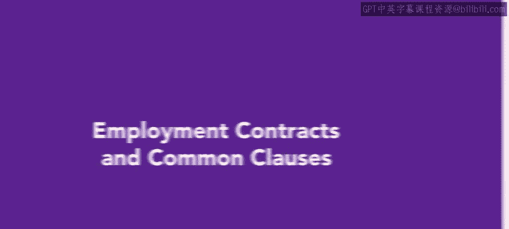
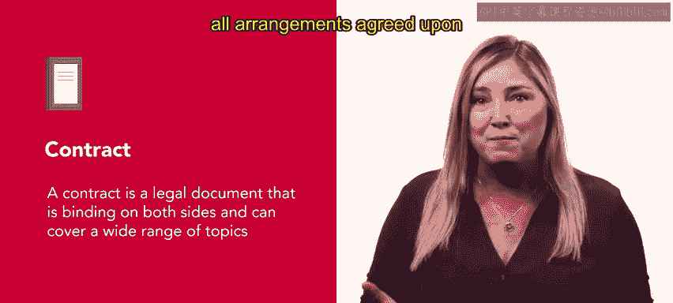
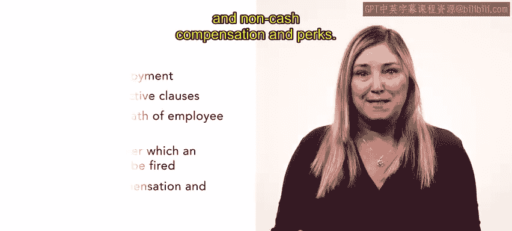

# HRCI《人力资源助理（招聘、学习发展、薪酬福利，1-3课／共5课）｜HRCI Human Resource Associate》 - P54：53_雇佣合同和常见条款.zh_en - GPT中英字幕课程资源 - BV1qi421r7ba

Now that you have learned how to negotiate an offer。

 we will discuss how to formalize offers in an employment contract and some clauses that are commonly included in contracts A contract is a legal document that is binding on both sides。

 and it can cover a wide range of topics， Any areas not specified in the contract are subject to common law Employ contract entail all arrangements agreed upon by the employer and employee。

😊。

An employment contract may not always be necessary， but it is needed in some cases。

 especially those involving senior executives。 some basic items often covered in a contract are the salary。

 benefits and scope of duties that have been agreed upon by both the employer and employee。

These would have been finalized through any negotiations after the initial offer was extended。

In addition to these items， there are a few clauses that are often necessary in employment contracts。

 First， a non-disclosure clause This clause requires that the employee maintain the confidentiality of proprietary information This clause is especially necessary in positions where sensitive or innovative information is exchanged a noncopy clause requires that the employee cannot seek employment with a competitor for a specified time after leaving the company Noncopy clauses are intended to prevent former employees from taking knowledge or information gathered from a position to a new job with a competitor。

A non solicitation clause requires that the employee cannot solicit or approach the employer's customers。

 vendors， or employees for a specified period after leaving the company。

Non solicitation clauses are often used with positions that require the employee to form close relationships with clients。

Another common clause is a termination clause。 A termination clause defines the conditions or causes that can result in the employee being terminated。

 This clause will often include how much notice must be given to the employee of termination along with any severance that might be owed to the employee Lastly。

 a change of control clause protects the employee's compensation or provides additional compensation in the event of a corporate reorganization。

 acquisition or merger。😊，Though similar， employee contracts and offer letters are different。

 Off letters outline the terms of the employment offer， including items like salary。

 benefits and other perks。 Off letters also should include other terms of employment such as the medical exam or background check。

 Any other special terms should also be included in an offer letter and important note is that an offer letter should always include that the company is an at will employer Employ contracts often cover a wider range of topics than offer letters。

 Unlike offer letters， employee contracts are legally binding documents。

 Some items that are typically covered in a contract。

 but aren't covered in an offer letter are a length of employment。 Common restrictive clauses。

 disability or a death of employee clauses， Con under which an employee may be fired。

 and noncash compensation in perks。😊。

As an HR professional， understanding employee contracts is key for a smooth negotiation。

 onboarding and orientation process， knowing the differences between a contract and an offer letter will help you determine when you might need to use one over the other Later。

 you'll learn more about onboarding a new employee after they've accepted an offer。😊。

