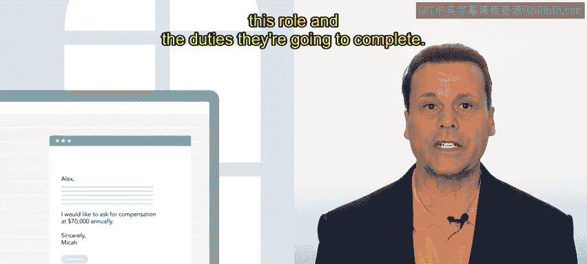
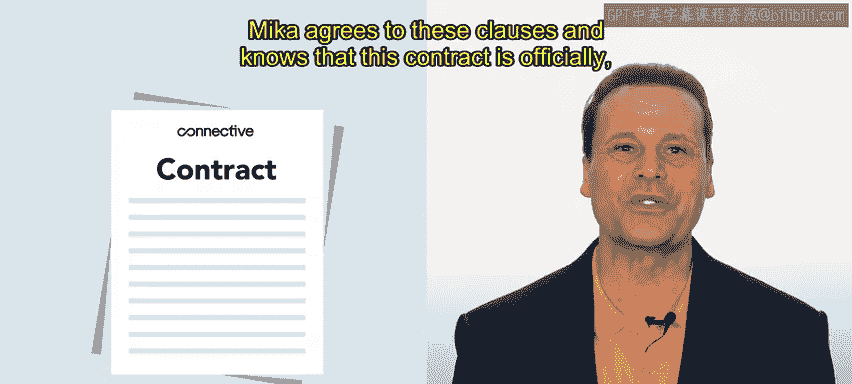

# HRCI人力资源助理课程：P55：示例：谈判 💼

在本节课中，我们将通过一个真实世界的场景，学习如何与候选人进行谈判。我们将跟随人力资源专员Alex的视角，看他如何为一家名为Connective的公司填补一个销售职位空缺，并与候选人Mika就雇佣条款进行协商。谈判是招聘过程中的关键环节，旨在达成对双方都有利的协议。

上一节我们介绍了面试环节，本节中我们来看看面试之后如何确定雇佣条款。

## 谈判背景与准备

Connective是一家现代化的通信公司，专门帮助企业保持联系。该公司通过一套软件工具（如视频会议和基于云的电话系统）帮助分布式团队进行协作。

人力资源专员Alex正在努力填补一个销售职位。在一次非常成功的市场营销活动之后，销售团队一直难以满足激增的需求。

此前，Alex面试了候选人Mika。Alex和销售团队在面试过程中对Mika印象很好，认为她非常适合这个职位。Mika也愿意接受一个试用期，以确保这个职位对双方都合适。这个试用期本质上是对Mika的一个更长期的评估。

为了敲定雇佣条款，Alex需要与Mika进行谈判。为了启动这个过程，Alex准备了一份录用通知书。

以下是Alex准备录用通知书时包含的关键信息：

*   **职位与职责**：Alex确保包含了关于职位和职责的具体信息。
*   **薪资分类**：Alex添加了该职位的薪资分类信息。
*   **薪酬与福利**：Alex明确了薪酬和福利待遇。
*   **雇佣性质**：Alex也确保提到了在Connective的雇佣是“随意雇佣”性质。

Alex为该职位提供了一个有竞争力的年薪：**$60,000**。根据该职位和预期的经验水平，人力资源和销售团队都认为这个薪资是公平的。

## 谈判过程与协商

Mika很高兴收到录用通知，但提出了一个还价。她期望的薪资更接近**$70,000**。Mika做了一些研究，认为这个数字更接近该职位及其职责的行业平均水平。

Alex知道，Connective公司为该职位设定的保留价格是**$65,000**。这是公司设定的薪资上限，超过这个数字就没有商量余地了。

Alex和Mika都希望达成协议，因此他们尝试进行协作式谈判。他们都希望找到一个让各方都满意的方案。

经过视频通话讨论，Alex和Mika同意了**$65,000**的薪资，但增加了Mika可以从Connective获得的股票数量。双方都很满意，Mika准备签署更新版的录用通知书和合同。

## 合同签订

与录用通知书类似，Connective公司为Alex提供了一个合同模板。合同包含了许多与录用通知书相同的信息，如职位名称、职责、薪酬和福利。

此外，合同还包括一些Connective在所有合同中都会包含的标准商业条款，即**保密与不披露条款**，以及**竞业禁止条款**。

Mika同意了这些条款，并明白这份合同具有正式的法律约束力。

## 谈判结果与总结

Connective公司的每个人都为Mika即将加入团队而感到兴奋。这次谈判是直接的，尽管Mika提出了还价，但最终结果让各方都感到满意。

Mika现在拿到了更新后的录用通知书和合同。一旦双方签署，入职引导和适应过程就可以开始了。

谈判可能很棘手，需要谨慎处理，但当各方都本着诚信进行谈判时，很可能最终会达成双赢的局面。

本节课中我们一起学习了谈判、录用通知书和合同的概述，这些知识可以在你未来的人力资源职业生涯中使用。接下来，你将学习关于入职引导和适应的内容。