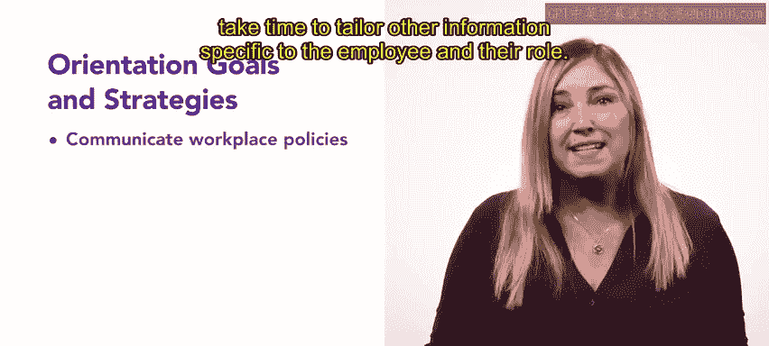

# HRCI人力资源助理课程：P57：员工入职培训

在本节课中，我们将要学习如何设计和实施一个成功的员工入职培训项目。入职培训是新员工或新晋升员工了解公司、融入团队、明确期望的关键环节，对于提升员工满意度、留存率和生产力至关重要。

## 🎯 入职培训的目的

上一节我们介绍了入职培训的重要性，本节中我们来看看其核心目的。入职培训的目的是为新入职或新晋升的员工提供必要信息，帮助他们成为组织的有效成员。

员工离开新公司，常常是因为他们在组织中缺乏归属感。一个成功的入职培训项目应让所有人感到受欢迎。该项目应确保新员工能够轻松提问、获取信息、解决问题并做出明智决策。这种积极主动的方法也能帮助员工避免潜在的错误。

此外，入职培训也能展示组织对持续改进和学习的承诺。

## 🎯 设定培训目标

在规划入职培训项目时，务必设定明确的目标。一些目标应适用于所有新员工，另一些则应根据员工的职位和职责进行定制。

以下是常见的入职培训目标：
*   **准备新员工**：使其成为组织的有效成员。
*   **推广沟通**：促进组织内最佳沟通实践。
*   **设定期望**：明确关于政策、绩效和程序的现实期望。
*   **介绍角色**：向员工介绍其角色及部门目标。
*   **目标对齐**：将员工个人目标与组织目标对齐。
*   **完成文书**：处理任何剩余的文书工作。

当然，有些目标比其他目标更容易实现。接下来，我们讨论一些实现其中几个目标的有效策略。

## 🤝 培养归属感

归属感是入职培训最重要的目标之一。员工成功与否往往取决于与团队的积极关系。

新员工应与最相关的团队成员和直属主管会面。在这些互动中，员工可以分享关于自己的信息。强调信任和真实性的团队关系与环境，将培养新员工和内部晋升员工的归属感。

## 📜 理解公司政策

另一个重要的入职培训目标是让员工透彻理解工作场所政策。当新员工在入职之初就熟悉政策时，他们对犯错的不安感会降低。

然而，高效地传达这些信息很重要，以避免让参与者感到不知所措。虽然有些政策和信息对所有员工是标准的，但花时间定制与员工角色相关的其他信息会很有帮助。

## 🔄 收集反馈与明确绩效

在入职培训后收集反馈也很重要，这将帮助你判断员工是否感到压力过大或无聊，并为未来改进你的项目。

最后一个重要的入职培训目标是让员工理解组织的绩效评估与衡量方式。务必包含关于绩效不佳的后果、员工如何防止误解，以及纪律审查或纠正措施的步骤等信息。

然而，理想情况下，关于绩效衡量与评估的对话应强调在组织内获得专业成长和晋升的机会。关于晋升、员工发展和调动的信息将帮助员工定义自己的长期目标。

## ✨ 总结

本节课中我们一起学习了成功入职培训的关键要素。一个全面的入职培训项目帮助新员工熟悉组织及其文化。在入职过程中提供恰当的指导和支持，能提升员工留存率、满意度和生产力。

后续课程中，你将了解更多关于入职流程的方法，以让员工在你的组织中感到受欢迎。