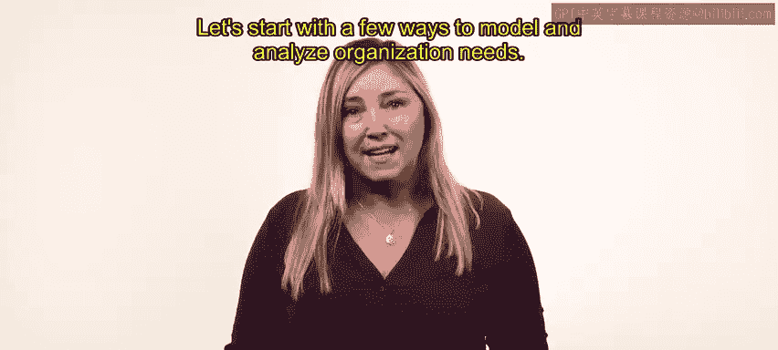
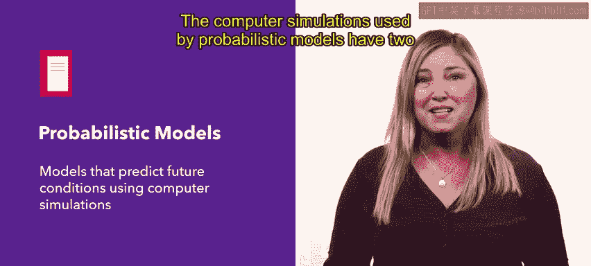
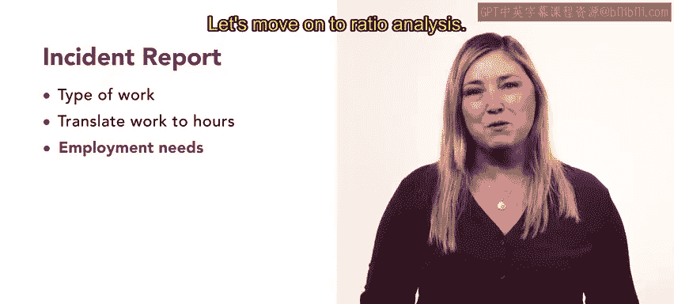
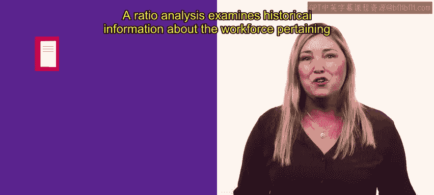
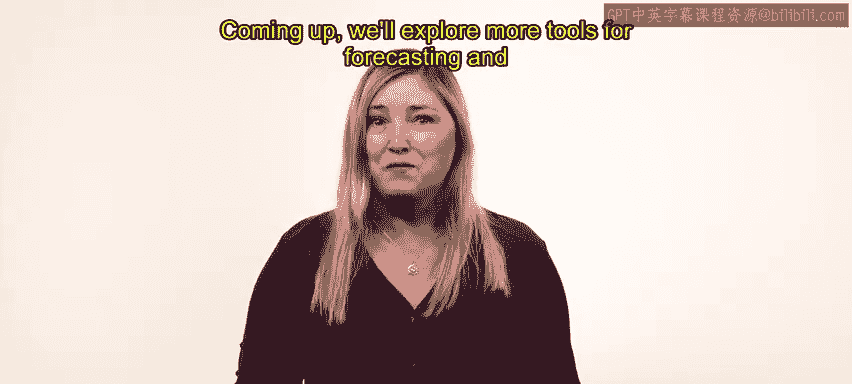

# HRCI人力资源助理课程：P5：预测劳动力需求 📊

在本节课中，我们将要学习人力资源专业人员需要掌握的一项核心技能：预测组织的劳动力需求。我们将探讨几种不同的预测方法，帮助你理解如何将组织的战略目标转化为具体的人员配置计划。

## 概述

预测劳动力需求是人力资源工具箱中的一项关键工具。它要求你根据组织的战略目标，确定需要填补或削减的具体岗位数量和类型。掌握这项技能，能让你更有效地支持组织的长远发展。

## 预测方法详解

上一节我们介绍了预测的重要性，本节中我们来看看几种具体的预测模型和分析方法。

### 单位需求法

单位需求法是一种基础方法。使用此方法时，你需要向各个单位或部门经理收集信息。

以下是实施此方法的两个关键步骤：
*   首先，请他们报告业务活动的量。
*   其次，请他们说明完成这些活动所需的人员数量。

为了获得整个组织的清晰图景，从多位单位经理处收集信息至关重要。最后，你可以将所有单位的反馈汇总起来，以确定组织未来几年的人员配置需求。

### 趋势预测法

趋势预测法用于预测未来的雇佣需求。其预测基于对特定雇佣相关因素随时间变化的预期。

例如，如果你的产品需要销售人员来推销，并且销售额预计会增长，那么未来你很可能需要更多的销售人员。

要理解这些趋势如何与雇佣需求相匹配，你需要充分了解影响组织人员配置的因素。回顾组织过去的表现，以及这些因素如何与工时需求相对应，是一个很好的起点。

### 概率模型法

与趋势预测类似，你也可以使用概率模型来获得洞察。概率模型通过计算机模拟来预测未来状况。

这些模型会基于提出的经济条件或组织变动来考虑可能的结果。概率模型使用的计算机模拟有两个潜在的局限性：
*   首先，其准确性完全取决于你提供的信息。
*   其次，随着为短期预测添加更多变量，模型可能变得成本高昂且难以处理。

### 工作量分析法

对于短期预测，工作量分析法会很有帮助。工作量分析旨在确定组织期望在近期实现的生产力产出，然后据此计算雇佣需求。

此分析分三个部分完成：
*   首先，确定实现生产力目标所需的工作类型。
*   然后，将工作转化为工时。例如，这些任务需要多少劳动力，以及需要多长时间。
*   最后，工作量预期可以转化为雇佣需求。

### 比率分析法

我们已经介绍了四种方法，接下来还有三种技术需要了解。让我们继续学习比率分析法。

比率分析法检查与组织特定方面（如销售或生产）相关的劳动力历史信息。

例如，在过去，一个团队需要每七名客户配备一名项目经理的比例。在下一季度，该团队预计将失去一名项目经理并增加14名新客户。使用比率分析，你可以确定组织需要雇佣三名新的项目经理来满足其需求。

### 德尔菲法

接下来，我们介绍德尔菲法。德尔菲技术通过结合许多从未谋面的专业人士的输入和专业知识来预测未来的工作需求，这些专家会随着时间的推移达成共识。

德尔菲法对于收集来自世界各地专业人士的判断和预测非常有用。

### 名义小组法

最后，与德尔菲法类似，名义小组技术涉及一组实际会面的专家。他们参加一个结构化的会议，就某个问题的解决方案达成一致。

在会议中，一名引导者引导小组进行一系列讨论和演示，参与者最终达成共识。

## 总结

本节课中我们一起学习了预测劳动力需求的多种方法，包括单位需求法、趋势预测法、概率模型法、工作量分析法、比率分析法、德尔菲法和名义小组法。这些预测方法只是一个示例，未来你可能会更多地使用它们，但它们是一个绝佳的起点。通过实践和经验，你将学会根据具体情况、组织和你的专业知识，准确选择使用哪种方法。在接下来的课程中，我们将探索更多用于内部预测和寻找人才的工具。