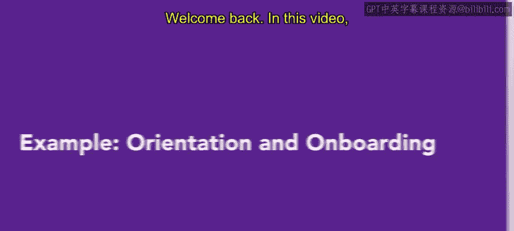
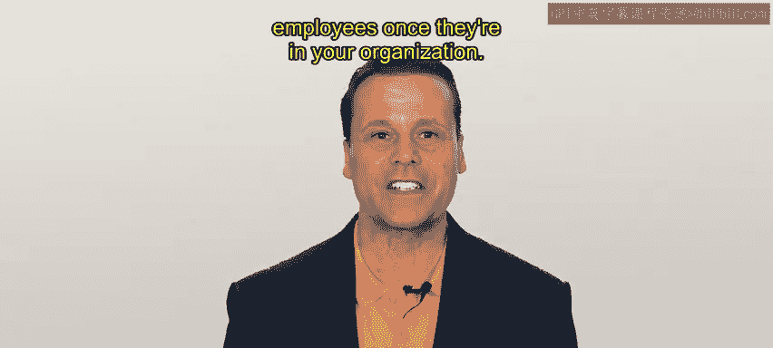

# HRCI人力资源助理课程：第3课：示例：入职培训与入职流程 🏢

在本节课中，我们将通过一个真实场景，学习新员工入职培训（Orientation）与入职流程（Onboarding）的具体实践。我们将跟随一家名为Connective的现代通信公司，看看其HR人员Alex如何欢迎新销售团队成员Mika。

## 概述

上一节我们介绍了入职培训与入职流程的基本概念。本节中，我们来看看这些概念如何在一个虚构但典型的公司环境中应用。我们将分步解析从新员工第一天报到，到首月融入的完整过程。

## 场景介绍：Connective公司

首先，让我们认识一下案例中的公司。Connective是一家帮助分布式团队保持联系的现代通信公司，其业务是提供视频会议和云端电话系统等软件工具。HR专员Alex刚刚为销售团队招聘了新员工Mika，Mika将在某个周一开始工作。

## 第一天：入职培训（Orientation）

Mika工作的第一天将主要用于入职培训。这一天的重点是处理各项后勤事务。

以下是Alex在Mika第一天安排的主要事项：

*   **行政与手续**：Alex将协助Mika设置工资单，填写剩余的文件，并注册福利。
*   **文化初识**：由于Connective的员工全部远程办公，无法进行办公室参观。因此，Alex为Mika安排了与公司几位团队负责人的视频通话。这些通话氛围轻松友好，旨在让Mika初步认识未来的同事。
*   **绩效说明**：Alex知道阐明绩效评估方式很重要。在Connective，员工通常每季度与经理会面，讨论目标与进展。公司，尤其是销售团队，为员工提供了广阔的成长空间，Alex也向Mika强调了这一点。

## 关键资料：员工手册

入职培训结束时，Alex确保Mika拿到了一份员工手册。

Connective的员工手册包含大量实用信息，例如：
*   公司使命宣言
*   薪酬政策
*   福利信息
*   假期安排
*   请假申请流程

Mika特别高兴地在手册中找到了一份包含所有同事联系方式的通讯录。

## 第一个月：入职流程（Onboarding）

在第一个月里，Alex将为Mika执行一个量身定制的入职流程。

接下来一个月，Mika将参与以下活动：
*   **深化文化理解**：Mika将参加与团队负责人更随意的虚拟会议，以更好地理解公司文化。
*   **团队融合**：Mika将定期与整个销售团队以及销售团队负责人进行一对一会议。
*   **破冰活动**：Alex为全公司安排了一场虚拟知识问答游戏，以增加趣味性。
*   **岗位学习**：当然，在入职过程中，Mika也将学习如何完成其岗位的所有任务与职责。

## 反馈与调整

入职培训及第一周的入职流程结束后，Alex征求了Mika对目前过程的反馈。

Mika对流程印象深刻，但也提到远程工作使得入职的某些部分更具挑战性。Alex对此表示同意，并感谢Mika的反馈。

除了虚拟入职的局限性，Mika的一切进展顺利。虽然Mika完全融入Connective团队还需要一些时间，但整个流程已经顺利展开。

## 总结与启示

本节课中，我们一起学习了入职培训与入职流程在一个具体公司案例中的应用。我们看到，对于新员工而言，入职培训与入职流程可能令人应接不暇。

你能为未来新员工做的最好的事情，就是确保入职培训和入职流程都经过周密规划。这项努力将有助于确保新员工感到受欢迎、有指导并获得支持。

接下来，你将学习员工进入组织后，如何对其进行保留。