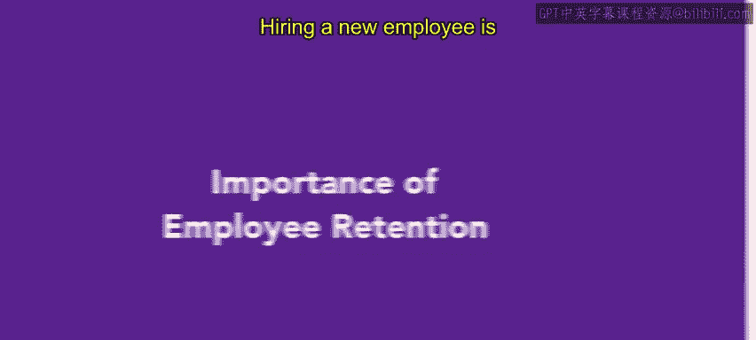

# HRCI人力资源助理课程：第3课：员工保留的重要性

在本节课中，我们将探讨招聘新员工的成本，分析员工流失带来的各项损失，并理解为什么高员工保留率对公司的成功至关重要。

---

## 概述：理解员工流失的成本

招聘新员工需要花钱，这是一个既定事实。然而，让我们深入探讨当一名员工离职时，公司所承担的成本。本节我们将概述招聘和培训新员工的成本，并解释为什么高保留率对公司至关重要。

根据美国进步中心的分析，对雇主而言，员工流失的成本可能高达该员工年薪的**30%**。在某些情况下，对于入门级职位，流失成本甚至可以达到该员工年薪的**213%**。为了避免不必要的损失或开支，一个需要关注的重要指标是**单次招聘成本**。

**单次招聘成本**是指招聘和培训一名新员工所需花费的金额。

---

## 评估招聘成本与资源效率

作为服务中心，人力资源部门必须评估自身的支出和资源使用效率。在某些情况下，高昂的招聘成本可能是合理的，例如在填补难以招聘的职位时。而在其他时候，高昂的招聘成本可能并不合理，因为它没有带来相应的生产力回报。

了解组织的单次招聘成本，并进一步按每个职位的平均值进行细分，有助于进行更好的预算编制和效果评估。

全球行业分析师乔什·伯森鼓励组织从整体角度思考失去一名员工的**总成本**。以下是需要考虑的一些方面。

---

## 员工流失的具体成本构成

以下是计算员工流失总成本时需要考虑的几个关键因素。

*   **招聘替代者的成本**：这包括广告、面试和筛选等环节的费用。
*   **新员工入职成本**：包括培训费用以及管理层为此投入的额外时间。
*   **生产力损失**：一名新员工可能需要**一到两年**的时间才能达到离职员工的生产力水平。
*   **内部敬业度下降**：当其他员工注意到高流失率时，他们可能会变得消极，导致自身生产力下降。
*   **客户服务质量下降与错误增加**：新员工完成任务需要更长时间，且解决问题的能力较弱。这在医疗保健等行业尤其重要，可能导致更高的错误率、疾病和其他非常昂贵的代价。
*   **入职后的持续培训成本**：在**2到3年**内，组织可能会投入相当于员工薪资**10%到20%** 或更多的资金用于培训。
*   **文化影响成本**：类似于敬业度下降，文化影响是指一名或一组员工的离职对留下员工士气的影响。这些员工可能会质疑原因。

---

## 员工是增值资产

最重要的一点是，员工是**增值资产**。一名员工在组织中工作的时间越长，他们的生产力就越高。他们熟悉系统，了解产品，并学会如何与团队成员协作。

---

## 总结：建立保留政策的重要性

由此可见，保留人才对企业而言是多么重要。如果你的组织没有制定相应的保留政策，你的企业就可能面临因员工流失而带来的上述损失风险。

在本节课中，我们一起学习了员工流失的多种成本构成，从直接的招聘费用到间接的生产力损失和文化影响。我们认识到，员工是随着时间增值的资产，因此，投资于员工保留政策对于企业的长期健康和财务成功至关重要。