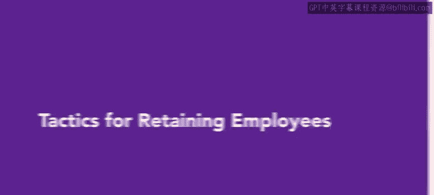
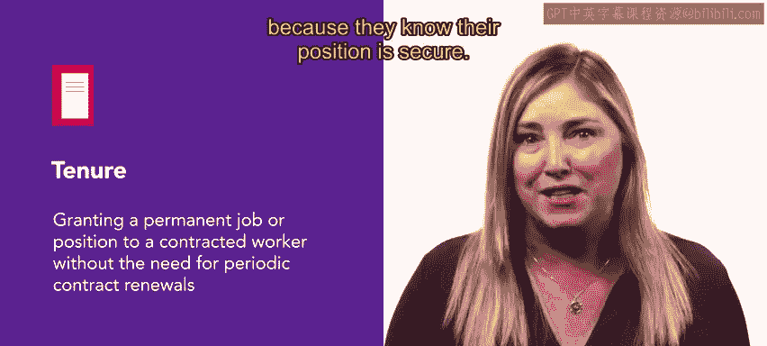

# HRCI人力资源助理课程：P62：保留员工的策略

在本节课中，我们将要学习如何制定有效的策略来保留组织中的优秀员工。员工保留是人力资源管理的核心任务之一，它直接关系到组织的稳定性和持续发展。我们将探讨多种实用的方法和工具，帮助您构建一个能够吸引并留住人才的工作环境。

---

上一节我们介绍了员工入职的重要性，本节中我们来看看如何确保员工在入职后能够长期保持满意并取得成功。当涉及到员工保留时，最好的进攻就是出色的防守。人力资源部门可以倡导为员工保留计划争取必要的预算和资源。通常，**用于防止人员流失的资金是比不断招聘和雇佣所花费的成本更好的投资**。

在某些情况下，简单的财务奖励，如奖金或年度加薪，就足以留住员工。但让我们回顾一下其他一些保留有价值员工的策略和工具。

以下是人力资源部门可以采用的几种核心保留策略：

*   **进行员工调查与面谈**：定期进行员工调查可以深入了解他们对工作和公司的满意度。在某些情况下，人力资源部门甚至会进行“留任面谈”，即与员工进行面对面交谈，了解他们选择留在公司的原因。人力资源团队将根据这些面谈的结果，找出工作中哪些方面能吸引和激励员工，以及哪些方面可能需要改进。他们可以在必要时做出改变，或者强化已经成功的工作领域。
*   **实施终身教职制度**：终身教职是学术环境中常用的一种保留策略，在医疗和法律行业也经常使用。它授予合同制员工永久性的工作或职位，无需定期续签合同。在某些情况下，终身教职还包括更好的就业福利或休假分配，以鼓励员工留下来。终身教职可以帮助激励员工在工作中保持创新，因为他们知道自己的职位是稳固的。
*   **开展教练辅导**：另一个发展领导技能和提高员工积极性的重要工具是教练辅导。教练辅导是一种发展特定技能的方法，教练向个人或团体提供信息和客观反馈。虽然教练辅导在领导层很重要，但这种策略也可以用于非领导岗位的员工，以培养新技能和积极性。人力资源部门负责向经理和高管提供教练辅导，指导他们如何运用领导力概念和应用来管理团队。高管教练是一个正式的系统，用于就良好表现所需的技能向经理和新主管提供咨询。教练通常来自公司外部。通过领导力评估、战略思维、人际交往技能以及通过他人达成结果等方面的辅导，人力资源部门可以为管理层提供取得成功所需的适当指导。
*   **推广员工教练**：除了领导力教练，员工也可以从他们的经理或组织内的其他个人那里接受教练辅导。员工教练可以通过进一步发展员工的技能和知识，帮助他们实现职业目标。因此，教练辅导可以帮助他们对自己的工作更有信心，并产生留在公司并在其岗位上成长的愿望。教练辅导可以一对一进行，也可以在具有共同目标的员工小组中进行。教练辅导还有助于培养员工与组织领导层之间的积极关系。
*   **制定继任计划**：不可能永远留住所有员工，因此继任计划也非常重要。继任计划是指为组织的未来成功识别和发展高潜力的员工。虽然从技术上讲，继任计划确实是为员工离职做准备，但它也可以作为一种策略来留住有才华的个人，希望他们成为组织内的领导者。继任计划通常以领导岗位为导向。从外部填补高级职位可能耗时、困难且昂贵。从内部提拔那些经过教练辅导和发展的员工来填补这些领导职位要容易得多，且更有益、更具成本效益。制定继任和替补计划是一个从需求评估开始的过程。这个过程包括识别高管和领导团队的技能组合，并评估那些技能和能力可能被开发以在公司内获得成长和成功的员工。通过继任计划提供这些机会，可以培养出高价值的员工，并使他们更有可能留在组织中，因为他们知道这里有成长的机会。

---

员工流失会给公司带来不必要的成本。对于人力资源部门而言，倡导更好的就业条件并将资金重新分配到提高员工满意度上，有助于节省招聘成本。通过结合上述策略，公司可以显著提高其员工保留率。

本节课中我们一起学习了多种员工保留策略，包括通过调查了解员工需求、实施终身教职提供稳定性、利用教练辅导促进个人与领导力发展，以及通过继任计划为员工规划成长路径。这些方法共同作用，能够有效降低员工流失率，为组织保存核心人才。

接下来，您将了解人力资源部门可以跟踪的不同指标，以及这些指标如何为您未来的决策提供信息。