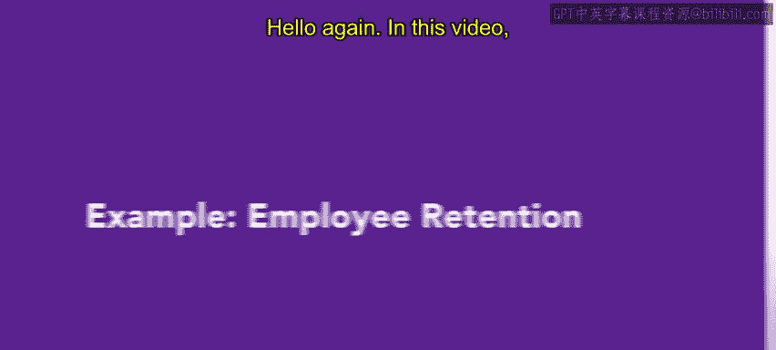
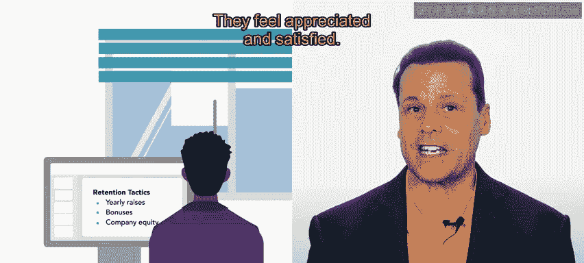
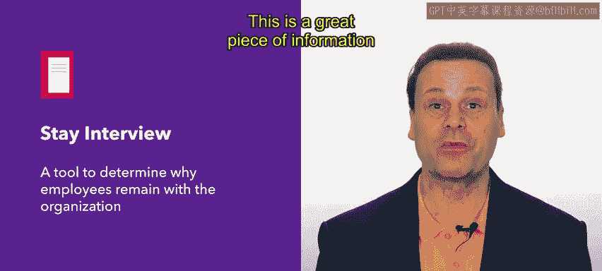
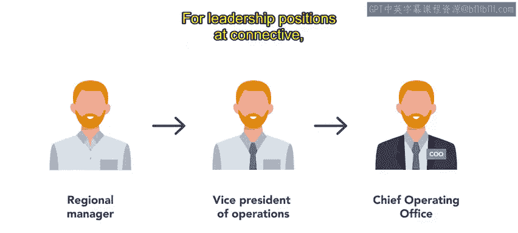

# HRCI人力资源助理课程：P63：示例：员工保留



在本节课中，我们将通过一个真实世界的场景来探讨员工保留。我们将跟随一家名为Connective的公司的HR从业者Alex，了解他如何运用多种策略来留住优秀人才。员工保留对于任何组织都至关重要，因为它能节省招聘成本，并维持一支高效、稳定的团队。

## 理解员工保留的重要性


上一节我们介绍了员工保留的基本概念和一些通用策略。本节中，我们来看看Alex是如何在实践中应用这些知识的。

Alex在Connective公司工作，这是一家帮助分布式团队协作的现代通信公司。他深知，员工是**增值资产**。员工在公司工作的时间越长，他们的生产力就越高。长期员工熟悉内部系统、产品，并懂得如何与团队协作，这些技能和知识的积累需要大量时间。

此外，Alex最近更新了公司的**单次招聘成本**数据。他发现，根据职位和团队的不同，招聘一名新员工的成本可能高达数千美元。这个成本的计算公式可以简化为：

```
单次招聘成本 = 广告费 + 筛选与面试时间成本 + 入职培训成本
```

这个不断上升的数字，强化了实施有效员工保留策略的必要性。

## 实施保留策略

基于以上理解，Alex采取了一系列策略来保留员工。以下是Alex采用的一些核心方法：

**基于货币的奖励**
这是最直接的策略之一。Alex会提供年度加薪、奖金和公司股权等货币奖励。这些奖励能让员工感到被赏识和满足。



**进行留任面谈**
为了获取更深入的信息，Alex会定期进行留任面谈。这些面谈旨在了解员工选择留在Connective的原因，以及如何激励他们继续为公司效力。通过这种方式，Alex发现，**完全远程工作的灵活性**是员工对公司忠诚和满意的一个重要因素。

**建立继任计划**
对于领导职位，Alex致力于建立继任计划。这意味着他需要提前识别和培养未来的领导者。



## 识别与培养未来人才



上一节我们看到了Alex如何通过面谈和奖励来保留现有员工。本节中，我们来看看他如何为公司的未来做准备。

Alex会定期与各部门负责人沟通，以识别出高潜力的员工和未来的领导者。这个过程被称为**人才盘点**。

与此同时，Alex还会对现任领导者进行**需求评估**。他和HR团队需要了解成功领导者所具备的技能，并在公司其他员工中寻找这些技能。这确保了当领导岗位出现空缺时，公司内部有合适的人选可以接替。


## 总结与回顾

本节课中，我们一起学习了员工保留的实际应用。我们跟随Alex，看到了他如何通过计算招聘成本来理解保留的重要性，并实施包括货币奖励、留任面谈和建立继任计划在内的多种策略。

员工保留是HR专业人员工作的核心部分。有效的保留策略能为公司节省大量的时间、精力和金钱，同时也能确保员工感到快乐、有动力且高效。记住，**员工保留**的最终目标是实现公司与员工的**双赢**。


接下来，你将有机会从一位现任HR从业者那里了解更多关于HR职业发展的信息。