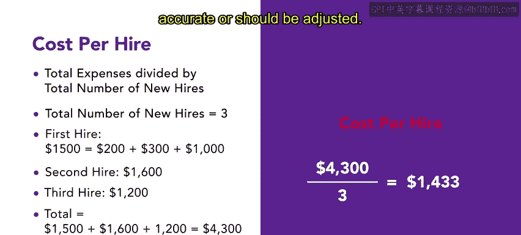
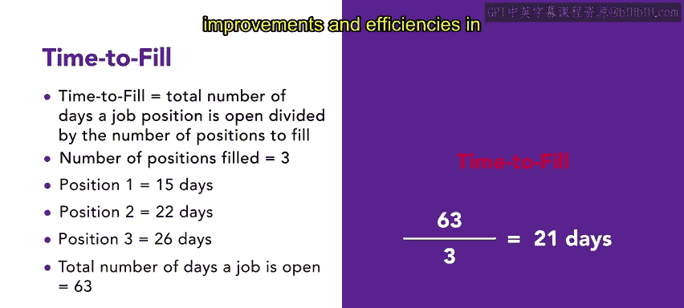
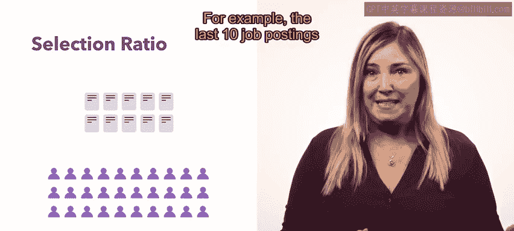

# HRCI人力资源助理课程：P64：需要跟踪的重要人力资源指标 📊

在本节课中，我们将学习人力资源专业人员用于衡量工作成效的关键指标。这些指标有助于支持公司的战略目标、规划未来人员配置方向，并识别当前人员职责与能力方面的差距。我们将重点介绍与招聘流程相关的三个核心指标。

人力资源指标通常可以从三个维度进行解读：效率、有效性和影响力。接下来，我们将从支持招聘流程的一些常见指标开始。

## 招聘相关核心指标

以下是三个用于评估招聘流程的重要指标。

### 1. 单次招聘成本 💰

**单次招聘成本**是指招聘一名新员工所需的总金额，包括广告费、招聘费、推荐费、差旅费和安置费。这是一个平均值。

其计算公式为：
**单次招聘成本 = 招聘总费用 / 新员工总数**

例如，去年你的组织招聘了三名新员工。
*   第一名员工的总招聘成本为1500美元（包括200美元广告费、300美元面试差旅费和1000美元安置费）。
*   第二名员工的成本为1600美元。
*   第三名员工的成本为1200美元。

计算过程如下：
总成本 = 1500 + 1600 + 1200 = 4300美元
单次招聘成本 = 4300美元 / 3 = **1433美元**

组织可以利用此指标来审视招聘流程的效率，判断招聘或入职过程中的费用是否合理，或是否需要调整。

### 2. 职位填补时间 ⏱️

**职位填补时间**衡量的是一个职位发布后保持开放状态的平均天数，即填补一个职位所需的时间。不同组织对此指标的起始点定义可能不同，有的从提交职位发布算起，有的则从人力资源部门批准职位空缺之日算起。

其计算公式为：
**职位填补时间 = 所有职位开放天数总和 / 已填补的职位数量**

例如，你的团队去年填补了三个职位。
*   第一个职位开放了15天。
*   第二个职位开放了22天。
*   第三个职位开放了26天。

计算过程如下：
总天数 = 15 + 22 + 26 = 63天
职位填补时间 = 63天 / 3 = **21天**

如果职位填补时间过长，则很可能需要改进和提升招聘流程的效率。

### 3. 筛选比率 📈

**筛选比率**是指某个职位录用的申请者数量与申请者总数的比例。

其计算公式可表示为：
**筛选比率 = 录用人数 : 申请总人数**

这个比率有助于评估招聘策略。如果录用人数相对于申请者总数比例很高，可能表明招募的申请者数量不足。申请者数量过少会难以判断是否已将职位提供给了最合适的最佳人选。

例如，你最近填补的10个职位共收到30份申请。
筛选比率 = 10 : 30，即 **1 : 3**。
这个比率意味着每个职位平均只有3名申请者，数量较低。你可能没有为该职位找到最佳人选。最好重新评估未来的职位招聘方式。

## 总结与展望

本节课我们一起学习了三个用于评估组织招聘流程的关键指标：**单次招聘成本**、**职位填补时间**和**筛选比率**。这些指标是衡量招聘效率与有效性的重要工具。

掌握这些基础指标后，你可以利用更详细的指南资源来深化理解。随着本课程接近尾声，你将进一步了解人力资源中的技术应用，并将所学知识付诸实践。