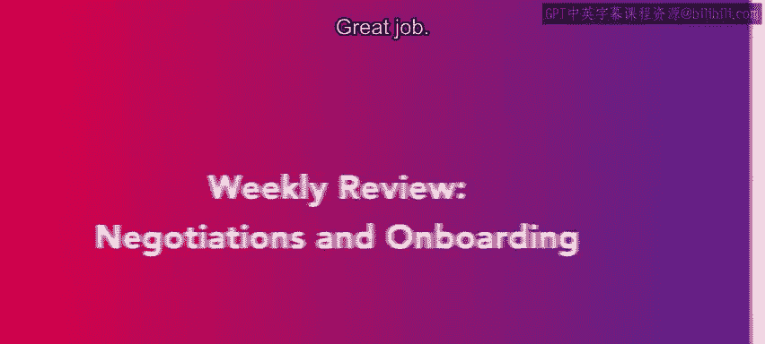
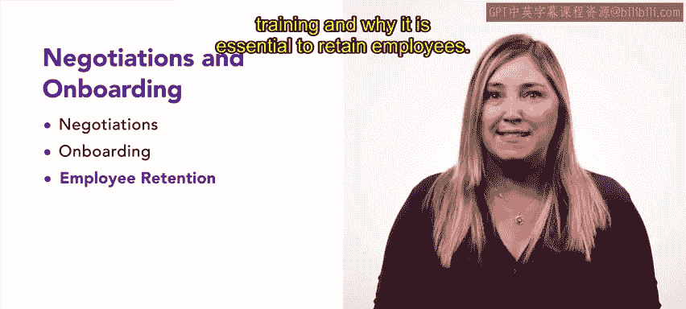

# HRCI《人力资源助理（招聘、学习发展、薪酬福利，1-3课／共5课）｜HRCI Human Resource Associate》 - P65：64_每周回顾：谈判和入职.zh_en - GPT中英字幕课程资源 - BV1qi421r7ba

Great job。 We have finished the final week of the course on talent acquisition。

 You should now have an understanding of offer negotiation and onboarding。

 Let's review what we covered this week In the first lesson。

 you learned about the offer negotiation process。 We discussed the complete remuneration package and how to differentiate between an employment offer and an employment contract。

 We also examined common employment contract clauses and explored a real world example of a negotiation in lesson 2。

 we started by defining onboarding and how to approach the onboarding process。

 including what tasks an employee may handle in their first week。

 We covered best practices for employee onboarding。

 including the core components of an employee handbook。 We defined inclusive onboarding。

 why it's essential。 and the key elements of an inclusive onboarding program。 too。 next。😊。

We explored employee retention and various activities and strategies that can help retain talented individuals within an organization。

 We also discussed the cost of hiring and training and why it is essential to retain employees。

 Finally， we covered information and tips on effectively showcasing projects in your portfolio for potential employers。

 We also included a quick guide on LinkedIn profile best practices。 Great work this week。😊。

