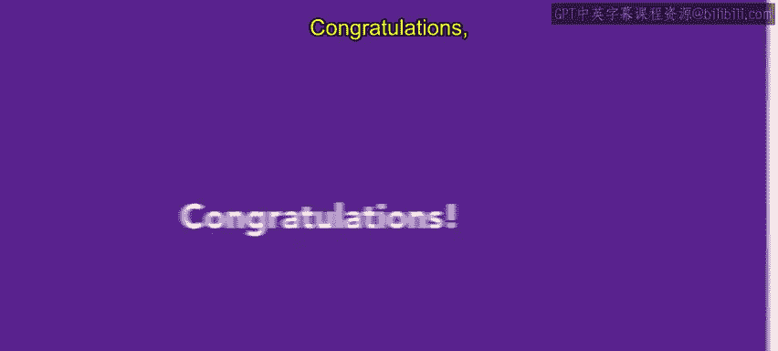
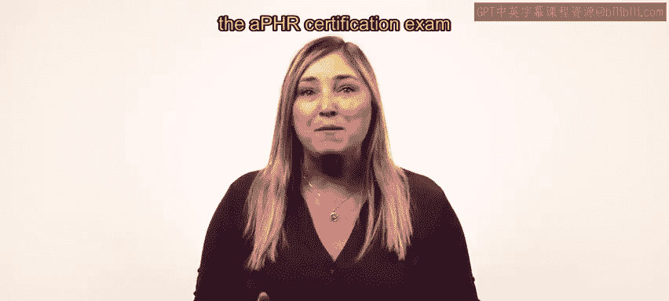
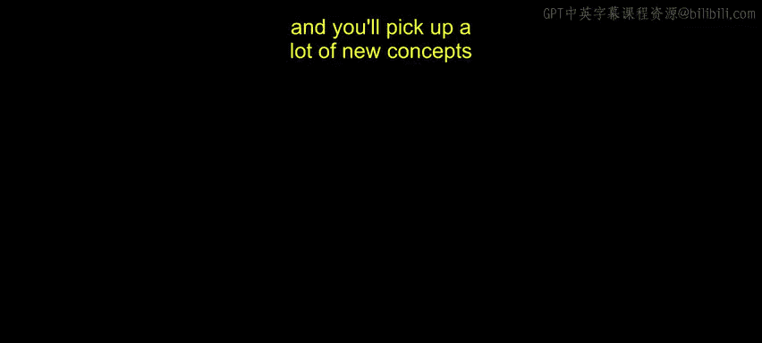

# HRCI《人力资源助理（招聘、学习发展、薪酬福利，1-3课／共5课）｜HRCI Human Resource Associate》 - P66：65_恭喜.zh_en - GPT中英字幕课程资源 - BV1qi421r7ba

Congratulations， you completed this course on talent acquisition。 you have certainly learned a lot。

 This course covered about 20% of the APHR exam and introduced some cornerstone skills for an HR professional。

 You learned the basics of talent acquisition， including forecasting and job design。

 You dove deeper into talent acquisition and covered the skills of job analysis and recruiting。

 You continued on the talent acquisition lifecycle and discovered how to source talent interview candidates and evaluate prospective employees and finally。

 you covered negotiating with and onboarding new employees。

 as well as learning tactics to retain employees。 great work on this course。

 The next course focuses on learning and development。

 Learn and development is another substantial segment of the APHR certification exam。

 and you'll pick up a lot of new concepts。😊。

