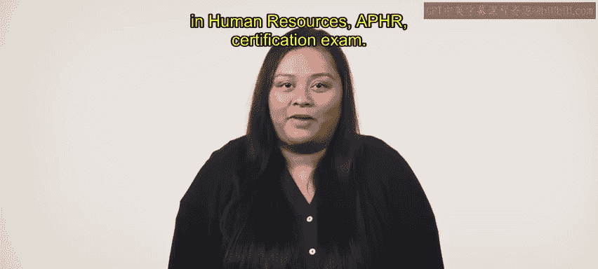

HRCI人力资源助理专业证书：P67：课程介绍与概览 🎯

在本节课中，我们将全面了解HRCI人力资源助理专业证书课程的结构、核心内容与学习目标。本课程旨在为学员提供成为人力资源助理所需的专业技能，并帮助学员准备APHR认证考试。

欢迎参加HRCI人力资源助理专业证书课程。您选择了迈向人力资源职业的道路，这令人振奋。本课程将重点培养作为人力资源助理所需的实用技能。从事人力资源职业将使您能够引导他人完成其职业发展路径，并帮助您的组织凭借强大的员工团队蓬勃发展。

本课程还将帮助您准备参加HRCI人力资源助理专业认证考试，即 **APHR认证考试**。

---

上一段介绍了课程的整体目标，接下来我们将逐一了解构成此证书的五个核心课程模块。

以下是五个核心课程模块的简要介绍：

*   **第一门课程：人才获取**
    这门课程专注于人才获取流程的各个方面。您将学习如何预测劳动力需求、寻找和招聘优秀候选人，以及如何聘用新员工并使其入职。

*   **第二门课程：学习与发展**
    本课程将概述在组织中创建有效培训的最佳实践。您将学习识别培训需求和实施培训的不同方法，以及如何评估培训计划的有效性。

*   **第三门课程：薪酬与福利**
    在这门课程中，您将研究雇佣关系中的整体薪酬方案的复杂性。这涉及构建薪酬策略和评估市场中的福利趋势。您还将学习不同的福利选项，以及如何评估不同的薪酬体系和人力资源技术。

*   **第四门课程：员工关系导论**
    我们将讨论如何创建和管理组织政策与程序。您将评估管理层与员工之间的价值观和态度，并学习适用于各级员工的绩效管理方法。

*   **第五门课程：合规与风险管理导论**
    最后一门课程通过研究风险评估和如何建立风险管理思维，来介绍风险管理和合规策略。您将学习不同类型的合规要求，包括法律合规和安全合规，及其在运营政策中的作用。课程最后将探讨人力资源在组织重组中的角色。

---

本节课中，我们一起学习了HRCI人力资源助理专业证书课程的整体框架和五个核心模块的内容。从人才获取到合规管理，这些课程涵盖了人力资源助理的关键职能领域。我们有很多内容要学习，现在让我们开始吧。