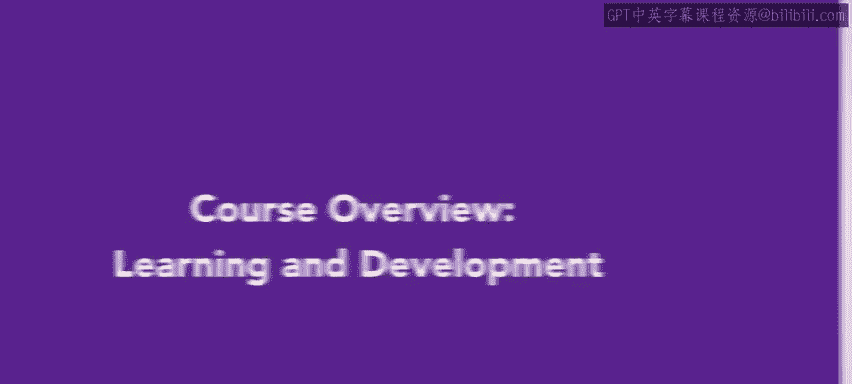
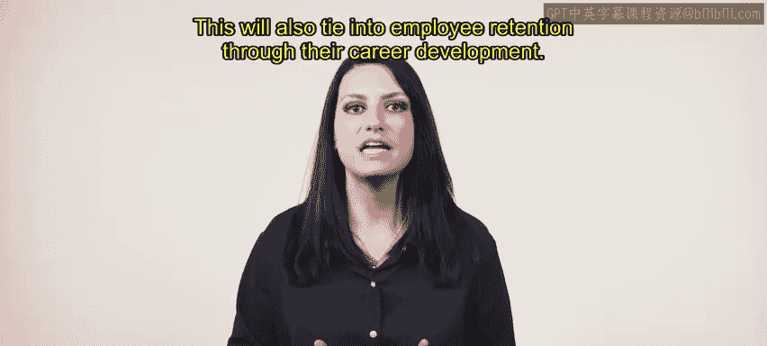
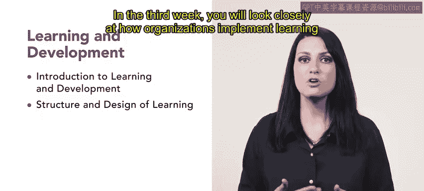

# HRCI《人力资源助理（招聘、学习发展、薪酬福利，1-3课／共5课）｜HRCI Human Resource Associate》 - P68：1_课程概述：学习与发展.zh_en - GPT中英字幕课程资源 - BV1qi421r7ba

Welcome to the Learning and Development course， this is a second course in the HRCI Human Resource Associate Professional Certificate。

In this course you will explore learning and development through the lens of developing talent within employees you will also learn the best practices for the creation and implementation of a learning and development strategy this will also tie into employee retention through their career development。

The focus of this week's lesson will be about career development and how it benefits organizations。

 you will also learn about the tools HR our departments use to optimize efficiency and retain high performing quality employees。

In the second week you will learn about creating engaging training experiences for career development along with training you will discover frameworks and metrics for evaluating as well as how to use a needs analysis process to improve the onboarding process and require training In the third week you will look closely at how organizations implement learning and development。

 including how they are delivered and how to make adjustments based on feedback from participants。

In the final week of this course， you will determine how to evaluate required and non- requiredquired training for employees。

 you will also learn about different methods for evaluating training along with how to intervene when an employee is not completing training or when a training is not effective。

Overall， this course will prepare you for the learning and development side of HR through engaging enhance hands on videos。

 discussions and activities， let's get started。😊。

