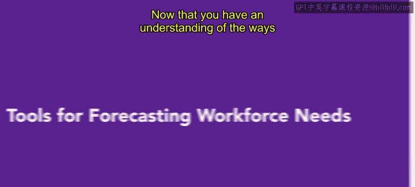
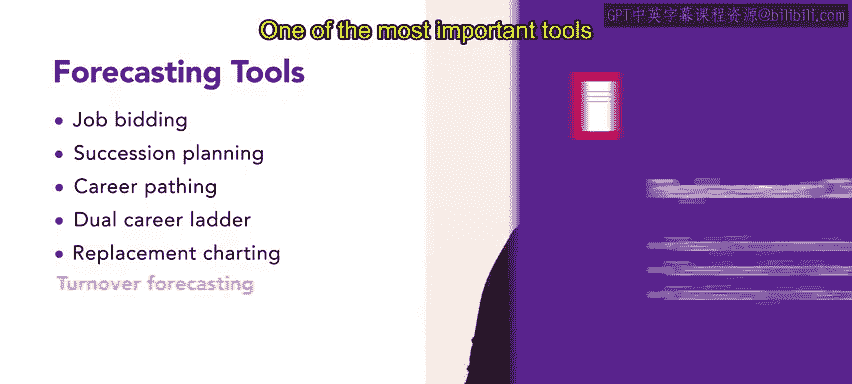
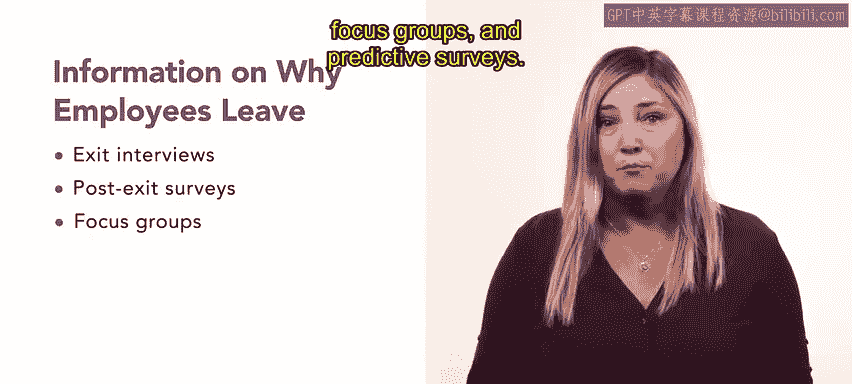

# HRCI人力资源助理课程：P6：预测劳动力需求的工具 🔧

在本节课中，我们将学习人力资源专业人员用于预测和满足组织劳动力需求的各种工具。这些工具超越了简单的招聘，旨在通过内部发展、规划和预测来优化人才管理。

上一节我们介绍了预测劳动力需求的方法，本节中我们来看看与之配套使用的具体工具。

## 职位竞标

职位竞标是指员工在某个职位实际空缺之前，就表达出对该职位的兴趣。这是一种有效的内部填补空缺的方式。

以下是其运作方式：
*   如果主管或人力资源代表提前知道某位员工对某个职位感兴趣。
*   并且该员工符合职位要求，那么他们可以提前接受培训，以获得所需的技能。
*   当该职位真正空缺时，这位员工也可以被纳入继任计划中。

## 继任计划

接下来，我们将介绍继任计划。继任计划旨在识别有潜力在未来（通常是一到五年内）担任组织管理或高管职位的优秀员工。

一旦识别出有潜力的员工，继任计划会明确这些员工需要接受何种培训、教育以及积累何种经验，才能为担任这些角色做好准备。

继任计划涉及职业路径规划，即通过识别员工为实现职业目标所需采取的步骤，来帮助他们规划长期职业生涯的过程。

## 双轨职业阶梯

接下来，我们讨论双轨职业阶梯。在双轨职业阶梯中，会规划一条侧重于专业知识和交叉培训的职业路径。

以下是其核心特点：
*   员工精通两个传统上不同的角色，然后进入下一个阶段。
*   双轨职业阶梯对于提拔那些无意承担管理或监督职责的优秀员工非常有价值。
*   通常，第二条轨道允许员工晋升到更高级的技术职位。
*   这种模式在工程或医学等技术技能价值显著的行业和领域最为常见。

## 人员接替图

现在，我们来探讨人员接替图。人员接替图可以帮助管理者和人力资源专业人员进行继任规划。

人员接替图将员工分为四类：
*   **准备晋升**：指那些具备承担更大责任所需知识、技能和能力的个人。
*   **待发展晋升**：指那些有潜力的员工，在完成更多培训或获得更多经验后，将准备好承担更多责任。
*   **在当前职位表现满意**：指那些能熟练完成现有工作，但未展现出晋升所需技能或潜力的员工。
*   **待替换**：指那些因各种原因（如退休、调动、晋升、病假或绩效不佳）预计不会长期留在组织中的员工。

## 离职率预测

人力资源专业人员拥有的最重要工具之一是离职率预测。正如我们一直在讨论未来的劳动力需求一样，审视现有员工并预测谁可能离开也同样重要。

离职成本高昂。人力资源经理的许多工作都旨在留住优秀员工并降低离职率。

关于员工为何离开组织的信息可以通过多种方式获取，包括：
*   **离职面谈**和**离职后调查**：由已辞职员工提供信息的宝贵来源。
*   **焦点小组**和**预测性调查**：深入了解现有员工对其工作及在组织未来的感受。

这些信息可被人力资源专业人员用来预测未来的离职率并改进劳动力规划。并非所有离职都是坏事。例如，如果组织正在精简规模，失去少量或大量员工可能并不令人担忧。因此，收集信息时，不仅要关注有多少员工离开公司，更要关注他们离开的原因。

人力资源经理应追踪离职的**自愿性**和**可避免性**。

本节课中我们一起学习了职位竞标、继任计划、双轨职业阶梯、人员接替图和离职率预测等工具。这些只是人力资源专业人员可用的部分工具。正如你所料，具体使用的工具和流程在很大程度上取决于组织及其员工。接下来的课程将涵盖关于不同类型员工的更详细信息。