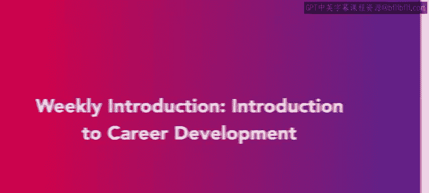
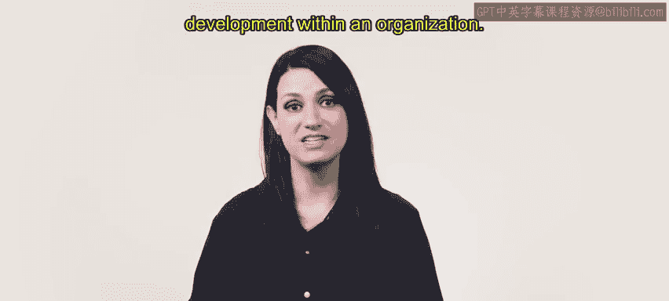
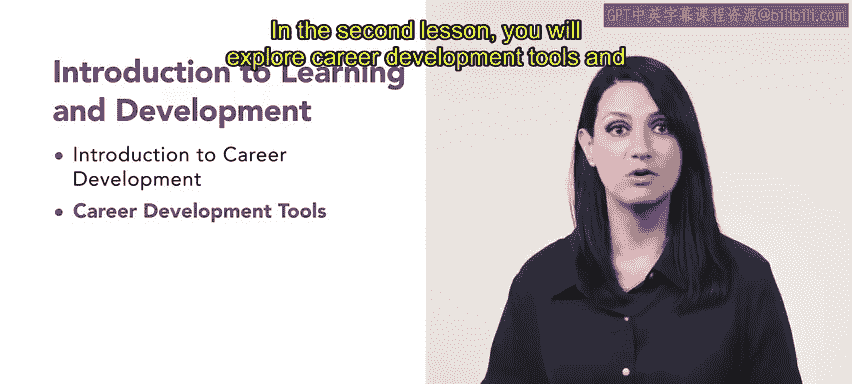
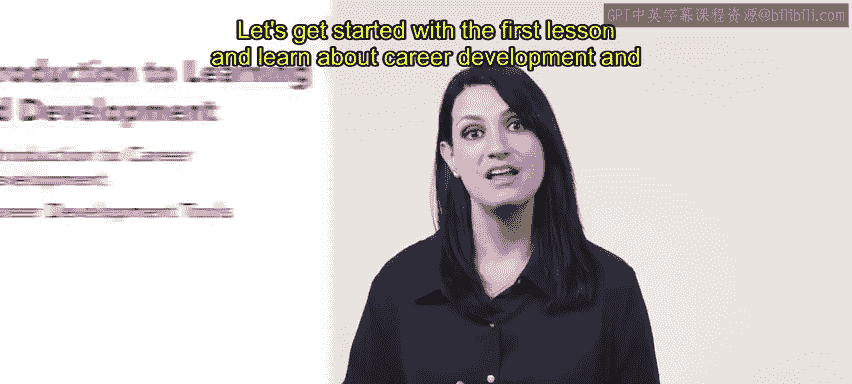

# HRCI《人力资源助理（招聘、学习发展、薪酬福利，1-3课／共5课）｜HRCI Human Resource Associate》 - P70：3_每周介绍：职业发展导论.zh_en - GPT中英字幕课程资源 - BV1qi421r7ba

Your journey to become an HR professional is just beginning welcome to the first week of the Learning and Development course。

We will begin this course by introducing learning and development within an organization Ors grow and achieve new goals through continuous improvement and training In the first lesson you will be introduced to career development you will learn about how career development is an essential component of a well functioning organization and second lesson you will explore career development tools and differentiate between the tools based on the desired outcome。

 Let's get started with the first lesson and learn about career development and how it benefits organizations。

