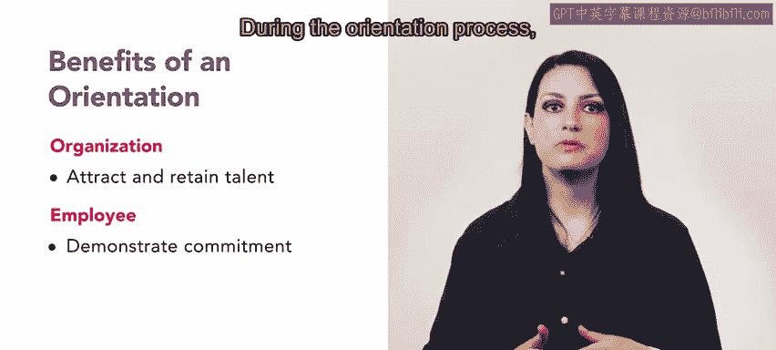

# HRCI人力资源助理课程：第4课：入职培训 🧑‍💼

在本节课中，我们将要学习入职培训对于新员工和组织成功的重要性。我们将了解入职培训的定义、主要目标以及它为员工和组织双方带来的具体益处。

---

没有适当的指导和支持，适应陌生的环境和角色可能会让人不知所措。在人力资源的职责中，确保入职培训有效且全面是你的工作。本节视频将介绍入职培训为何对新员工的成功至关重要。

## 什么是入职培训？🎯

上一节我们提到了入职培训的重要性，本节中我们来看看它的具体定义和目标。

入职培训是一个让新员工了解新雇主的**政策**、**程序**、**福利**和**期望**的过程。例如，在SlicU公司入职的第一天，新员工会见到他们的经理和团队成员。他们还会被分配一位伙伴或导师，带领他们熟悉餐厅环境，比如披萨盒存放在哪里。这位伙伴也会在新员工适应新角色的过程中解答任何问题。

入职培训的主要目标是帮助新员工成为其新部门或组织中高效且适应良好的成员。这个过程有助于新聘用的员工和近期晋升的员工尽快开始做出贡献。

## 成功入职培训的目标 📝

了解了入职培训的基本概念后，以下是成功入职培训计划的一些额外目标：

*   **促进沟通最佳实践**：入职培训最重要的目标之一是促进团队内部和组织内部的沟通最佳实践。这些最佳实践将帮助新员工轻松地开始与团队和客户沟通。
*   **设定清晰现实的期望**：入职培训计划会就**政策**、**绩效**和**程序**设定清晰且现实的期望。人力资源代表可以审查全组织范围的政策，而员工的直属经理可以讨论绩效期望和指标。
*   **介绍部门目标**：入职培训的另一个目标是向员工介绍其部门的目标。当员工理解自己如何能帮助实现这些目标时，他们就能更快地做出贡献。
*   **统一员工与组织目标**：入职培训计划还应将员工的目标与组织的目标统一起来。例如，人力资源部门或员工的经理可以展示职业发展机会，并概述这些活动如何帮助他们在新角色中取得成功。
*   **完成必要培训**：在入职培训期间，员工还需完成组织或地方/联邦法规要求的培训。培训主题可能包括**多元化、公平与包容**、**职场骚扰**或组织特定的规则。

## 入职培训的益处 🤝

我们已经明确了入职培训的目标，现在来看看它如何使组织和员工双方受益。

入职培训计划不仅为新员工做好准备，也使你的组织受益。入职培训计划展示了组织对新员工和现有员工成长与成功的承诺。当你帮助新员工适应新角色、团队和部门时，他们会感到被支持。注重员工发展的公司能够吸引并留住人才。

在入职培训过程中，当员工获得必要的资源以保持高效时，他们也能受益。他们能够展现出加入团队的承诺和热情。

---

开始一份新工作可能令人心生畏惧，而一个强大的入职培训计划能帮助新员工从一开始就感到被支持并为成功做好准备。

本节课中，我们一起学习了入职培训的定义、核心目标以及它对员工和组织的双重价值。接下来，你将探索职业发展领域，请继续保持学习。