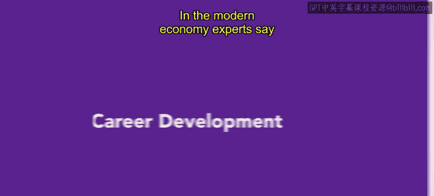
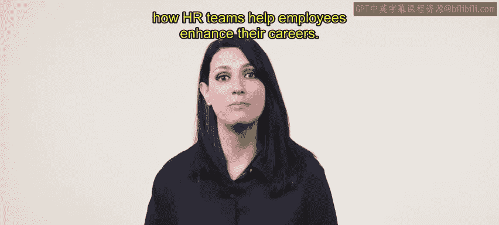
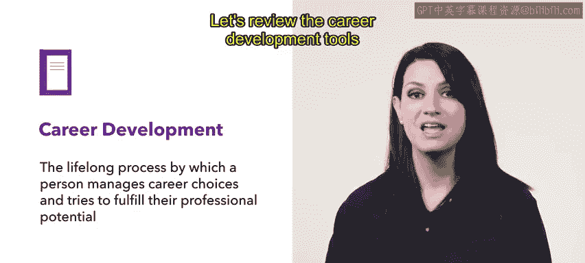
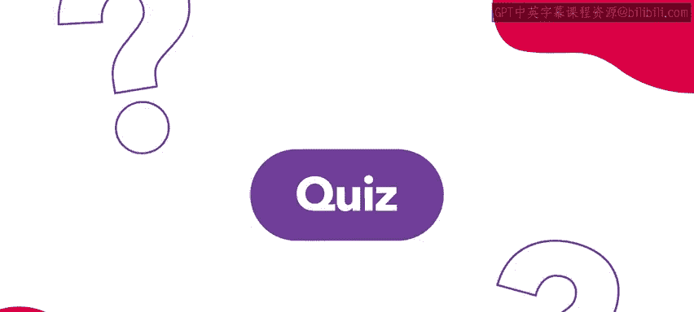
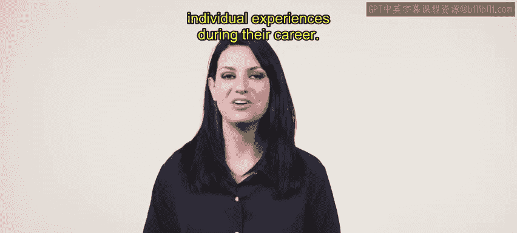

# HRCI《人力资源助理（招聘、学习发展、薪酬福利，1-3课／共5课）｜HRCI Human Resource Associate》 - P73：6_职业发展.zh_en - GPT中英字幕课程资源 - BV1qi421r7ba

In the modern economy， experts say the average person will change careers 5 to seven times。

 This estimation reinforces the idea that career development is a vital， lifelong process。

 In this video， you'll learn about career development and how HR teams help employees enhance their careers。

Career development refers to a lifelong process by which a person manages career choices and tries to fulfill their professional potential。

Career development is a shared responsibility between individuals and their employers。

 Let's review the career development tools and opportunities your organization can provide The first career development tools coaching through coaching。

 an employee learns new tasks， gains new skills or tackles problems outside of their current position。

 For example， Ari， a new employee at urban attire gains knowledge and skills use in other roles when he is paired with experienced employees in different departments。

 Another career development tool is counseling。 Counsing provides an employee with advice or support for job related planning or issues。

Urban attire partners with career counselors to provide employees with career guidance and support。

The next tool is mentoring mentoring helps an employee navigate the internal politics of the organization。

 a mentor can advocate for the employee to senior management or advise them on how to climb the corporate ladder Mentoring helps both employees。

 the one being mentored and the one offering their mentorship。At Urban attire。

 RA is participating in a mentorship program that pairs new and experienced employees。

 This program helps employees develop their skills and navigate the organization's culture。

 Aing an employee's strengths and weaknesses is also a career development tool。

 Urban attire conducts annual employee surveys to assess team member strengths。

 weaknesses and training needs。 This information is used to develop training and development programs that help employees reach their full potential。

😊，Another career development tool is opportunity for employees to learn new knowledge about themselves。

 As a new worker， A takes a psychometric test for urban attire to identify his learning。

 leadership and communication styles。 This insight benefits both Ari and the team by optimizing training。

 workload and team culture for more efficient collaboration。😊。

When your organization encourages career development。

 it demonstrates care for employee satisfaction and growth at the organization。

 but also in the workforce， employers have various opportunities to facilitate career development。

Coming up， you'll learn about the different phases and individual experiences during their career。

