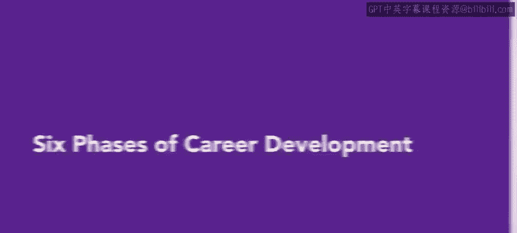
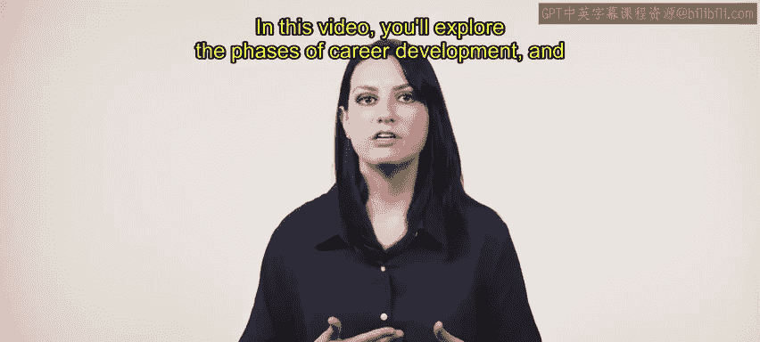
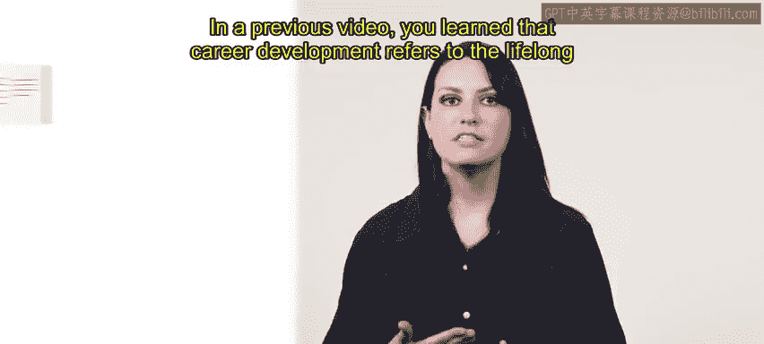
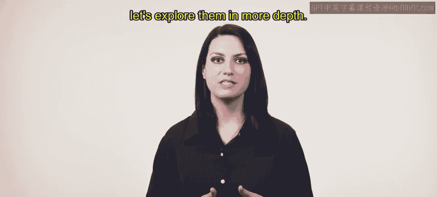
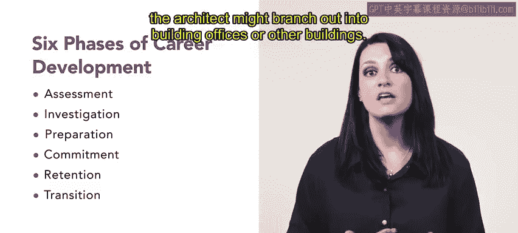
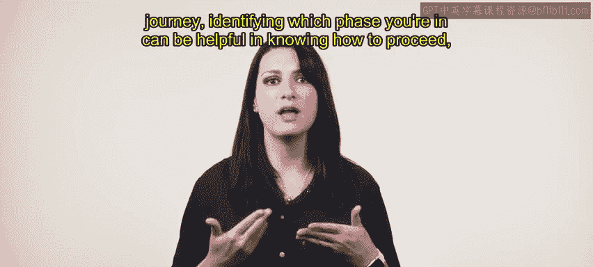

# HRCI《人力资源助理（招聘、学习发展、薪酬福利，1-3课／共5课）｜HRCI Human Resource Associate》 - P74：7_职业发展的六个阶段.zh_en - GPT中英字幕课程资源 - BV1qi421r7ba

Career development is for everyone， no matter what their role or level is in their organization。

 before an individual is hired at an organization， HR teams might focus their town acquisition strategy on advertising their passion for development to attract candidates。

Once employees are hired， focusing on an employee's career development is a great way to avoid disengagement with their role。

In this video， you'll explore the phases of career development and how to engage with employees during each phase。

In a previous video， you learn that career development refers to the lifelong process by which a person manages career choices and tries to fulfill their professional potential。

It's natural for organizations to take note of those who are working hard on career development and will often move them into leadership training。

 Such employees known as high potential employees or hypos receive enhanced in training and guidance。

 They are exposed to increasingly demanding positions to gauge their ability to handle challenges。

 Let's look at an example。Alex is a recent high school graduate who is about to start college。

 Alex finds a job as a server at Splice U。 The job description entails working part time hours。

Alex would be responsible for tasks such as taking orders。

 helping with inventory and cleaning the restaurant at the start or end of the day。

 After a couple of months， as Alex improves as a server。

 Alex's manager begins to give them more responsibilities， such as helping create schedules。

 After about a year at SU， Alex is promoted to assistant manager。

 Although every employee's career development will look different。

 even within the same organization and role， Alex's story is an example of some of the phases of career development and employee can go through。

 In general， there are six phases of career development。 Let's explore them in more depth。😊。

The first phase of career development is assessment and the assessment phase an employee will evaluate their strengths and weaknesses。

 this can involve working with a career counselor or coach or simply some self reflection。

For example， someone with an interest in skills and communications might explore a role at an organization like Connective which focuses on teleconferencing once an employee identifies their skills and what they can do with them。

 it's time for the investigation phase。In the investigation phase。

 the individual researches different career options。

 This may involve informational interviews with people working in different careers。

 The third stage is preparation。 This is where the person gets ready to enter the world of work by setting goals and learning relevant skills。

 For example， if a person identifies that they want to be an architect specifically one who builds homes。

 They might then explore what sort of education skills and other requirements such a role would need。

 The next stage's commitment。 This is where the person finally becomes an applicant and conducts a job search accepts a job offer and commits to a career。

In our architect example， this is where the employee finds and accepts a position as say。

 a junior architect at a firm， the fifth stage is retention。

In this stage the employee advances in their career， in our example case， architecture。

 an employee would update job skills and build a professional network。

 This is when our architect continues their education。

 networks with fellow architects at various levels and further explores development opportunities。

They are interested and engaged with their roles at this stage。 Finally。

 we have the six stage transition。 This is when the employee sensing dissatisfaction with their career contemplates and then makes a career change。

 This can look like choosing a completely different field and starting the process all over again。

 or it can be changing focus in their own field。😊，For example， instead of home building。

 the architect might branch out into building offices or other buildings。

Some people go through this phase and some don't。

No matter where you or an employee in your organization are in the career development journey。

 identifying which phase you're in can be helpful in knowing how to proceed or how to support an employee。

