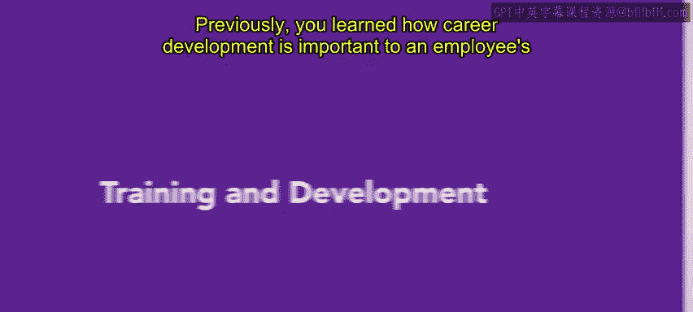
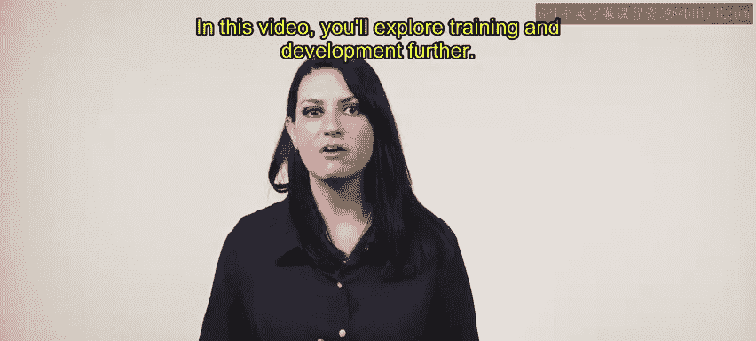
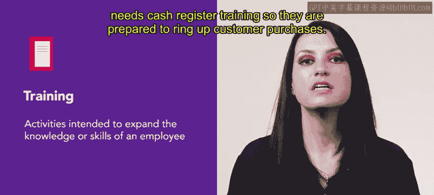
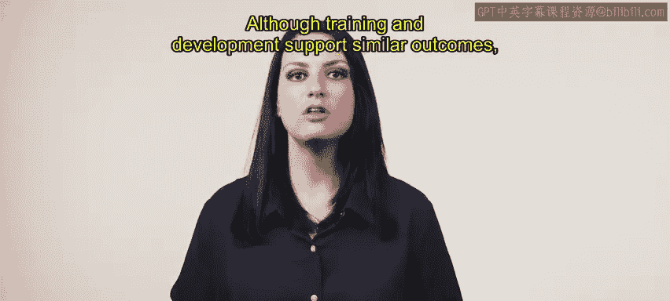
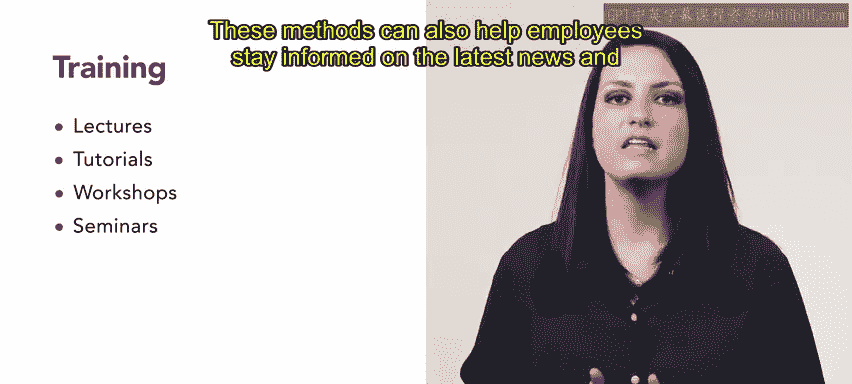
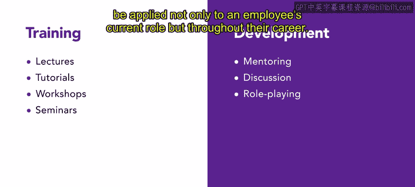
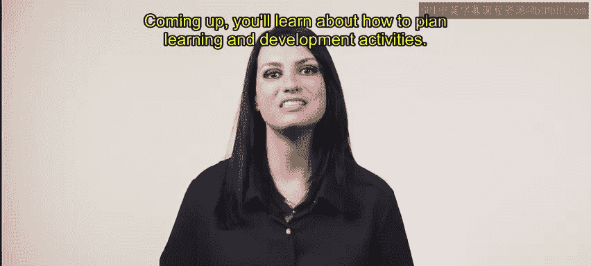

# HRCI《人力资源助理（招聘、学习发展、薪酬福利，1-3课／共5课）｜HRCI Human Resource Associate》 - P75：8_培训与发展.zh_en - GPT中英字幕课程资源 - BV1qi421r7ba

Previously， you learned how career development is important to an employee's journey training and other types of development are great ways to make sure employees are growing in their career。

In this video， you'll explore training and development further。

 Training refers to activities intended to expand the knowledge or skills of an employee so that they can perform better in a job。

 Training needs are usually evaluated on the job。 For example， an employee at urban attire。

 a clothing retail store needs cash register training so they are prepared to ring up customer purchases。

 Development refers to activities aimed at improving the skills of an employee so they can perform better in the future。

 Development may apply to their current role or another role later in their career。 For example。

 leadership development programs prepare middle managers for higher level management positions。

It can be challenging to evaluate the effectiveness of development activities because their impact is intended for the future。

Both training and development are meant to maximize the potential of employees and the organization。

 even highly qualified candidates will eventually require training and development to meet the changing needs of the business environment。

Although training and development supports similar outcomes。

 there are a couple of ways that they are different。

Training methods focus on increasing knowledge or skills methods can include lectures， workshops。

 seminars， tutorials， audio video recordings， workbooks and online learning these methods can also help employees stay informed on the latest news and updates in their fields。

On the other hand， development focuses on sharpening professional skills。

 techniques such as mentoring discussion， role playing。

 coaching and supervised practice support development， In other words。

 development is often more hands on than training and it is meant to be applied not only to an employee's current role but throughout their career。

Training and development are crucial parts of an employee's career development pathEmploys who emphasize these activities show how much they care about their employees in their careers。

Coming up， you'll learn about how to plan learning and development activities。

