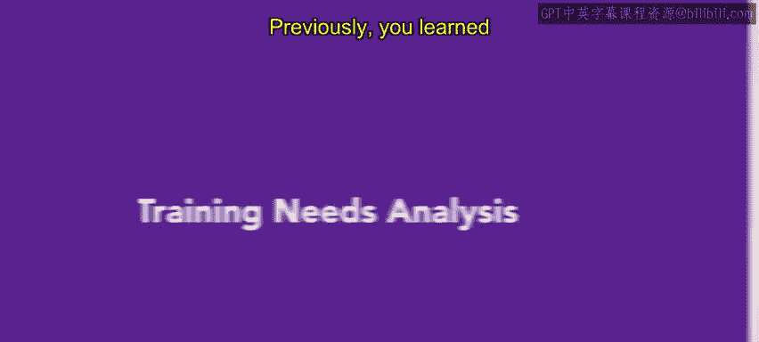
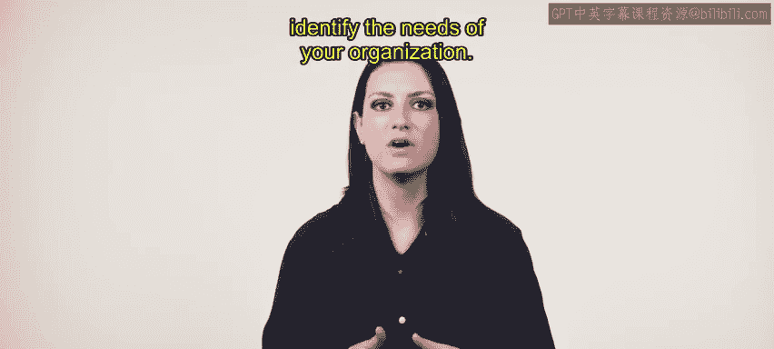
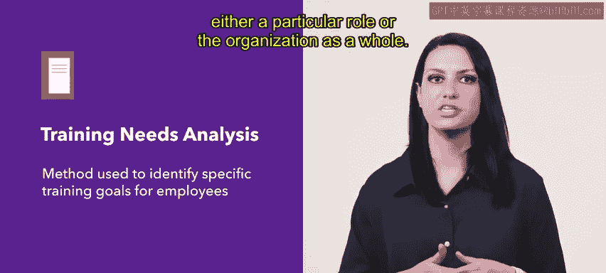
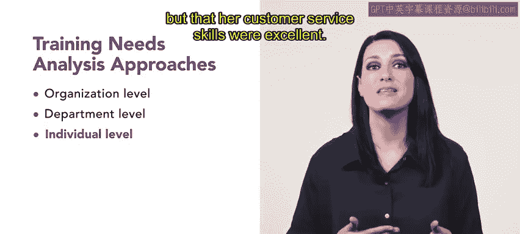
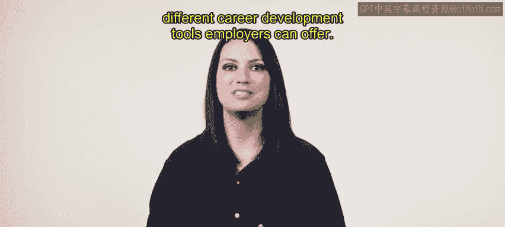

# HRCI人力资源助理课程：1-3：培训需求分析（TNA）📊

在本节课中，我们将要学习培训需求分析（TNA）的概念、作用以及具体实施方法。培训需求分析是人力资源团队识别员工和组织培训需求的关键工具，它能帮助我们发现当前技能与目标要求之间的差距，从而制定有效的培训计划。

## 什么是培训需求分析？🔍

上一节我们介绍了培训与发展规划，本节中我们来看看如何确定具体的培训需求。培训需求分析是一种用于识别员工具体培训目标的方法，其核心是通过审视组织内可改进的领域来实现。

该方法通常始于理解组织所需的核心能力。它可以通过提出以下问题来进行评估：
*   员工需要完成哪些任务？
*   员工需要具备哪些知识、技能和能力才能在其岗位上取得成功？

需求评估应揭示出员工当前技能组合与特定岗位或组织整体要求之间存在的任何差距。

## 培训需求分析的实施层面 📈

根据分析范围的广度，我们可以采取几种不同的方法。让我们以“都市风尚”服装公司为例进行说明。

以下是培训需求分析可以实施的几个层面：

*   **组织层面分析**：用于识别全公司范围的培训需求。例如，“都市风尚”的人力资源团队通过分析可能发现，员工普遍缺乏对某款新产品（如可收纳夹克）的标准化培训。随后，他们可以向相关门店或个人提供培训资源。
*   **部门层面分析**：在部门级别进行，以识别培训或支持需求。例如，“都市风尚”的人力资源部门可能与西装礼服部合作进行分析，并发现需要在毕业舞会季节提供人员补充培训和充足的人员配置。
*   **个人层面分析**：进行非常具体的分析，以检查个别员工在其工作技能方面的差距。例如，由于克拉拉曾在书店工作但未在服装店工作过，她的分析结果显示，她需要对“都市风尚”销售的各种服装进行额外培训，但她的客户服务技能非常出色。

## 组织分析与个人分析 📊

培训需求分析在了解个人乃至更广泛群体的需求方面都极为有用。我们来比较一下分析可以采取的两种主要范围。

**组织分析**考察组织内各系统的运作方式，包括人力资源规划、产品质量和组织文化。它涉及量化结果并识别影响这些结果的变量。其公式可以概括为：
`组织效能 = f(人力资源规划， 产品质量， 组织文化， ...)`

**个人分析**则侧重于特定员工的表现。其目标应是识别那些需要额外技能或能力才能在工作中表现出色的员工。培训应量身定制以满足这些需求，而不需要培训的员工则不应被要求参与。

## 总结与展望 🎯

本节课中我们一起学习了培训需求分析。正如你所了解的，培训需求分析是一个有用的工具，可用于识别团队或组织各个层面在知识或技能组合上的差距。让员工及时掌握最新工具能帮助他们在工作中变得更加自信和高效。

接下来，你将探索雇主可以提供的不同职业发展工具。