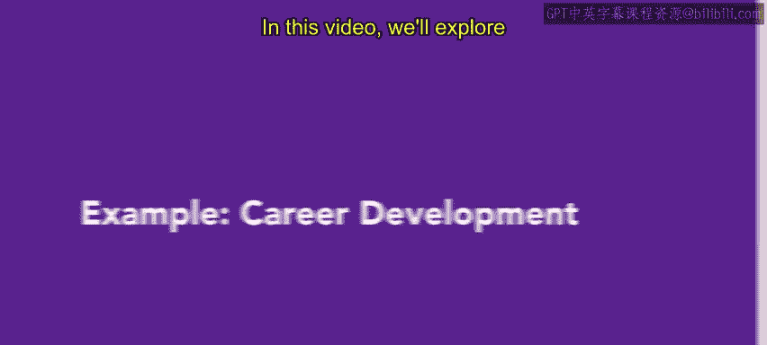
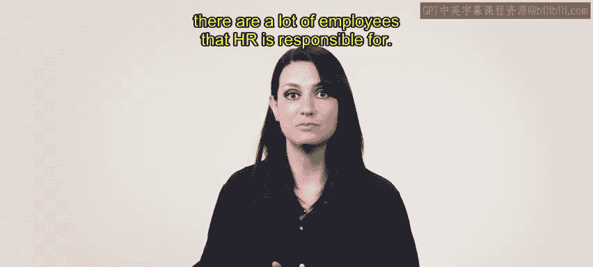
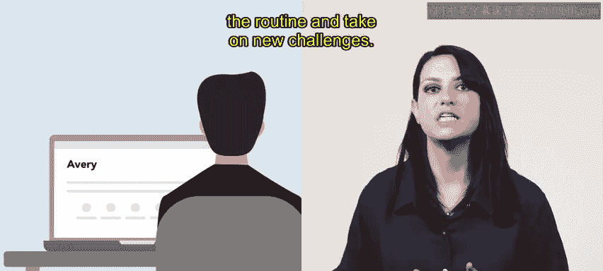
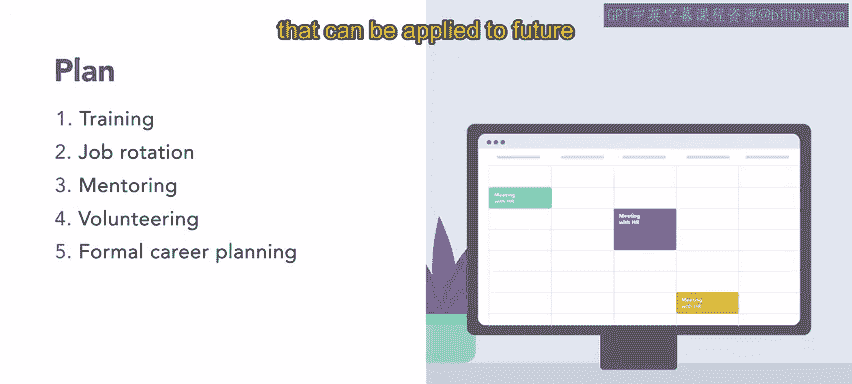

# HRCI《人力资源助理（招聘、学习发展、薪酬福利，1-3课／共5课）｜HRCI Human Resource Associate》 - P80：13_示例：职业发展.zh_en - GPT中英字幕课程资源 - BV1qi421r7ba

In this video we'll explore a real world example of career development planning for this example。

 we will follow Nary at Urban Attire。Urban attire is a midsized business that specializes in casual wear for the modern metropolitan lifestyle。

 Urban attire offers a wide range of trendy and practical clothing options with a factory。

 brick and mortar locations and a headquarters。 There are a lot of employees that HR is responsible for。

Urban attire has a marketing team that keeps up with trends and engages customers。

Nary from HR is helping Avery from the marketing department create a career plan。

A career plan can show Avery that the organization is invested in their success and wants to keep them happy and motivated。

First， Mary familiarizes himself with Avery's file before discussing career development。

Avery is a marketing lead who has been with Urban attire for six years。

 they have a bachelor's degree in marketing and a master's degree in business administration。

Avery has shown potential as a future leader but isn't sure about a management role， however。

 Avery has expressed interest in learning about the different opportunities in the organization Avery wants to break up the routine and take on new challenges。

After talking to Avery， Mary suggests the first step in the plan。

 attend a leadership training course this would allow Avery to see if they would be interested in pursuing a management role in the organization Mary locates an online course that focuses on developing leadership skills。

 strategic thinking and decision making abilities Next。

 Avery and Mary discusses second step job rotation Jo rotation can help Avery experience different roles in the marketing department and discover any interesting opportunities。

This will allow Avery to develop a broader perspective and understanding of the organization's overall marketing strategy and what possibilities there are for new challenges After they have completed the training and job rotation。

 Avery will be paired with a mentor a senior manager in the marketing department the mentor will provide guidance。

 feedback and support to help Avery develop the skills and knowledge they need to succeed in future roles。

 regardless of whether or not they decide to pursue management opportunities。Next。

 Mary discusses volunteer opportunities that Avery is passionate about。

Nary presents the organization's sponsored volunteer programs that align with Avery's interests。

 This will allow Avery to develop new skills and gain exposure to new ways of thinking and working。

 while also giving back to the community volunteerunteering can be done at the same time as earlier steps in the career development plan to keep Avery engaged in the organization and interested in their job。

After talking， Avery decides to work with the School of Promdress program that takes used gowns and repurpos them for people who can' afford a new dress。

 Lastly， Na and Avery determine the amount of support Avery would like from human resources。

 Avery would like to follow up monthly to adjust the career plan In these feedback sessions。

 Avery will share what they have learned about themselves through the plan。

 This ensures that the plan remains tailored to Avery's interests and that the organization gains information that can be applied to future career development for others。

Avery is now on track to develop a more interesting and exciting career。

 We'll check back in with Marriott Urban attire later In your future human resources role。

 you will probably help build career development plans。

 Help employees state engaged with and excited about work is a task that will hopefully keep you engaged and excited。

 too。😊。

