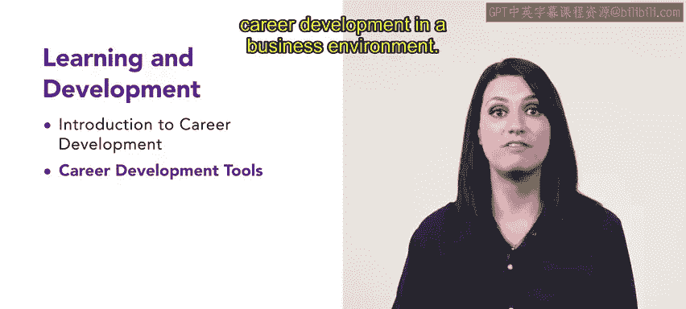

# HRCI人力资源助理课程：第1周：学习与发展导论回顾 🎯

在本节课中，我们将对第一周“学习与发展”模块的核心内容进行回顾与总结。

本周的学习已接近尾声。祝贺你完成了本课程第一周的学习内容。你已经学到了许多关于学习与发展的知识。学习与发展是人力资源专业人员需要持续掌握的重要课题。你现在所学的一切都将在未来的人力资源职业生涯中得到应用。

现在，让我们回顾一下本周所涵盖的内容。

## 📚 第一课：职业发展导论

在第一课中，我们介绍了职业发展的基本概念。

以下是该课程的核心要点：
*   你学习了职业发展的生命周期及其不同阶段。
*   你了解了谁应对职业发展负责。
*   在课程最后，你分析了一个真实商业场景，观察了一家企业如何运用职业发展技能。

## 🛠️ 第二课：职业发展工具

在第二课中，我们探索了不同类型的职业发展工具。

以下是该课程的核心要点：
*   你学习了培训与发展的基础知识。
*   你了解了学习与发展规划。
*   你认识了一些具体的职业发展工具。
*   这些知识通过一个商业环境中的真实职业发展案例得到了巩固。

---

本节课中，我们一起学习了职业发展的基础概念、生命周期、责任归属以及常用的发展工具。本周关于“学习与发展”的导论部分到此结束。下周，你将基于已学知识，进一步探索学习体系结构与设计流程的初始步骤。