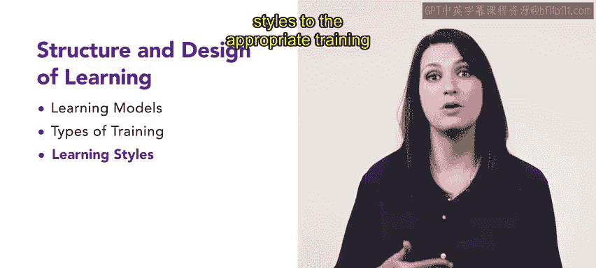

# HRCI《人力资源助理（招聘、学习发展、薪酬福利，1-3课／共5课）｜HRCI Human Resource Associate》 - P83：16_每周介绍：学习的结构与设计.zh_en - GPT中英字幕课程资源 - BV1qi421r7ba

I hope you're excited to continue this learning journey。 We have a lot to cover。

 so let's get started。We'll begin this lesson by introducing the structure and design of learning。

 This content will prepare you to identify and select training and development programs that will best serve your employees and organization。

 First， we will cover the different types of learning models。

 identifyingdentifying the different types of learning models in their uses as an important skill for a future HR professional。

 Next， you will learn about different types of training。

 familiararity with the different types of training allows you to identify the most effective format for your employees。

 Last， you will learn about different learning styles。

 Knowledge of the different learning styles allows you to connect learning styles to the appropriate training for peak effectiveness。

 Are you ready， Let's begin with the first lesson by discussing the different types of learning models。

😊。

