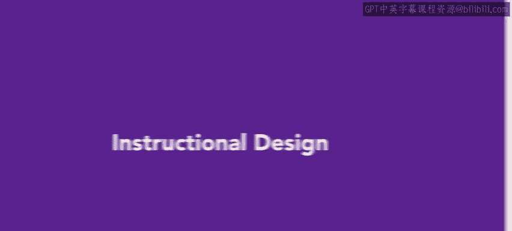
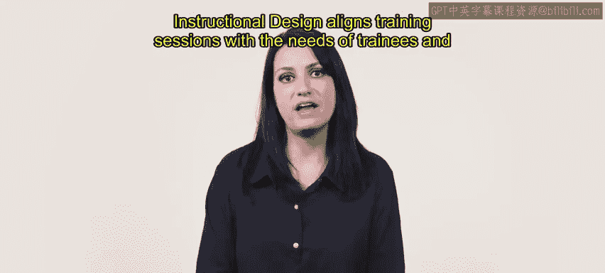
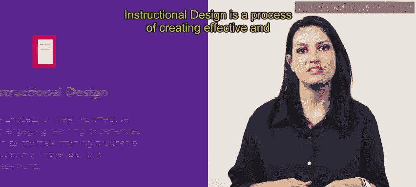
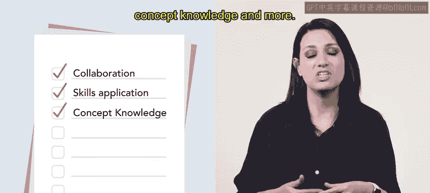
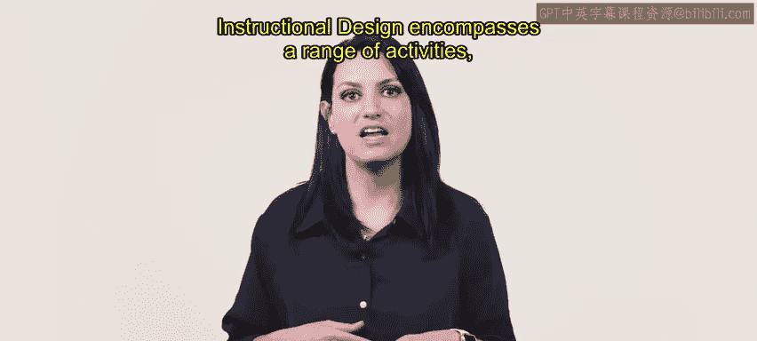
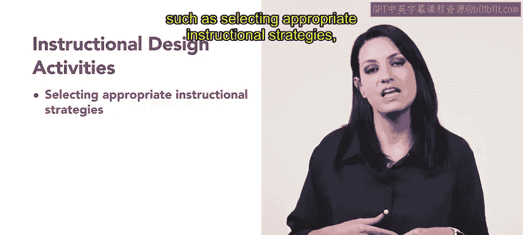
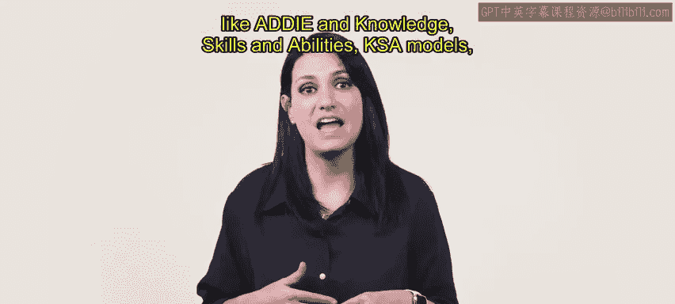
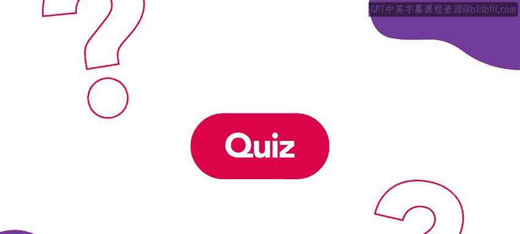
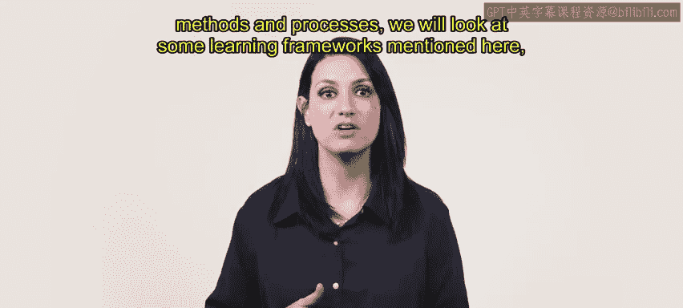

# HRCI人力资源助理课程：第17课：教学设计 📚

在本节课中，我们将要学习**教学设计**的概念、目标、方法及其核心流程。我们将了解它如何超越传统的培训方式，创造出更有效、更具吸引力的学习体验。

---

传统的培训方法，例如基于课堂的培训项目，常常无法吸引学习者，并产生不尽人意的效果。

教学设计运用创新的流程来创造有效且引人入胜的学习体验。这种方法可以改变人们学习和记忆信息的方式。

教学设计使培训课程与受训者和雇主的需求保持一致。

教学设计是创造有效且引人入胜的学习体验的过程，例如课程、培训项目、教育材料和评估。

教学设计的主要目标是促进学习，并确保受训者达成特定的学习成果。

这些学习成果可以包括协作能力、技能、应用能力、概念知识等。当公司出现培训需求时，人力资源专业人员可能会聘请专业的教学设计人员或采用教学设计框架。

教学设计涵盖一系列活动，例如选择合适的教学策略、设计促进参与和互动的活动、创建多媒体内容以及开发评估工具。

为了指导学习的创建，教学设计会使用一些框架，例如我们将在本课程后面讨论的 **ADDIE模型** 和 **知识、技能与能力（KSA）模型**。

---

上一节我们介绍了教学设计的基本概念和目标，本节中我们来看看一些核心的教学设计框架。

以下是两个关键的教学设计框架：

*   **ADDIE模型**：这是一个系统化的教学设计流程，包含五个阶段：**分析（Analysis）**、**设计（Design）**、**开发（Development）**、**实施（Implementation）** 和 **评估（Evaluation）**。
*   **KSA模型**：这个模型关注于识别和培养学习者所需的 **知识（Knowledge）**、**技能（Skills）** 和 **能力（Abilities）**，以确保培训内容与岗位要求紧密相连。

---

本节课中我们一起学习了教学设计。我们了解到，它是一种系统化的方法，旨在通过创新的流程和框架（如ADDIE和KSA），设计出符合需求、有效且能吸引学习者的培训方案，从而提升学习效果和知识留存率。