# HRCI人力资源助理课程：第3课：ADDIE学习模型 📚

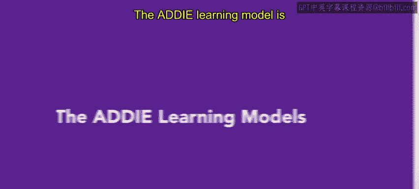

在本节课中，我们将要学习ADDIE学习模型。这是一个用于设计和开发有效培训项目的系统性框架。我们将通过一个时尚公司的案例，详细拆解该模型的五个阶段，帮助你理解如何运用它来满足员工的具体培训需求。

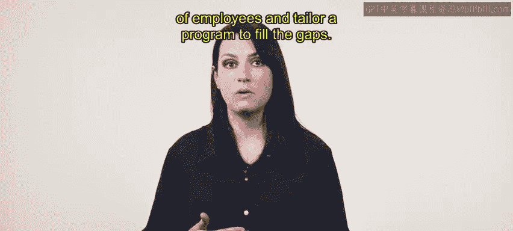

---

## 概述

ADDIE模型是一个灵活且系统化的流程，用于创建满足员工特定需求的有效培训。使用ADDIE时，你需要评估员工当前的技能水平，并量身定制一个项目来填补技能差距。该模型包含五个阶段：**分析**、**设计**、**开发**、**实施**和**评估**。

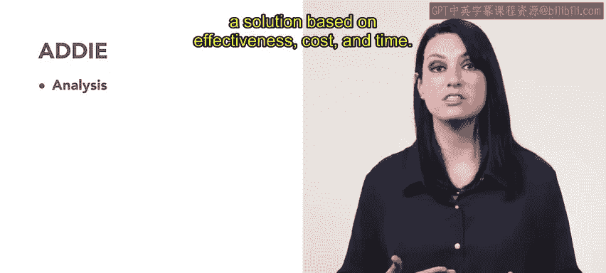

---

## 第一阶段：分析 🧐

ADDIE模型的第一步是分析培训需求。这个阶段包括三个具体步骤：首先，确定培训项目的目标；其次，收集关于员工当前技能水平或技能差距的数据；最后，根据效果、成本和时间来提出并评估解决方案。

想象一下，你在一个名为“都市风尚”的时尚公司人力资源部工作。你的任务是为销售团队准备一个即将到来的行业活动。你希望培训团队实施个性化的销售方法，以确保客户获得最佳服务。

为了分析销售团队的培训需求，你需要收集关于团队成员当前技能水平以及他们成功履职所需知识和技能的数据。以下是收集数据的方法：

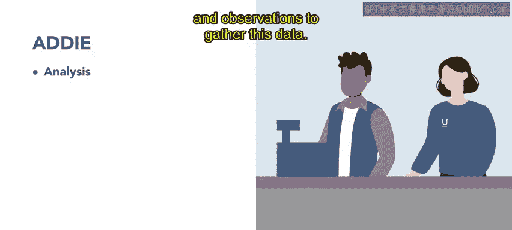

*   使用**调查问卷**。
*   进行**访谈**。
*   进行**观察**。

你的分析结果显示，销售团队成员不熟悉公司的新产品线，也缺乏向潜在客户销售这些新产品所需的技能。

---

## 第二阶段：设计 ✍️

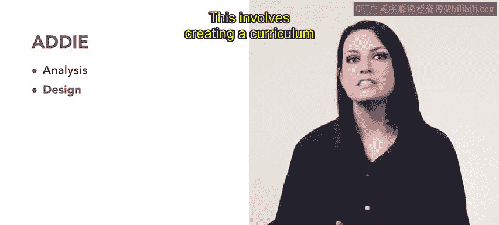

上一节我们介绍了如何分析培训需求，本节中我们来看看如何根据分析结果进行设计。设计阶段侧重于确定目标受众、制定培训目标和创建培训内容。

回到我们的案例，下一步是设计培训项目。这涉及到创建一个满足销售团队特定需求的课程体系。你的课程体系应基于分析阶段收集的数据。

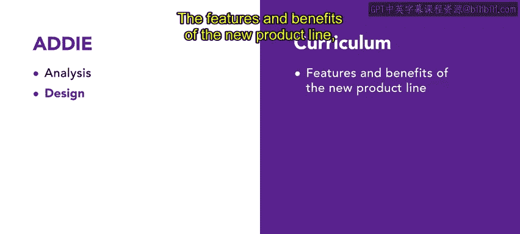

对于销售团队的培训，课程将涵盖以下主题：

*   **新产品线的特点和优势**。
*   **销售流程**。
*   **如何应对客户的异议**。

---

## 第三阶段：开发 🛠️

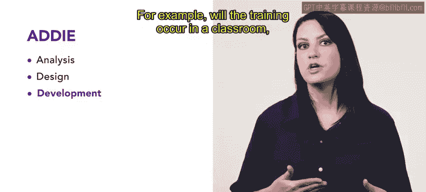

设计好培训蓝图后，我们进入开发阶段。在这个阶段，教学设计师会开发培训材料、教学方法和培训方式。例如，培训将在教室进行、在线进行还是通过自学完成？

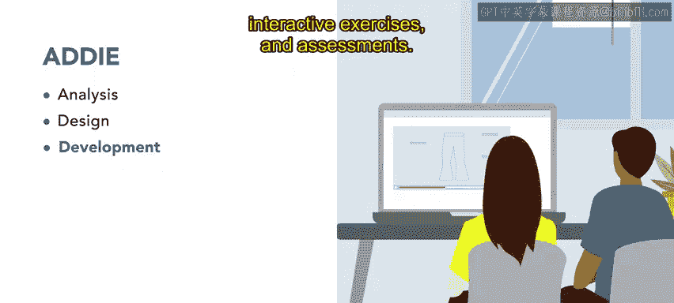

让我们看看“都市风尚”公司的开发阶段。培训材料由熟悉新产品线和公司销售方法的内部团队开发。材料包括多种多媒体资源，例如：

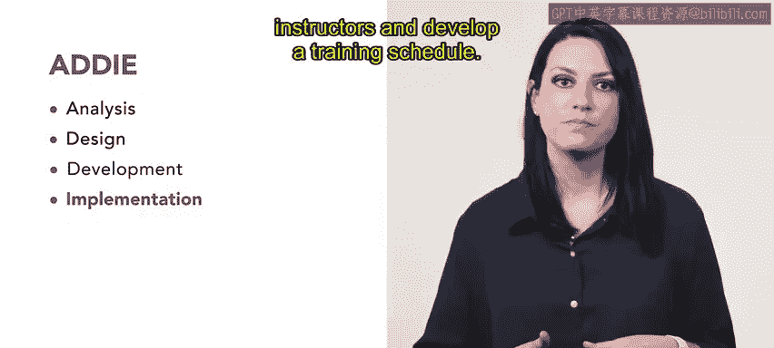

*   **视频**。
*   **互动练习**。
*   **评估测试**。

---

## 第四阶段：实施 🚀

开发出培训材料后，接下来就是实施阶段。在这个阶段，教学设计师需要选择交付方式、聘请并培训讲师，以及制定培训时间表。

现在，让我们探讨如何实施你的销售培训。为了降低培训成本并允许销售团队按自己的节奏学习部分内容，培训采用课堂和在线相结合的交付方式。课堂课程涵盖核心主题，在线培训则提供额外的支持和练习。

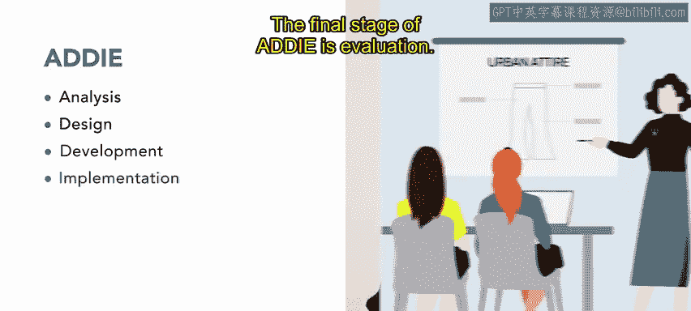

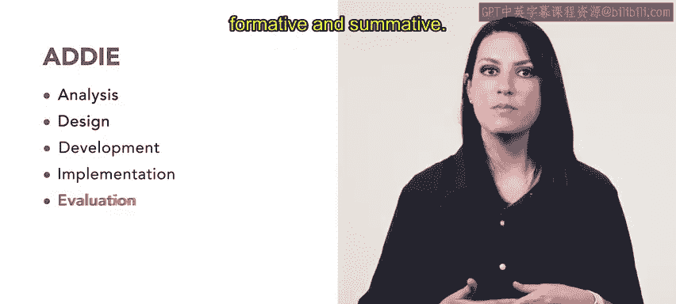

---

## 第五阶段：评估 📊

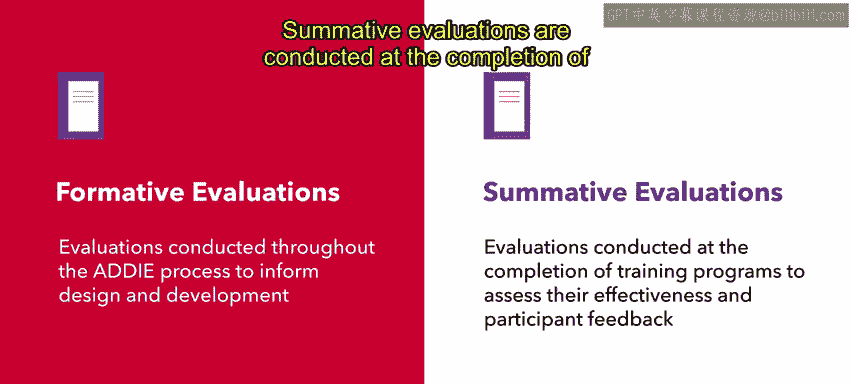

实施培训后，最后一步是评估。评估有两种类型：形成性评估和总结性评估。

**形成性评估**贯穿整个ADDIE过程，为设计和开发提供信息，包括需求评估、工作分析、试点测试和预测试。

**总结性评估**在培训项目完成后进行，旨在评估其有效性和收集参与者反馈。

让我们回到案例，看看评估阶段的结果。销售团队成员对培训项目进行了评估。总结性评估显示，该项目有效地满足了销售团队的需求。团队成员现在能够成功地向潜在客户销售新产品。

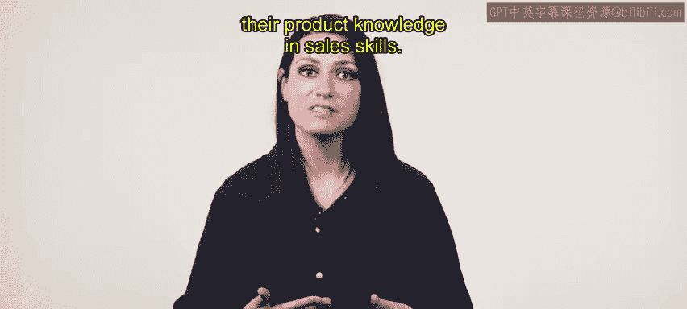

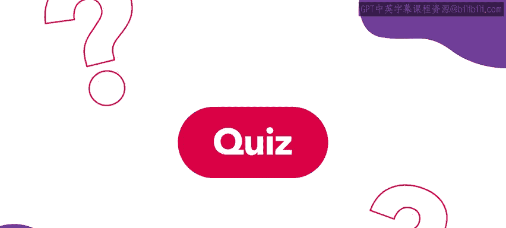

---

## 总结

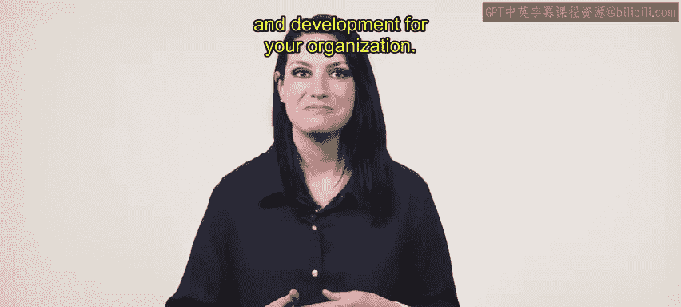

本节课中我们一起学习了ADDIE学习模型。通过使用ADDIE模型，你开发出了一个有效的培训项目。你的销售团队提升了产品知识和销售技能，现在已为即将到来的活动做好了准备。现在你了解了ADDIE模型及其用于培训的系统化方法。在后续课程中，你将探索该领域使用的其他学习模型，以便为你的组织做出关于培训与发展的最佳决策。