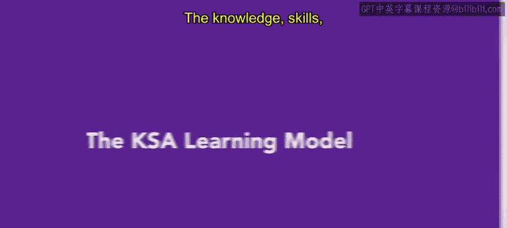
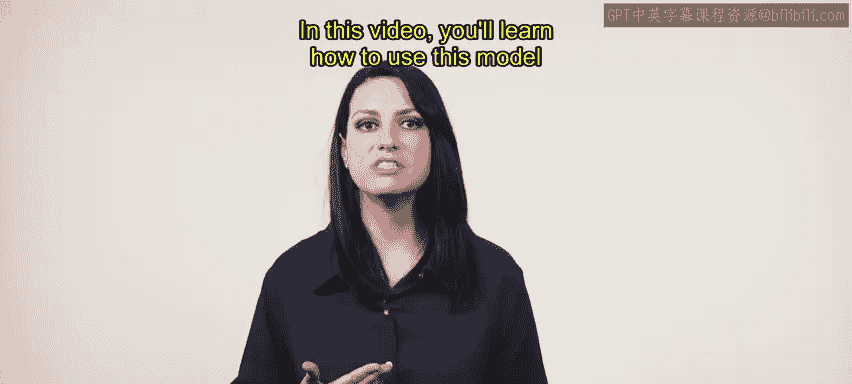
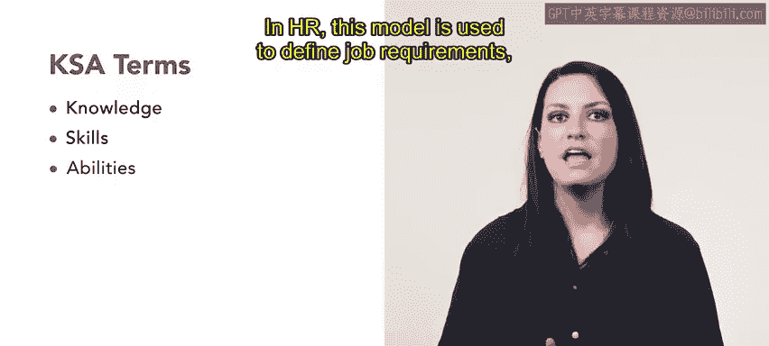
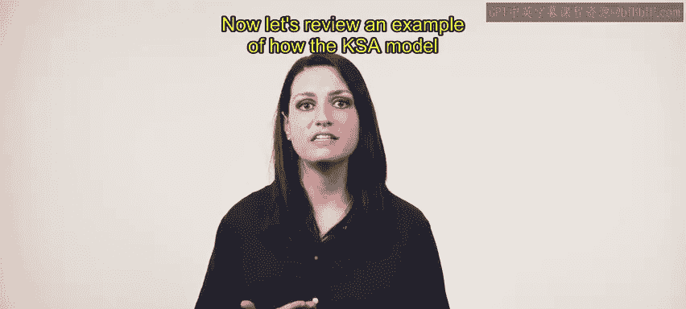
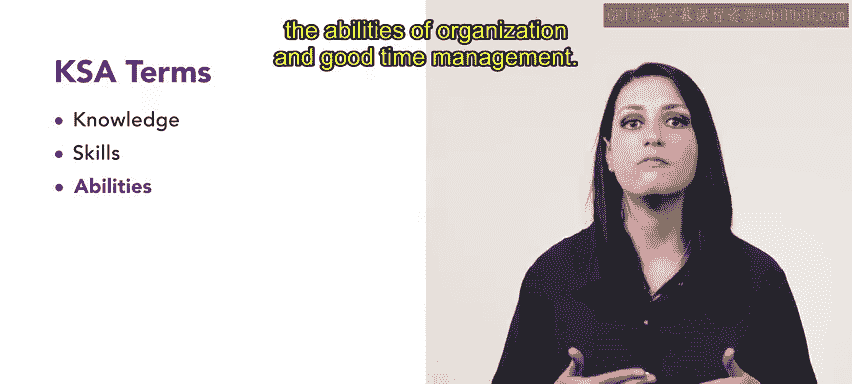

# HRCI《人力资源助理（招聘、学习发展、薪酬福利，1-3课／共5课）》 - P86：19_KSA学习模型

## 📚 课程概述
在本节课中，我们将要学习KSA学习模型。KSA模型是美国联邦政府开发的一个框架，用于招聘员工。本视频将介绍如何运用此模型来创建培训与发展计划。

## 🔍 什么是KSA模型？
KSA模型是一个用于定义员工在特定岗位上取得成功所需的知识、技能和能力的框架。

该模型具体定义为：
*   **知识**：对概念的理论性理解。
*   **技能**：通过实践经验或培训对知识的应用。
*   **能力**：员工与生俱来的天赋或特质。

在人力资源领域，此模型被用于定义职位要求、评估候选人，以及评估现有员工的培训与辅导需求。

## 🧩 KSA模型应用示例
上一节我们介绍了KSA模型的基本概念，本节中我们来看看如何运用该模型为一个客户服务团队设计培训。

Urban Attire公司正在为新的日班经理制定培训计划。他们需要确定一位候选人要在此岗位上取得成功所应具备的知识、技能和能力。作为人力资源助理，你需要整理一份KSA陈述来制定日班经理的培训计划。

以下是针对日班经理角色的KSA分析：

*   **知识**：例如，班次经理必须懂得如何管理库存和制定排班表。
*   **技能**：经理必须会操作库存管理软件，并使用电子表格来创建排班表。
*   **能力**：班次经理必须具备组织能力和良好的时间管理能力。

## 📝 课程总结
本节课中我们一起学习了KSA学习模型。你现在可以思考如何在自己的组织中运用此模型来支持培训工作。接下来，我们将学习更多不同的学习框架，以及如何运用它们来创建成功的培训计划。