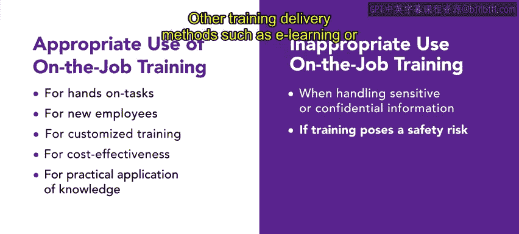

# HRCI《人力资源助理（招聘、学习发展、薪酬福利，1-3课／共5课）｜HRCI Human Resource Associate》 - P89：22_在职培训.zh_en - GPT中英字幕课程资源 - BV1qi421r7ba

In this video， you will learn about on the job training and what it is most effective The versatility of this type of training is a key benefit on the job training。

 often called OjT is based on the idea that an employee can learn a job while simultaneously working For example。

 line workers at an auto manufacturing plant might learn their job while actually performing the tasks on the job training is appropriate to use for a variety of purposes and audiences you can use it to teach hands-on tasks。

 train new employees， deliver customized training， maintain cost effectiveness。

 and demonstrate practical application of knowledge on the job training is highly effective for jobs that require specific handson skills or knowledge。

 such as operating machinery or equipment In these jobs learning by doing as the best way to acquire the necessary competencies on the job training is an excellent way to train new employees who lack experience or knowledge of the job new employees can observe and work alongside more experienced colleagues。

 which helps them quickly become productive in their new roles。

In addition， OJT is a flexible training method that can be customized to meet your organization' and employ specific needs the training can be tailored to focus on the skills and knowledge that are essential for the job on the job training as a cost effectiveffive delivery method this type of training uses existing equipment and facility so your organization can provide training at a minimal cost Finally。

 on the job training is ideal to teach employees to apply theoretical knowledge and practical situations for example。

 an employee who has learned accounting principles in a classroom can apply those principles to real accounting transactions during OJT。

There are occasions when you should not use this type of training however。

 on the job training should not be used if the training involves sensitive or confidential information or poses a safety risk。

Other training delivery methods such as elening or classroom training may be better suited for those situations。

Additionally， the training may be ineffective if the trainer is not experienced or qualified。

In conclusion， on the job training has many uses， we've reviewed when it can be effective and when other training delivery methods may fare better。

 we will explore different types of on the job training in the upcoming videos。

