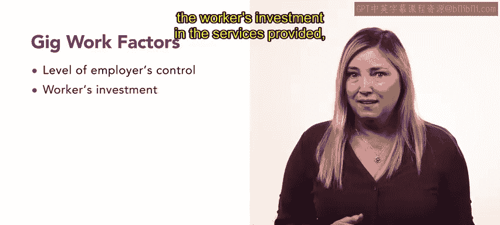

# HRCI《人力资源助理（招聘、学习发展、薪酬福利，1-3课／共5课）》：P8：零工经济 💼

在本节课中，我们将要学习零工经济的概念，了解零工工作的特点，并探讨零工工作者与独立承包商之间的区别。

---

零工工作在当今经济中很常见，例如临时工或独立承包商。零工工作者可能为你的组织带来益处。上一节我们回顾了独立承包商，本节中我们来看看零工工作，以及区分零工工作者与独立承包商的因素。

顾名思义，零工工作是临时且灵活的。这类工作可能是短期且多样的，但许多人和组织已开始依赖它。像Lyft、Uber、Instacart和Doordash这样的公司都使用零工工作者来快速高效地完成成千上万的工作。

应用程序让零工工作者很容易获得工作。个人注册、创建个人资料，然后根据自己的便利接受可用的工作。零工工作通常是不需要特定技能的一般性工作。😊

---

食品配送、网约车共享，甚至宠物看护现在都更依赖零工工作者。零工工作者与独立承包商之间的法律区别，仍在由公司和法院确立中。

以下是影响这种区分的几个因素：

*   **雇主对工作者的控制程度**：`控制程度 = 雇主指令的详细程度`
*   **工作者对所提供服务的投入**：`投入 = 工具、设备、培训等自备资源`
*   **雇佣关系的持续时间是临时的还是永久的**：`关系性质 = 项目制 / 长期雇佣`
*   **员工服务与雇主业务的整合程度**：`整合度 = 工作是否为业务核心组成部分`

---

零工工作在最近几年变得普遍，已成为经济的重要组成部分，但雇主与零工工作者之间的关系仍在定义中。如果你的组织正在考虑使用零工，你应该随时关注有关此问题的立法和法律裁决。

随着本课程的继续，我们将了解更多关于临时工人和不同工作方式的内容。

---

本节课中我们一起学习了零工经济的基本概念、其运作方式，以及区分零工工作者与独立承包商的关键法律因素。理解这些区别对于人力资源合规管理至关重要。