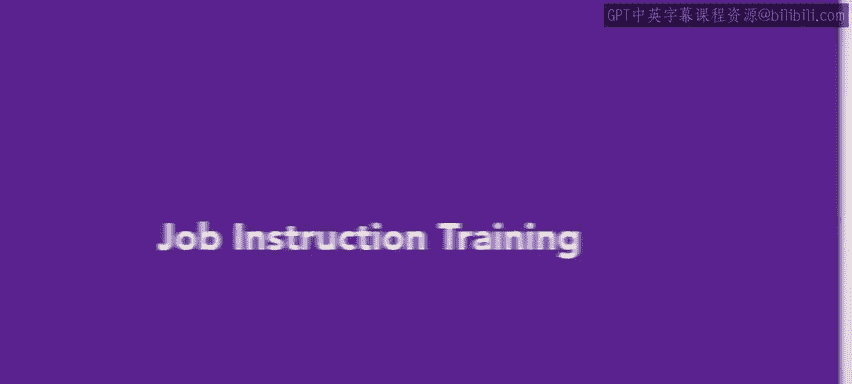
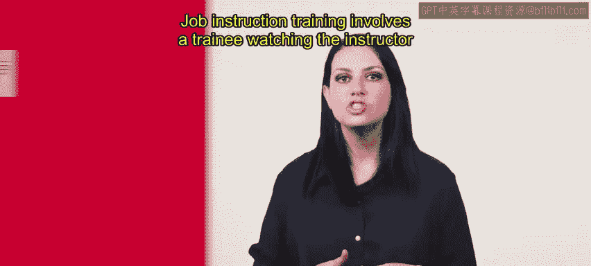
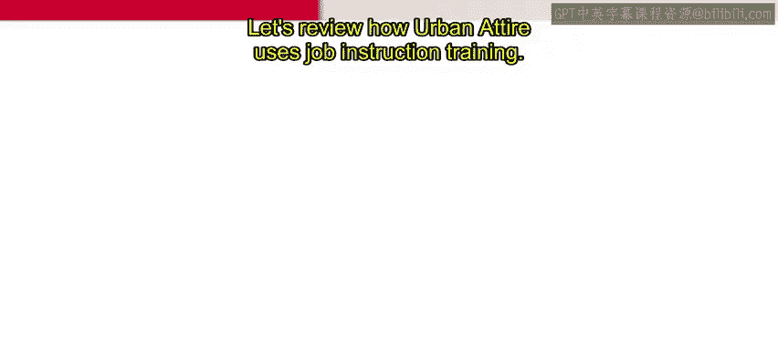
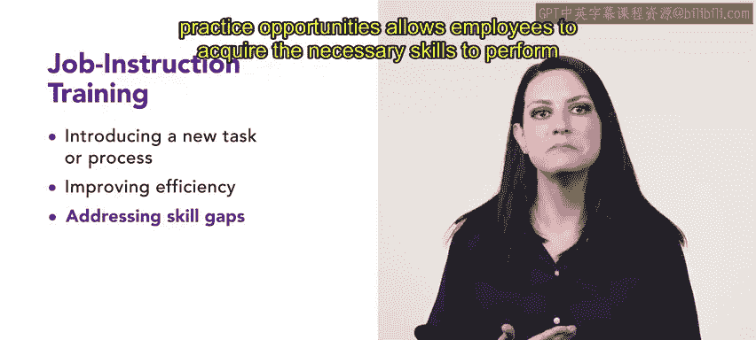
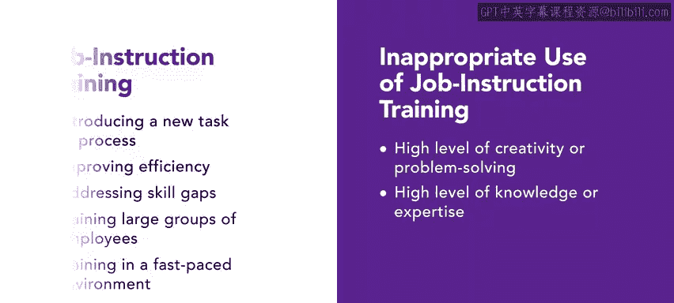
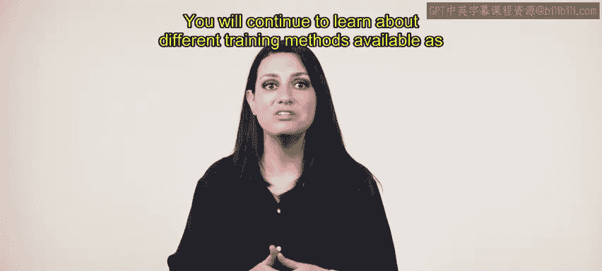

# HRCI《人力资源助理（招聘、学习发展、薪酬福利，1-3课／共5课）｜HRCI Human Resource Associate》 - P90：23_工作指导培训.zh_en - GPT中英字幕课程资源 - BV1qi421r7ba

In addition to the other training models you have learned about。

 job instruction training is a type of training where the learner observes a task before demonstrating their own skills。

This allows new employees to learn their position， take notes and implement their skills after observing job instruction training involves a trainee watching the instructor perform a jobs task repeatedly before practicing and then taking on those tasks for themselves。

 Let's review how urban attire uses job instruction training。 Ari， a cashier urban attire。

 trains by watching a lead cashier complete customer transactions。

 The lead cashier explains to Ari each step and the reasons behind it。

This type of learning is called vicarious learning。 When Ari is ready， they take over the register。

 The lead cashier will closely monitor Ari's work for a period of time to ensure it is done correctly。

In your human resources position， you may be a part of decisions on how to deliver training to new employees。

Job instruction training is appropriate for onboarding across training employees when introducing a new task or process。

 improving efficiency， addressing skill gaps， training large groups of employees。

 and training in a fast paced environment。Job instruction training is an effective way of teaching new tasks or processes to employees a lead employee breaks the task down into steps while performing it and clearly explains each step this narration allows employees like RA to learn how to perform the task accurately and quickly。

Job instruction training can help improve efficiency by standardizing the process and reducing errors。

Employees all learn the tasks the same way from watching the same group of lead employees employees can learn to perform the task more efficiently and effectively if clear instructions and feedback are provided。

Job instruction training can address skill gaps in employees being provided with step by step instructions and practice opportunities allows employees to acquire the necessary skills to perform the task at the required level of competency。

 Job instruction training is useful when training a large group of employees。

 The standardized approach ensures that all employees receive the same training。

 regardless of the trainers experience or skill level。

 Jo instruction training is an effective training method in fast paced environments。

 such as retail stores and quick service restaurants。

Being provided with concise and standardized training allows employees to quickly learn to complete customer transactions accurately and efficiently。

There are also occasions in which job instruction training should not be used。

If the task requires a high level of creativity or problem solving。

 job instruction training may not be as suitable as it focuses on standardization and repetition。

Additionally， if the task requires a high level of knowledge or expertise。

 other training methods such as classroom training or coaching may be more effective。

Job instruction training allows for more observant methods of learning。

 you will continue to learn about different training methods available as you continue along with this course。

