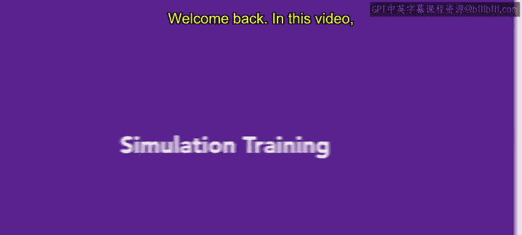
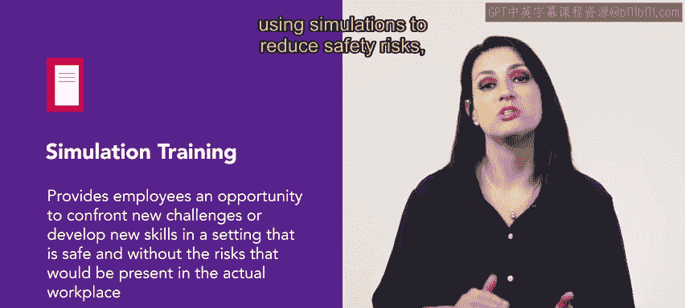
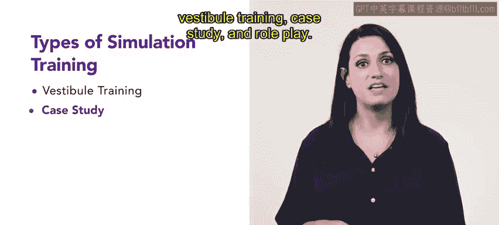
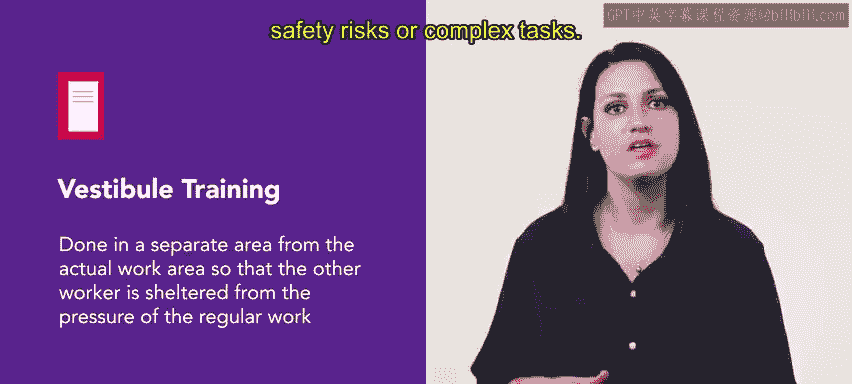
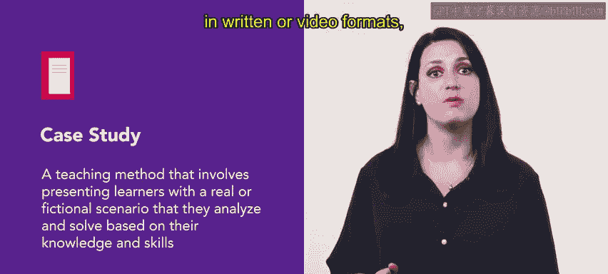
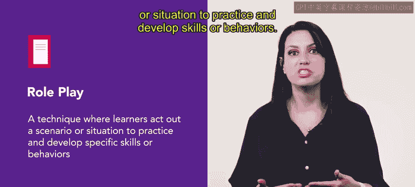
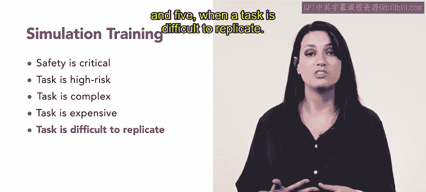
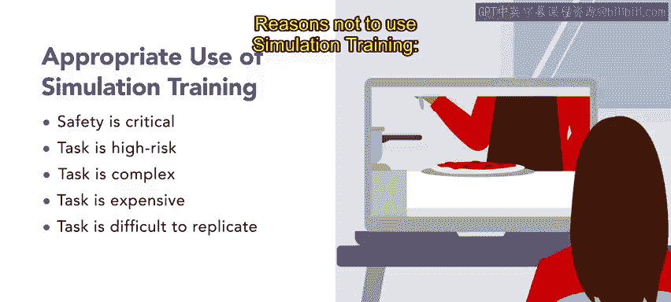
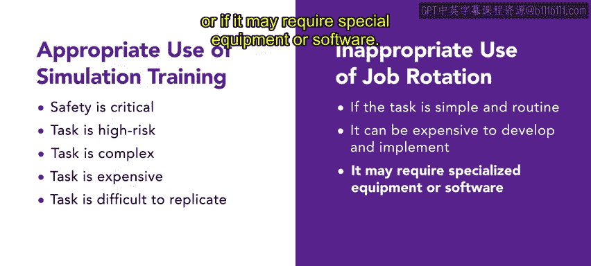

# HRCI《人力资源助理（招聘、学习发展、薪酬福利，1-3课／共5课）》：P91：24_模拟培训 🎯

在本节课中，我们将要学习**模拟培训**。这是一种让员工在安全、无风险的环境中面对新挑战或发展新技能的重要方法。我们将探讨模拟培训的不同类型、适用场景及其目的与优势。

## 概述 📋

模拟培训为员工提供了一个安全的环境，使其能够应对新挑战或发展新技能，而无需承担实际工作场所中可能存在的风险。在人力资源工作中，有时需要使用模拟培训来降低安全风险、最小化成本，甚至让新员工能够完成复杂的任务。

## 模拟培训的类型 🧩

上一节我们介绍了模拟培训的基本概念，本节中我们来看看它的几种主要类型。模拟培训主要分为三种：**虚拟培训**、**案例研究**和**角色扮演**。

### 虚拟培训

虚拟培训在与实际工作区域分离的专门区域进行。这使员工免受常规工作压力的干扰，有助于他们在处理存在安全风险或复杂任务时集中注意力。

以下是虚拟培训的一个应用实例：
*   **Urban Attire** 公司利用虚拟培训，在一个模拟商店布局和设备的环境中，教导新员工如何处理客户咨询、操作收银机及执行其他任务。这使得员工在与真实客户互动前，就能熟悉工作职责并建立信心。

### 案例研究

案例研究是一种教学方法，向学习者呈现真实或虚构的场景，要求他们运用自身知识和技能进行分析和解决。案例可以以书面或视频形式呈现，并可以是个体或小组任务。

以下是案例研究的一个应用实例：
*   **Urban Attire** 公司在新员工入职培训中使用案例研究。员工会面对不同的客户场景，讨论如何在遵循公司政策的前提下帮助客户并改善其购物体验。

### 角色扮演

角色扮演是一种让学习者通过表演特定场景或情境来练习和发展技能或行为的技术。

以下是角色扮演的一个应用实例：
*   **Urban Attire** 公司在职业发展培训中使用角色扮演。员工扮演顾客或销售助理，演练各种场景。这使员工在真实的客户互动中能有更好的反应，因为他们可以借鉴培训中处理各种情况的经验。

## 何时使用模拟培训？ ⏰

了解了模拟培训的类型后，我们来看看在哪些情况下使用它最为有效。模拟培训应在以下场景中考虑使用：

以下是适用模拟培训的关键场景：
1.  **安全至关重要时**：例如，**Sliceliceu** 餐厅使用模拟培训让厨房员工练习安全规程。厨房工作存在烫伤和割伤的风险，员工通过模拟学习烤箱操作和安全程序。
2.  **任务风险高时**：例如，**Sliceliceu** 使用模拟来展示比萨烤箱的操作与维护。烤箱高温可能造成烧伤或火灾，清洁维护也涉及危险化学品，模拟可以安全地进行培训。
3.  **任务复杂时**：例如，**Sliceliceu** 使用模拟教导员工如何在高峰时段管理和协调订单。模拟让员工能专注于复杂的流程而不受干扰。
4.  **任务成本高昂时**：模拟培训在涉及昂贵设备或材料的任务中具有成本效益。**Sliceliceu** 的人力资源部门提倡使用模拟，因为其通常是一次性成本且无需维护，为组织节省了新员工培训开支。
5.  **任务难以在现实中复现时**：例如，**Sliceliceu** 的新员工难以始终如一地复制比萨的口味和质量。模拟允许员工通过重复练习来制作高品质的比萨，而不会影响实际产品的质量。

## 何时不宜使用模拟培训？ 🚫

当然，模拟培训并非万能。在以下情况下，可能需要考虑其他培训方式：

以下是不宜使用模拟培训的情况：
*   任务简单且常规。
*   开发和实施模拟的成本可能过高。
*   模拟可能需要特殊的设备或软件。

## 总结 ✨

本节课中，我们一起学习了模拟培训。**模拟培训**为学习者提供了一个安全的学习环境，使其能够基于挑战来提升和增强新技能。它通过**虚拟培训**、**案例研究**和**角色扮演**等多种形式，在保障安全、控制成本、处理复杂或高风险任务方面发挥着重要作用。未来，我们将继续学习其他有益于新员工学习体验的培训类型。